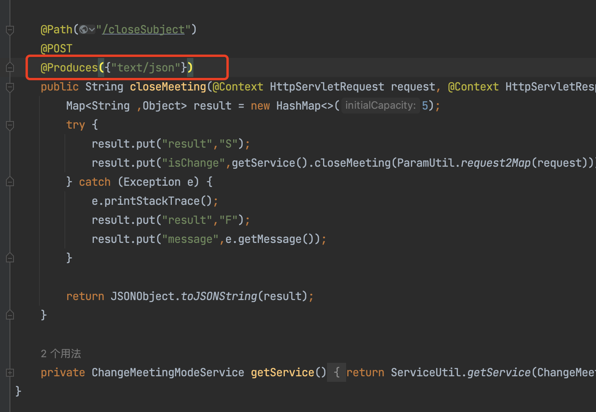
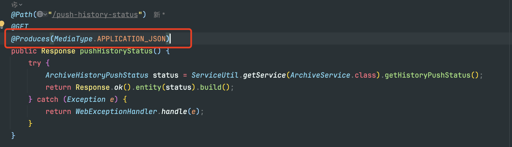
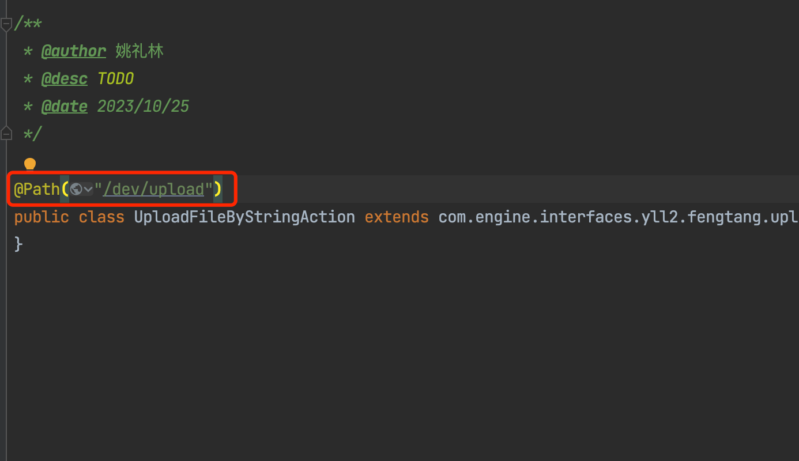
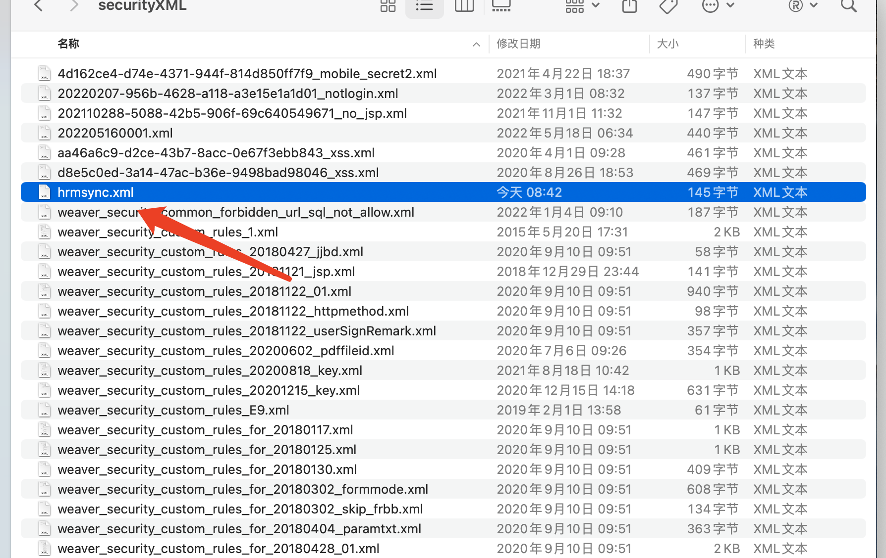

E9 的后端接口只支持 GET 和 POST 类型，其它类型接口会调用不到。

## 创建接口

按照泛微开发规范，创建接口类需创建两个类，一个类用于暴露接口，另一个类写接口的核心代码。

### 创建暴露接口类：

需要在`com.api.interfaces.*`路径下创建类，否则接口不会被识别。

在类上需要使用`@Path`注解，注解的 value 填写接口路径，注意此接口路径不能与其它暴露类接口路径相同。

```java

@Path("/secondev/demo/test")
public class TestApi extends TestAction {
}

```

### 创建核心业务接口类

类需要在`com.engine.interfaces.*`路径下。

下面示例中分别创建了 GET`/secondev/demo/test`接口和 POST`/secondev/demo/test/handle`接口，接口全路径为暴露类接口路径+核心类接口路径。

在类中可创建方法定义接口

- `@Path`定义接口路径，可以为空

- `@GET`或`@POST`定义接口请求方法，只支持这两个请求方法，其它方法如 PUT，DELETE 不支持

- `@Consumes`注解定义接口接收的请求参数类型，此注解不是必需，但建议加上，明确接口请求参数类型

- `@Produces`注解定义接口的返回参数类型，此注解不是必需，但建议加上，明确接口返回参数类型

方法中的`@Context HttpServletRequest request`和`@Context HttpServletResponse response`可获取方法的请求和响应对象，这两个参数不是必需要有的，按需加上。

service 实例获取：

不推荐直接使用 new 创建 service 实例，需要使用`ServiceUtil.getService()`方法获取 service 实例，service 类需要继承`com.engine.core.impl.Service`类，这样的好处是可以通过标准接口拦截 service 方法，方便后续修改和扩展。

接口示例：

```java

public class TestAction {
    
    private TestService service;
    
    @Path("")
    @GET
    @Consumes(MediaType.APPLICATION_JSON)
    @Produces(MediaType.TEXT_PLAIN)
    public Response hello(@Context HttpServletRequest request, @Context HttpServletResponse response) {
        return Response.ok("success").build();
    }
    
    @Path("handle")
    @POST
    @Consumes(MediaType.APPLICATION_JSON)
    @Produces(MediaType.APPLICATION_JSON)
    public Response handle(@Context HttpServletRequest request,@Context HttpServletResponse response) {
        Map<String, Object> params = ParamUtil.requestJson2Map(request);
        try {
            Map<String, Object> result = getService().handle(params);
            return Response.ok(result).build();
        } catch (Exception e) {
            return WebExceptionHandler.handle(e);
        }
    }
    
    private TestService getService() {
        if (service == null) {
            service = ServiceUtil.getService(TestServiceImpl.class);
        }
        return service;
    }
    
}

```

### 创建 Service 类

service 接口

```

public interface TestService {
    
    Map<String, Object> handle(Map<String, Object> params);
}

```

service 实现类，需要继承`com.engine.core.impl.Service`

在实现类中就可以写业务代码了，不需要再创建 Cmd 类，按照泛微开发规范，可以再创建 Cmd 类，让 cmd 类执行业务代码。

```java

public class TestServiceImpl extends Service implements TestService {
    @Override
    public Map<String, Object> handle(Map<String, Object> params) {
        return commandExecutor.execute(new TestCmd(params));
    }
}

```

### 创建 Command 类

在此类中写业务代码。

cmd 类需要继承`AbstractCommand<>`类，其中的范型类型为 execute 方法的返回类型。

```java

public class TestCmd extends AbstractCommand<Map<String ,Object>> {
    private final Map<String, Object> params;
    
    public TestCmd(Map<String, Object> params) {
        this.params = params;
    }
    
    @Override
    public Map<String, Object> execute(CommandContext commandContext) {
        // 业务代码
        return Collections.emptyMap();
    }
}

```

### 接收参数

#### 接收请求参数

使用`ParamUtil`获取请求参数

标准的`com.engine.common.util.ParamUtil`可以获取接口请求参数，包括 GET 方法的参数，和 FORM 形式的请求参数，此方法不支持获取 JSON 参数。

```java

@Path("")
@GET
@Consumes(MediaType.APPLICATION_JSON)
@Produces(MediaType.TEXT_PLAIN)
public Response hello(@Context HttpServletRequest request, @Context HttpServletResponse response) {
    // 获取请求参数，参数会存在 map 中
    Map<String, Object> params = com.engine.common.util.ParamUtil.request2Map(request);
    return Response.ok("success").build();
}

```

使用`@QueryParam`注解获取请求参数

该注解可获取接口链接中的参数

注解中需指定参数名称

```java

@Path("/param")
@GET
@Consumes(MediaType.APPLICATION_JSON)
@Produces(MediaType.TEXT_PLAIN)
public Response param(@QueryParam("name") String name) {
    
    return Response.ok("success").build();
}

```

使用`@FormParam`注解获取表单参数

该注解可获取接口请求参数类型为 FORM 的表单参数

```java

@Path("/param")
@POST
@Consumes(MediaType.APPLICATION_FORM_URLENCODED)
@Produces(MediaType.TEXT_PLAIN)
public Response param(@FormParam("name") String name) {
    
    return Response.ok("success").build();
}

```

#### 接收 JSON 参数

- 1.使用参数对象接收

我不建议使用这种方式，因为一旦 json 转为指定对象抛出了异常，日志不会打印出任何错误信息，导致问题极难排查，我建议手动将`HttpServletRequest`中的输入流转为指定对象。

传入的 JSON 将直接转换为参数对象，例如：json 将转换为 UserParam，此方式对 FORM 参数无效

```java

@Path("/user")
@POST
@Consumes(MediaType.APPLICATION_JSON)
@Produces(MediaType.APPLICATION_JSON)
public Response user(UserParam userParam) {
    try {
        if (userParam == null) {
            throw new WebParamException.BodyParamException("请求参数不能为空");
        }
        ParamValidationUtils.webParamValidate(userParam);
        UserResult userResult = new UserResult();
        userResult.setMsg("成功");
        return Response.ok(userResult).build();
    } catch (Exception e) {
        return WebExceptionHandler.handle(e);
    }
}

```

- 2.可以用标准的`com.engine.common.util.ParamUtil.requestJson2Map()`方法进行转换，此方法需要较新 Ecology 版本才会有。

```java

@Path("/getJson")
@POST
@Consumes(MediaType.APPLICATION_JSON)
@Produces(MediaType.APPLICATION_JSON)
public Response getJson(@Context HttpServletRequest request,@Context HttpServletResponse response) {
    // 获取 json
    Map<String, Object> params = ParamUtil.requestJson2Map(request);
    JSONObject json = new JSONObject(params);
    return Response.ok().build();
}

```

- 3.或者手动获取 request 中的 json

```java

@Path("")
@POST
@Consumes(MediaType.APPLICATION_JSON)
@Produces(MediaType.APPLICATION_JSON)
public Response testPost(@Context HttpServletRequest request) {
    try {
        // 直接从request输入流读取JSON数据
        String jsonString = IOUtils.toString(request.getInputStream(), "UTF-8");
        JSONObject json = JSONObject.parseObject(jsonString);
        
        log.info("json:" + json);
        JSONObject result = new JSONObject();
        result.put("result", "success");
        return Response.ok(result.toJSONString()).build();
    } catch (IOException e) {
        // 处理异常
        return Response.status(Response.Status.INTERNAL_SERVER_ERROR).build();
    }
}

```

除了`ParamUtil`里的方法外，`ValidateManager`类的`requestJson2Map`方法也可以从 request 对象获取 json

`weaver.hrm.webservice.validate.ValidateManager`

#### 参数校验

#### 引入依赖

使用 Bean Validation 对接口参数进行校验，建议先对接口参数进行校验，是否合规，防止错误的数据流入后面的业务处理，导致问题难以排查。

需要在项目中引入3个依赖：

gradle：

```gradle

// 参数校验
implementation("jakarta.validation:jakarta.validation-api:3.1.1")
implementation('org.hibernate.validator:hibernate-validator:8.0.1.Final')
implementation('org.glassfish:jakarta.el:4.0.2')

```

如果你是用普通的 java 项目结构（非gradle)，则可以在仓库网站上根据坐标搜索到依赖，然后下载jar包，比如`jakarta.validation:jakarta.validation-api:3.1.1`依赖的坐标就是`jakarta.validation-api`,仓库地址：Maven Repository: jakarta.validation-api，点击对应的版本号之后，点此下载jar包：


获取到依赖后将对应的这3个jar包放入服务器中的 ecology/WEB-INF/lib 目录中


#### 使用方法

当前系统的 Jersey 版本太低（1.x），无法自动校验接口参数，需要手动校验，即手动调用 Validation 的 API 进行校验，比如：

```java

@Path("/user")
@POST
@Consumes(MediaType.APPLICATION_FORM_URLENCODED)
@Produces(MediaType.APPLICATION_JSON)
public Response user(UserParam userParam) {
    try {
        if (userParam == null) {
            throw new WebParamException.BodyParamException("请求参数不能为空");
        }
        // 手动校验参数
        ParamValidationUtils.webParamValidate(userParam);
        UserResult userResult = new UserResult();
        userResult.setMsg("成功");
        return Response.ok(userResult).build();
    } catch (Exception e) {
        return WebExceptionHandler.handle(e);
    }
}

```

需要创建一个校验的工具类：(注意，代码中的某些异常是在我项目中才有的，你可以创建自己的异常代替)

```java

/**
 * Api 参数校验工具类
 *
 * @author 姚礼林
 */
@UtilityClass
public class ParamValidationUtils {
    /**
     * 验证 API 参数，如果校验不通过则抛出异常
     *
     * @param object API BODY 参数对象
     * @throws WebParamException.BodyParamException 校验不通过时的异常
     */
    public static <T> void webParamValidate(T object) throws WebParamException.BodyParamException {
        List<String> result = validate(object);
        if (!result.isEmpty()) {
            throw new WebParamException.BodyParamException(String.join("; ", result));
        }
    }
    
    /**
     * 验证对象并返回所有错误信息
     */
    public static <T> List<String> validate(T object) {
        Set<ConstraintViolation<T>> violations = ValidatorInstance.INSTANCE.validator.validate(object);
        return violations.stream()
                .map(v -> v.getPropertyPath() + ": " + v.getMessage())
                .collect(Collectors.toList());
    }
    
    /**
     * 验证对象，如果失败抛出异常
     */
    public static <T> void validateAndThrow(T object) {
        Set<ConstraintViolation<T>> violations = ValidatorInstance.INSTANCE.validator.validate(object);
        if (!violations.isEmpty()) {
            String message = violations.stream()
                    .map(ConstraintViolation::getMessage)
                    .collect(Collectors.joining(", "));
            throw new IllegalArgumentException("验证失败: " + message);
        }
    }
    
    /**
     * 验证对象的特定属性
     */
    public static <T> List<String> validateProperty(T object, String propertyName) {
        Set<ConstraintViolation<T>> violations =
                ValidatorInstance.INSTANCE.validator.validateProperty(object, propertyName);
        return violations.stream()
                .map(ConstraintViolation::getMessage)
                .collect(Collectors.toList());
    }
    
    private enum ValidatorInstance {
        /**
         * 枚举实例
         */
        INSTANCE();
        private final Validator validator;
    
        ValidatorInstance() {
            validator = Validation.buildDefaultValidatorFactory().getValidator();
        }
    }
}

```

对请求参数和 JSON 参数都可以进行校验，只需要加上校验注解，下面是 JSON 参数的校验示例：

`UserParam`是接收的参数对象，在成员字段中加上校验注解即可：

```java

@Data
public class UserParam {
    @NotBlank
    @NotNull
    private String name;
    @NotNull
    private Integer id;
}

```

还有更多校验注解，可以向 AI 提问获取这些注解的用法。

### 接口返回

虽然接口方法可以将 String 作为返回值，但我不建议这么做，因为它无法定义 HTTP 状态，前端只能接收到 HTTP 状态为 200，除非接口出现异常，另外不方便将类对象转为接口返回数据，比如我想将 PersonVo 对象作为接口的返回数据，我必需手动将对象转为 JSON。

```java

// 方法返回字符串，字符串为 json 数据（不推荐）
@Path("/create")
@Consumes(MediaType.APPLICATION_FORM_URLENCODED)
@Produces(MediaType.APPLICATION_JSON)
@POST
public String create(@Context HttpServletRequest request){
   
}

```

我建议是返回`Response`对象，它可定义更丰富的返回信息

```java

// 方法返回 Response (推荐)
@Path("/push-history")
@POST
@Consumes(MediaType.APPLICATION_FORM_URLENCODED)
@Produces(MediaType.APPLICATION_JSON)
public Response pushHistory(@FormParam("workflowIds") String workflowIds) {
    try {
        if (StringUtils.isBlank(workflowIds)) {
            throw new WebParamException.BodyParamException("[workflowIds] 参数必传");
        }
        List<Integer> ids = Arrays.stream(workflowIds.split(","))
                .map(Integer::parseInt).collect(Collectors.toList());
        HistoryArchivePushResult result = getService().pushHistoryWorkflow(ids);
        return Response.ok().entity(result).build();
    } catch (Exception e) {
        return WebExceptionHandler.handle(e);
    }
}

```

`Response`可直接将对象转为 JSON

```

return Response.ok().entity(obj).build();

```

可定义 HTTP 状态，比如返回500

```

Response.serverError()
        .entity(ApiResult.failed("服务器内部错误"))
        .build();

```

指定状态码

```

Response.status(404).build();

```

❌ 不支持直接返回对象，如：期望的是将 UserResult 对象转为 json 返回，但是实际上接口不会返回任何数据

```java

@Path("/user")
@POST
@Consumes(MediaType.APPLICATION_JSON)
@Produces(MediaType.APPLICATION_JSON)
public UserResult user(UserParam userParam) {
    if (userParam == null) {
        throw new WebParamException.BodyParamException("请求参数不能为空");
    }
    ParamValidationUtils.webParamValidate(userParam);
    UserResult userResult = new UserResult();
    userResult.setMsg("成功");
    return userResult;
}

```

#### 返回枚举

如果接口的返回的对象中包含枚举，如何将枚举转换为返回参数值

需要在枚举中使用  jackson 包下的`@JsonValue`注解，添加到获取参数值的方法上，例如：

```

public enum ParamType {
    /**
     * 字符串
     */
    STRING(0, "字符串"),
    
    private final int value;
    private final String displayName;
    
    ParamType(int value, String displayName) {
        this.value = value;
        this.displayName = displayName;
    }
    
    @JsonValue
    public int getValue() {
        return value;
    }
}

```

在接口返回时，需要使用 jackson 将对象转换为 json，如果不手动转换直接返回对象，它是不会使用 jackson 去转换的

例如：

```java

@Path("/{id}")
@GET
@Produces(MediaType.APPLICATION_JSON)
public Response getInterfaceConf(@PathParam("id") Integer id) {
    try {
        InterfaceConfDto interfaceConf = getService().getInterfaceConf(id);
        // 使用 jackson 将对象转换为 json
        return Response.ok().entity(ParamUtil.parseObjectToJson(interfaceConf)).build();
    } catch (Exception e) {
        return WebExceptionHandler.handle(e);
    }
}

```

`parseObjectToJson()`方法：

```

/**
 * 使用 jackJson 将指定对象转换为 json
 *
 * @param object 需要转换的对象
 * @return json 对象，如果转换失败则返回 null
 */
public static JSONObject parseObjectToJson(Object object) {
    try {
        String json = MAPPER.writeValueAsString(object);
        return JSON.parseObject(json);
    } catch (JsonProcessingException e) {
        LOG.error("将指定对象转换为 json 发生异常", e);
        return null;
    }
}

```

### 通用返回体

建议在开发接口时统一使用一个返回体类，避免产生各个接口的返回体不同导致处理方式不一样

例如：

```java

public class OpenApiResult<T> {
    private Integer status;
    private String message;
    private boolean success;
    private T data;
    
    public OpenApiResult(Integer status, String message, boolean success, T data) {
        this.status = status;
        this.message = message;
        this.success = success;
        this.data = data;
    }
    
    /**
     * 接口请求成功返回对象
     * @param data 接口数据
     * @return 接口返回体
     * @param <T> 任意类型
     */
    public static <T> OpenApiResult<T> success(T data) {
        return new OpenApiResult<>(Response.Status.OK.getStatusCode(), "success", true, data);
    }
    
    /**
     * 接口请求失败返回对象
     * @param message 错误信息
     * @param status 对应HTTP的状态码
     * @return 接口返回体
     * @param <T> 任意类型
     */
    public static <T> OpenApiResult<T> failed(String message, Integer status) {
        return new OpenApiResult<>(status, message, false, null);
    }
    
    public Integer getStatus() {
        return status;
    }
    
    public void setStatus(Integer status) {
        this.status = status;
    }
    
    public String getMessage() {
        return message;
    }
    
    public void setMessage(String message) {
        this.message = message;
    }
    
    public boolean isSuccess() {
        return success;
    }
    
    public void setSuccess(boolean success) {
        this.success = success;
    }
    
    public T getData() {
        return data;
    }
    
    public void setData(T data) {
        this.data = data;
    }
}

```

### 统一异常处理

建议在接口方法内使用 try catch 包裹代码块，捕获异常，并进行异常处理。如果不捕获异常，发生异常时会向上抛出，异常不会打印在集成日志，问题不好追踪，接口返回的也不是我们想要的格式。

```java

@Path("/push-history-status")
@GET
@Produces(MediaType.APPLICATION_JSON)
public Response pushHistoryStatus() {
    try {
        ArchiveHistoryPushStatus status = getService().getHistoryPushStatus();
        return Response.ok().entity(status).build();
    } catch (Exception e) {
        // 异常处理，打印错误日志，向前端展示异常信息什么的
        return WebExceptionHandler.handle(e);
    }
}

```

可以定义一个通用的异常处理类，来处理接口的异常

```java

/**
 * @author 姚礼林
 * @desc 接口异常处理，将异常
 * @date 2024/6/11
 */
@UtilityClass
public class WebExceptionHandler {
    
    private static final Logger logger = LoggerFactory.getLogger(WebExceptionHandler.class);
    
    public static Response handle(Throwable e){
        logger.error("接口发生异常",e);
        if (e instanceof WebParamException) {
            WebParamException webParamException = (WebParamException) e;
            return Response.status(webParamException.getStatus())
                    .entity(ApiResult.failed(e.getMessage()))
                    .build();
        }
        if (e instanceof FrontErrorMessage) {
            return Response.serverError()
                    .entity(ApiResult.failed("发生错误：" + e.getMessage()))
                    .build();
        }
        return Response.serverError()
                .entity(ApiResult.failed("服务器内部错误"))
                .build();
    }
    
    public static Response handleOpenApiException(Throwable e){
        logger.error("接口发生异常：" + e.getMessage(), e);
        if (e instanceof WebParamException) {
            WebParamException webParamException = (WebParamException) e;
            return Response.ok()
                    .entity(OpenApiResult.failed(e.getMessage(), webParamException.getStatus().getStatusCode()))
                    .build();
        }
        return Response.ok()
                .entity(OpenApiResult.failed("接口发生异常",
                        Response.Status.INTERNAL_SERVER_ERROR.getStatusCode()))
                .build();
    }
}

```

## 创建文件下载接口

使用此工具类可让接口进行文件下载

```java

import cn.hutool.core.io.IoUtil;
import lombok.experimental.UtilityClass;
import lombok.extern.slf4j.Slf4j;
    
import javax.servlet.http.HttpServletResponse;
import java.io.File;
import java.io.IOException;
import java.nio.file.Files;
    
/**
 * @author 姚礼林
 * @desc 接口生成文件下载响应工具类
 * @date 2025/8/29
 **/
@UtilityClass
@Slf4j
public class WebFileDownloadUtil {
    
    /**
     * 接口生成文件下载响应，让接口可下载文件
     * @param response 响应
     * @param file 需要下载的文件
     * @param fileName 下载文件的文件名
     * @throws IOException IO异常
     */
    public static void setDownloadResponse(HttpServletResponse response, File file, String fileName) throws IOException {
        setResponseHeader(response, fileName);
        IoUtil.copy(Files.newInputStream(file.toPath()), response.getOutputStream());
    }
    
    
    private static void setResponseHeader(HttpServletResponse response, String fileName) {
        String suffix = FileUtil.getSuffix(fileName);
        response.setHeader("Character-Encoding", "utf-8");
        response.setHeader("Content-Type", "application/" + suffix);
    
        // 正确处理中文文件名编码
        try {
            // 使用UTF-8编码文件名，并添加引号
            String encodedFileName = java.net.URLEncoder.encode(fileName, "UTF-8");
            response.setHeader("Content-disposition", "attachment; filename=\""
                    + fileName + "\"; filename*=UTF-8''" + encodedFileName);
        } catch (Exception e) {
            // 如果编码失败，使用原始文件名
            log.warn("文件名编码失败，使用原始文件名: {}", fileName);
            response.setHeader("Content-disposition", "attachment; filename=\"" + fileName + "\"");
        }
    }
}

```

使用示例：

```java

@Path("/download")
@GET
@Consumes(MediaType.APPLICATION_JSON)
@Produces(MediaType.APPLICATION_JSON)
public Response download(@Context HttpServletRequest request,@Context HttpServletResponse response) {
    try {
        WebFileDownloadUtil.setDownloadResponse(response, new File("/test.txt"), "test.txt");
        return Response.ok().build();
    } catch (IOException e) {
        return WebExceptionHandler.handle(e);
    }
}

```

更多文件下载示例：

[二次开发] 后端-下载文件

## 配置接口白名单

将接口配置在白名单后，调用接口时不需要进行认证，可直接访问。

编辑`ecology/WEB-INF/prop/weaver_session_filter.properties`

修改 unchecksessionurl 属性值，在最前面或者最后面添加接口地址，注意接口地址之间要使用分号隔开

重启后生效


## 相关问题

### 系统启动不了，报错：java.lang.RuntimeException: javax.naming.NameNotFoundException: com/sun/jersey/config/CDIExtension

检查接口设置参数是否有误



### GET接口执行正常，但返回状态为500

需要设置返回的类型



### 接口没问题，但就是调不通，返回404

#### 路径相同

类上的Path路径不要和其他类相同



#### 被安全包拦截

查看安全包日志，/ecology/WEB-INF/securitylog/systemSecurity日期.log ，看接口有没有被拦截，可在日志中搜索接口地址。

解决方法可按下面的 “base64传到后端发生变化” 解决方法

#### 系统问题

这个就比较邪门，接口写的没问题，可能是系统不识别接口，可以改类名试试。

### base64传到后端发生变化

当接口中的参数有 base64 时，传到后端中发生了变化

#### 问题原因：

安全包对参数做了转换，导致跟原始传参不一致

图文描述：

#### 解决方法：

给加了安全包的url例外解决 skip-any-check-list

后续类似问题，可以先判断是否安全拦截

在WEB-INF/securityXML文件夹中添加xml文件



文件内容为：

```xml

<?xml version="1.0" encoding="UTF-8"?>
    
<root> 
 <skip-any-check-list>
  <url>/api/hrm/resful/synHrmresource</url>
</skip-any-check-list>
</root>

```

在文件中添加要排除的链接

访问 http://您的OA地址/updateRules.jsp 生效新的拦截规则