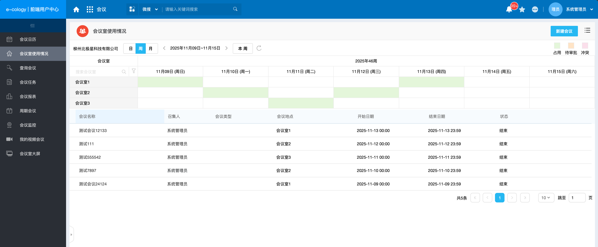
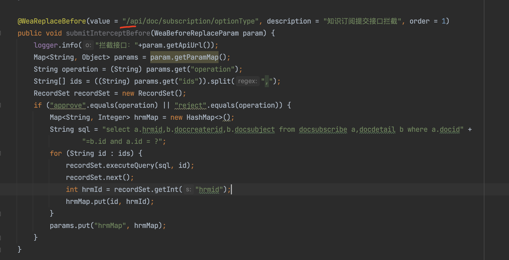
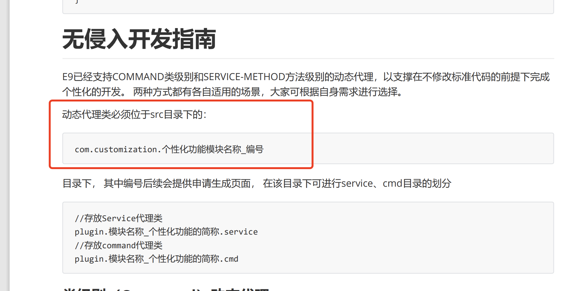

参考：E9BackendDdevelopmentGuide.pdf

[E9BackendDdevelopmentGuide.pdf](https://e-cloudstore.com/e9/file/E9BackendDdevelopmentGuide.pdf)

## 接口拦截

什么是接口拦截？

就是允许前端在调用后端接口时，在接口执行前或执行后进行拦截，可获取接口的传入参数、返回结果等数据。

## 创建接口拦截类

接口类路径必需在  com.*.impl 中，不然不会生效。

类必需有`@WeaIocReplaceComponent`注解，注解中可指定名称，不指定也可以。

```java

@WeaIocReplaceComponent("DocSearchIntercept")
public class DocSearchIntercept {
}

```

## 前置拦截

前置拦截是在接口执行之前拦截，此时接口的业务还未执行。前置拦截的主要作用是获取接口请求参数，但用途并不是很大，后置拦截也可以获取请求参数，一般都使用后置拦截。

在拦截类内创建一个方法，方法需加上`@WeaReplaceBefore`注解，注解中的3个属性必填，value 为需要拦截的接口路径，必需以 /api 开头，order 为拦截顺序，如果此接口有多个拦截，则按此顺序进行拦截，description 填写拦截说明。

```java

@WeaIocReplaceComponent
public class ApiInterceptDemo {
    
    @WeaReplaceBefore(value = "/api/ec/dev/table/datas", order = 1, description = "表格数据前置拦截")
    public void before(WeaBeforeReplaceParam param) {
        // 获取接口参数
        Map<String, Object> params = param.getParamMap();
    }
}

```

## 后置拦截

后置拦截就是在接口执行之后进行拦截，主要用途是修改接口的返回数据，和在接口执行之后，将接口的请求参数推送到第三方系统，比如在人力资源人员修改时调用接口，当接口执行后就需要将修改后的人员信息同步到第三方系统。

后置拦截需要在拦截类下创建一个方法，并在方法添加`@WeaReplaceAfter`注解，和前置拦截一样，这3个属性也是必填。

在后置拦截中我们可以对接口的返回数据进行修改，例如过滤不想要的数据。

```java

@WeaIocReplaceComponent
public class ApiInterceptDemo {
    
    @WeaReplaceAfter(value = "/api/ec/dev/table/datas", order = 1, description = "表格数据后置拦截")
    public String after(WeaAfterReplaceParam param) {
        // 获取接口参数
        Map<String, Object> params = param.getParamMap();
        String dataKey = (String) params.get("dataKey");
    
        // 可对接口执行结果进行更改，结果类型为 json
        String result = param.getData();
    
        // 返回接口执行结果
        return result;
    }
    
}

```

## 接口拦截示例

### 过滤会议

使用场景：会议室使用页面需要只保留会议室为某类型的会议



对会议页面中的表格数据接口进行后置拦截，roomTypes 为传入的接口参数，指定需要保留的会议室类型

```java

/**
 * 拦截表格数据获取接口，过滤会议数据，只保留指定会议室类型的会议。在 {@link #getRoomReportList} 方法中在 sql where 中添加了标记，
 * 根据此标记判断是否进行数据过滤。
 */
@WeaReplaceAfter(value = "/api/ec/dev/table/datas", order = 1,
        description = "会议过滤，根据传入的会议室类型参数，根据会议室类型过滤会议，只保留指定会议室类型的会议")
public String datas(WeaAfterReplaceParam param) {
    Map<String, Object> params = param.getParamMap();
    // 从接口参数中获取会议室类型
    String roomTypes = Util.null2String(params.
            get(RoomReportDataCmdProxyWithMeetingFilter.ROOM_TYPE_PARAM_NAME));
    // 接口执行结果
    String data = param.getData();
    // 如果没有会议室类型，或者该接口不是需要拦截的接口，返回原数据
    if (roomTypes.isEmpty() || !sqlWhereContainsFlag(params)) {
        return data;
    }
    
    // 对接口返回数据进行处理，过滤会议数据
    JSONObject dataJson = JSONObject.parseObject(data);
    if (dataJson.containsKey("datas")) {
        JSONArray datas = dataJson.getJSONArray("datas");
        // 过滤会议数据
        datas = filterMeetings(datas, Util.splitString2List(roomTypes, ","));
        dataJson.put("datas", datas);
        data = dataJson.toJSONString();
    }
    return data;
}
    
private JSONArray filterMeetings(JSONArray datas, List<String> roomTypes) {
    List<Object> newData = datas.stream().filter(i -> {
        JSONObject meeting = (JSONObject) i;
        String address = meeting.getString("address");
        if (StrUtil.isEmpty(address)) {
            return false;
        }
        List<String> roomIds = Util.splitString2List(address, ",");
        return roomsContainsAnyTypes(roomIds, roomTypes);
    }).collect(Collectors.toList());
    return new JSONArray(newData);
}java

```

### 添加流程菜单

示例：

```java

package com.engine.customization.demo.service.impl;
    
import com.alibaba.fastjson.JSONObject;
import com.engine.common.util.ParamUtil;
import com.engine.workflow.constant.menu.SystemMenuType;
import com.engine.workflow.constant.requestForm.RequestMenuType;
import com.engine.workflow.entity.requestForm.RightMenu;
import com.weaverboot.frame.ioc.anno.classAnno.WeaIocReplaceComponent;
import com.weaverboot.frame.ioc.anno.methodAnno.WeaReplaceAfter;
import com.weaverboot.frame.ioc.anno.methodAnno.WeaReplaceBefore;
import com.weaverboot.frame.ioc.handler.replace.weaReplaceParam.impl.WeaAfterReplaceParam;
import com.weaverboot.frame.ioc.handler.replace.weaReplaceParam.impl.WeaBeforeReplaceParam;
import org.slf4j.Logger;
import org.slf4j.LoggerFactory;
import weaver.hrm.HrmUserVarify;
import weaver.hrm.User;
import weaver.systeminfo.SystemEnv;
    
import javax.servlet.http.HttpServletRequest;
import javax.servlet.http.HttpServletResponse;
import java.util.ArrayList;
import java.util.List;
import java.util.Map;
    
/**
 * <Description> <br>
 * @author han.mengyu <br>
 * @version 1.0 <br>
 * @createDate 2021/12/29 <br>
 * @see com.engine.customization.demo <br>
 */
@WeaIocReplaceComponent("demoService") //如不标注名称，则按类的全路径注入
public class GetRightMenuProxy {
    private static final Logger LOGGER = LoggerFactory.getLogger("customlog");
    
    //这是接口前置方法，这个方法会在接口执行前执行
    //前值方法必须用@WeaReplaceBefore,这里面有两个参数，第一个叫value，是你的api地址
    //第二个参数叫order，如果你有很多方法拦截的是一个api，那么这个就决定了执行顺序
    //前置方法的参数为WeaBeforeReplaceParam 这个类，里面有四个参数，request，response，请求参数的map，api的地址
    @WeaReplaceBefore(value = "/api/workflow/reqform/rightMenu",order = 1,description = "rightMenu接口前置方法")
    public void rightMenuBefore(WeaBeforeReplaceParam beforeReplaceParam){
        Map paramMap = beforeReplaceParam.getParamMap();
        paramMap.putIfAbsent("iocTestKey", "1");
        LOGGER.debug("com.engine.customization.demo.service.impl.GetRightMenuProxy.rightMenuBefore start...");
    }
    
    @WeaReplaceBefore(value = "/api/workflow/reqform/rightMenu",order = 2,description = "/api/workflow/reqform接口前置方法")
    public void reqFormBefore(WeaBeforeReplaceParam beforeReplaceParam){
        String apiUrl = beforeReplaceParam.getApiUrl();
        LOGGER.debug("com.engine.customization.demo.service.impl.GetRightMenuProxy.reqFormBefore start...  apiUrl = [{}]", apiUrl);
    }
    
    //这个是接口后置方法，大概的用法跟前置方法差不多，稍有差别
    //注解名称为WeaReplaceAfter
    //返回类型必须为String
    //参数叫WeaAfterReplaceParam，这个类前四个参数跟前置方法的那个相同，不同的是多了一个叫data的String，这个是那个接口执行完返回的报文
    //你可以对那个报文进行操作，然后在这个方法里return回去
    @WeaReplaceAfter(value = "/api/workflow/reqform/rightMenu",order = 1,description = "rightMenu接口ioc方式添加按钮")
    public String rightMenuAfter(WeaAfterReplaceParam weaAfterReplaceParam){
        HttpServletRequest request = weaAfterReplaceParam.getRequest();
        HttpServletResponse response = weaAfterReplaceParam.getResponse();
    
        // 获取用户id
        User user = HrmUserVarify.getUser(request, response);
        // 获取请求参数
        Map<String, Object> requestMap = ParamUtil.request2Map(request);
        String data = weaAfterReplaceParam.getData();//这个就是接口执行完的报文
        LOGGER.debug("com.engine.customization.demo.service.impl.GetRightMenuProxy.rightMenuAfter start...  data = [{}]", data);
    
        Map<String, Object> parasedData = JSONObject.parseObject(data, Map.class);
        List<RightMenu> rightMenus = (List<RightMenu>) parasedData.getOrDefault("rightMenus", new ArrayList<>());
        RightMenu rightMenu = new RightMenu(SystemEnv.getHtmlLabelName(-81472, user.getLanguage()),
                RequestMenuType.BTN_CUSTOMIZE,
                "window.doProxyCmd(\"iocBtn\")",
                "icon-coms-daiban", 101, SystemMenuType.CUSTOMIZE);
    
        rightMenus.add(rightMenu);
        parasedData.put("rightMenus", rightMenus);
        return JSONObject.toJSONString(parasedData);
    }
    
}

```

注意问题

如果接口路径api前没有“/”可能会导致接口不能拦截



## Command 类代理

什么是 Command 类？Command 类是业务代码执行的类，例如接口一般分为3层，第一层是接口定义层，也就是 Controller 层，然后再到 Service 层，然后到 Command 层，Command 就是接口执行业务代码的地方，许多 Ecology 标准的接口都会在 Command 层执行业务逻辑。

可对 Command 类进行代理，如在 Command 类执行前或执行后进行业务处理。

类路径必需位于`com.customization`路径下

创建代理类需要使用`@CommandDynamicProxy`注解，target 填写被代理 Command 类的 class ，desc 填写代理说明，类需要继承`AbstractCommandProxy<>`并实现方法，`AbstractCommandProxy<>`中的范型类型为被代理类的 execute 方法的返回类型。

要获取被代理类的实例，可通过强转 execute 方法的参数获取

```

// 获取被代理类
GetRoomReportDataCmd cmd = (GetRoomReportDataCmd) command;

```

示例：

```java

@CommandDynamicProxy(target = GetRoomReportDataCmd.class, desc = "会议室数据接口动态代理，过滤会议，只保留指定会议室类型的会议")
public class CmdProxyDemo extends AbstractCommandProxy<Map<String, Object>> {
    private final IntegrationLog log = new IntegrationLog(CmdProxyDemo.class);
    
    @Override
    public Map<String, Object> execute(Command<Map<String, Object>> command) {
        // 获取被代理类
        GetRoomReportDataCmd cmd = (GetRoomReportDataCmd) command;
        // 获取请求参数，可获取到接口请求参数（有时不行）
        Map<String, Object> params = cmd.getParams();
        // 执行被代理类，获取执行结果
        Map<String, Object> result = nextExecute(cmd);
        
        try {
            // 对执行结果进行处理
        } catch (Exception e) {
            log.error("过滤会议发生异常", e);
        }
        return result;
    }
    
}

```

## 如何找到接口对应的 Cmd 类？

[[后端开发知识]]

可按照链接文档的"根据接口路径找到对应的类"进行查找

## 示例-会议数据过滤

`GetRoomReportDataCmd`类为会议数据的业务执行 cmd 类，可通过代理该 cmd 类，修改 cmd 类的执行结果，也就是会议数据，进行会议数据过滤，只保留某会议室类型的会议。

```java

@CommandDynamicProxy(target = GetRoomReportDataCmd.class, desc = "会议室数据接口动态代理，过滤会议，只保留指定会议室类型的会议")
public class RoomReportDataCmdProxyWithMeetingFilter extends AbstractCommandProxy<Map<String, Object>> {
    public static final String ROOM_TYPE_PARAM_NAME = "meetingRoomType";
    private final IntegrationLog log = new IntegrationLog(RoomReportDataCmdProxyWithMeetingFilter.class);
    
    private final RecordSet recordSet;
    private final MeetingFilterHelper meetingFilterHelper;
    
    public RoomReportDataCmdProxyWithMeetingFilter(RecordSet recordSet, MeetingFilterHelper meetingFilterHelper) {
        this.recordSet = recordSet;
        this.meetingFilterHelper = meetingFilterHelper;
    }
    
    public RoomReportDataCmdProxyWithMeetingFilter() {
        this.recordSet = new RecordSet();
        this.meetingFilterHelper = new MeetingFilterHelper(recordSet);
    }
    
    @Override
    public Map<String, Object> execute(Command<Map<String, Object>> command) {
        GetRoomReportDataCmd cmd = (GetRoomReportDataCmd) command;
        Map<String, Object> result = nextExecute(cmd);
    
        try {
            Map<String, Object> params = cmd.getParams();
            // 该参数为前端页面传入的参数，根据该参数指定需要过滤的会议类型
            String meetingRooms = Util.null2String(params.get(ROOM_TYPE_PARAM_NAME));
            if (meetingRooms.isEmpty()) {
                return result;
            }
            List<String> meetingRoomList = Util.splitString2List(meetingRooms, ",");
            if (meetingRoomList.isEmpty()) {
                log.info("传入的会议室类型为空");
                return result;
            }
    
            if (!result.containsKey("datas")) {
                log.info("不存在 datas");
                return result;
            }
    
            log.info("启用会议过滤");
            changeData(result, meetingRoomList);
        } catch (Exception e) {
            log.error("过滤会议发生异常", e);
        }
        return result;
    }
    
    private void changeData(Map<String, Object> result, List<String> roomTypeList) {
        @SuppressWarnings("unchecked")
        List<Map<String, Object>> datas = (List<Map<String, Object>>) result.get("datas");
        filterMeetings(roomTypeList, datas);
        result.put("datas", datas);
    }
    
    /**
     * 过滤数据中的会议，数据中的会议室的会议室类型需要在传入的会议室类型中，否则将该会议室的会议数据清空
     */
    private void filterMeetings(List<String> roomTypeList, List<Map<String, Object>> datas) {
        datas.forEach(room -> {
            String roomId = Util.null2String(room.get("roomid"));
            Optional<Integer> roomTypeOp = meetingFilterHelper.getRoomType(Integer.parseInt(roomId));
            if (!roomTypeOp.isPresent() || !roomTypeList.contains(roomTypeOp.get().toString())) {
                room.put("info", new ArrayList<>());
            }
        });
    }
    
}

```

## service 方法代理

我已经验证，无法对自行二开的 service 类进行代理。

## 相关问题

## cmd代理类不生效问题

路径不对，cmd代理类必需位于以下目录


