## 常见数据库表

### 组织架构表

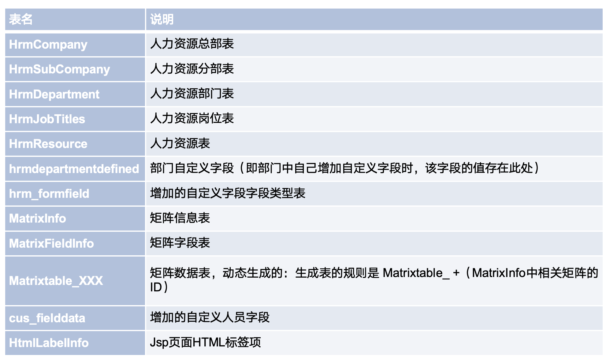

### 流程表

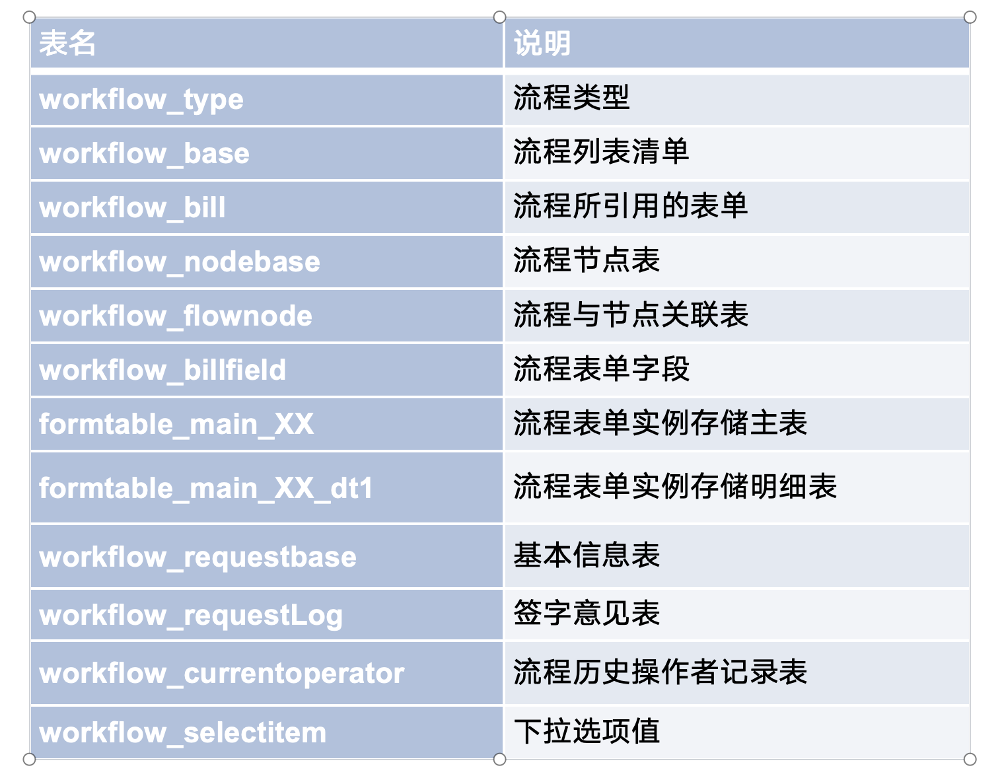

### 权限表

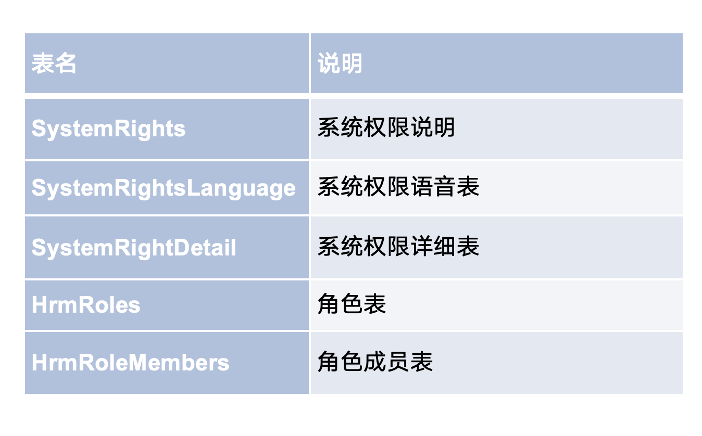

### 案例分析

1、如果用户的密码不记得了怎么办？

Hrmresource

2、如果系统管理员的密码不记得了怎么办？

hrmresourceManager

4、如果自定义人事卡片的数据要批量修改怎么做？

Cus_fileddate

5、流程签字意见写错了怎么修改？

Workflow_requestLog

6、根据流程requestid查询该流程由哪个用户提交、当前处理人是哪个用户

Workflow_requestBase

## workflow_currentoperator 流程流转操作者表

该表可获取流程流转中节点的操作人，可获取操作人的提交时间、操作类型、是否超时等信息

### 查询流程状态是否为意见征询

查询 workflow_currentoperator 表，takisremark 字段为2（是意见征询接收人） ，并且 isremark 字段为1（转发）

isremark 为 0（未操作）,takisremark 为 -2 （是未回复前意见征询人状态）

意见征询人，则takisremark 字段为2（是意见征询接收人） ，并且 isremark 字段为2（已操作）

isremark 为 0（未操作）,takisremark 为 0 （是回复后意见征询人状态）

takisremark 字段为空

### 查询操作人最后一次操作记录

这样就能查到操作人最新的记录，根据islasttimes 字段判断，0 是历史记录，1 是最新记录

### 查询流程是否超时

只查询未提交的操作者，只要有操作者超时就算已超时

isprocessed 表示超时处理，不为空时表示流程已超时

islasttimes 查询最后一次操作

```sql

SELECT isprocessed,isremark,userid,islasttimes from workflow_currentoperator  where requestid=534536
and isprocessed is not null and islasttimes=1 and isremark !=2 and isremark!=4

```

### isremark 字段

如果是未操作，操作者有流程提交或审批权限，则 isremark 为 0 ，如果操作人为转发， isremark 为 1 ，其它的操作类型也有对应的值，如果是为已操作，无论什么类型 isremark 都为 2（已操作）

## hrmresource 人力资源表

该表是存储所有人员信息

### 查询人员状态

status 字段是人员状态，但是它是一个选项id，直接查是获取不到中文名称的。

获取状态的多语言名称：

比如需要在流转意见中显示人员状态，并支持多语言，比如切换英语，状态就要用英文。

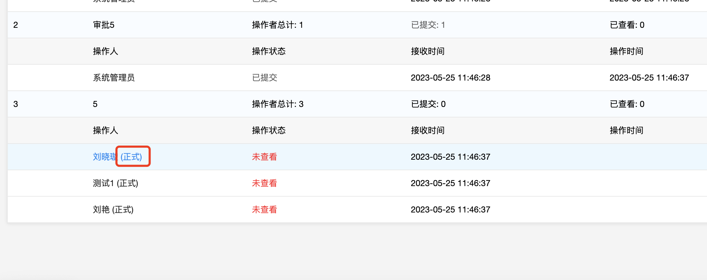

要获取到多语言名称，需要关联另一个表进行查询，语句为：

```sql

select s.SELECTNAME from hrmresource h,hrm_SelectItem s where h.id = ? and s.fieldid = 11
and s.SELECTVALUE = h.status

```

查到的是一个标签，放到前端就可以支持多语言

## SystemSet 系统设置表

systemset 表为系统设置表，可以获取到系统的一些设置

例如获取系统的访问地址

```

select oaaddress from SystemSet

```

## workflow_bill 工作流单据信息表

可用于查询流程表单信息，也可以查询建模表单信息，可通过 workflow_base 的 formid 关联 workflow_bill 表的id。

字段说明：

## SQL

### 查询表单字段类型

```sql

SELECT 
  b.fieldname AS '数据库字段名',
  h.labelname AS '字段显示名称',
  b.fielddbtype AS '字段类型',
  b.type AS '字段控件类型',
	b.fieldhtmltype as '单据字段页面类型' 
FROM workflow_billfield b
JOIN HtmlLabelInfo h ON b.fieldlabel = h.indexid 
WHERE 
  h.languageid = 7  -- 限定中文环境
  AND b.billid = -16  -- 替换为实际表单ID（负值表示自定义表单）

```

### 查找独立选择框的选项名称

fieldid：字段id后面的数字

SELECTVALUE：选项id

```sql

select SELECTNAME from workflow_selectitem where fieldid =? and SELECTVALUE = ?

```

数据表联查，根据流程表名、字段名、字段值找到选项名称

```sql

SELECT
	s.SELECTNAME 
FROM
	workflow_selectitem s,
	workflow_bill b,
	workflow_billfield f 
WHERE
	s.SELECTVALUE = 1 
 AND s.fieldid = f.id 
 AND f.fieldname = 'xlk' 
 AND f.billid = b.id 
 AND b.tablename = 'formtable_main_16'

```

### 查找公共下拉框字段的显示值

这个表可以查到公共选择框的信息

select * from mode_selectitempage WHERE id =1;

这个表查找公共选择框选项信息，mainid为mode_selectitempage的id

SELECT * from mode_selectitempagedetail where mainid = 1

流程字段的值就是查询结果的顺序，从0开始，例如d选项的字段值就为2

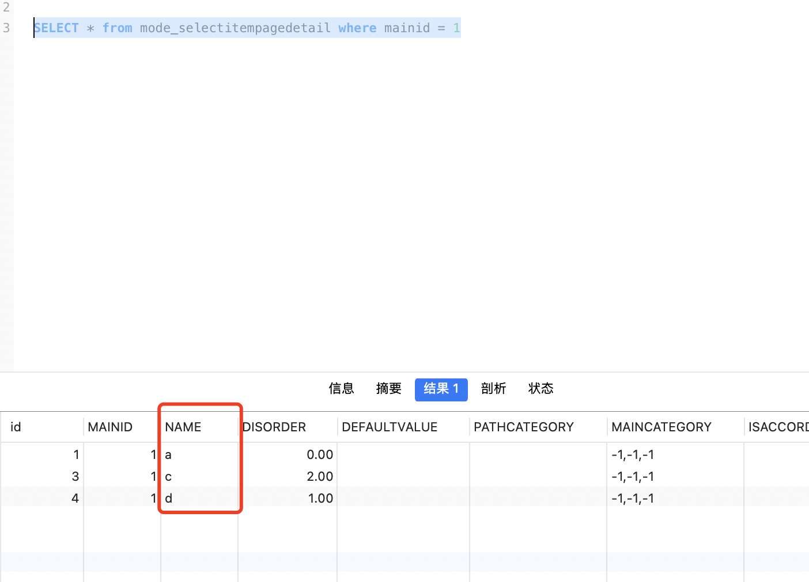

### 查询节点设置的操作者

Workflow_HrmOperator 存储了节点操作者信息

workflow_groupdetail表中的type表示操作者设置的类型，如指定人，流程创建人，所有人，指定部门，type为3时为指定人，为17时为流程创建人

```sql

SELECT
wng.groupname AS 操作组名称,
wh.objid AS 人员ID
FROM
workflow_groupdetail wgd
INNER JOIN
Workflow_HrmOperator wh ON wgd.id = wh.groupdetailid
INNER JOIN
workflow_nodegroup wng ON wgd.groupid = wng.id
WHERE
wgd.type = 3
and wng.nodeid = 224

```

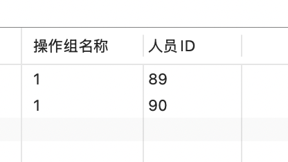

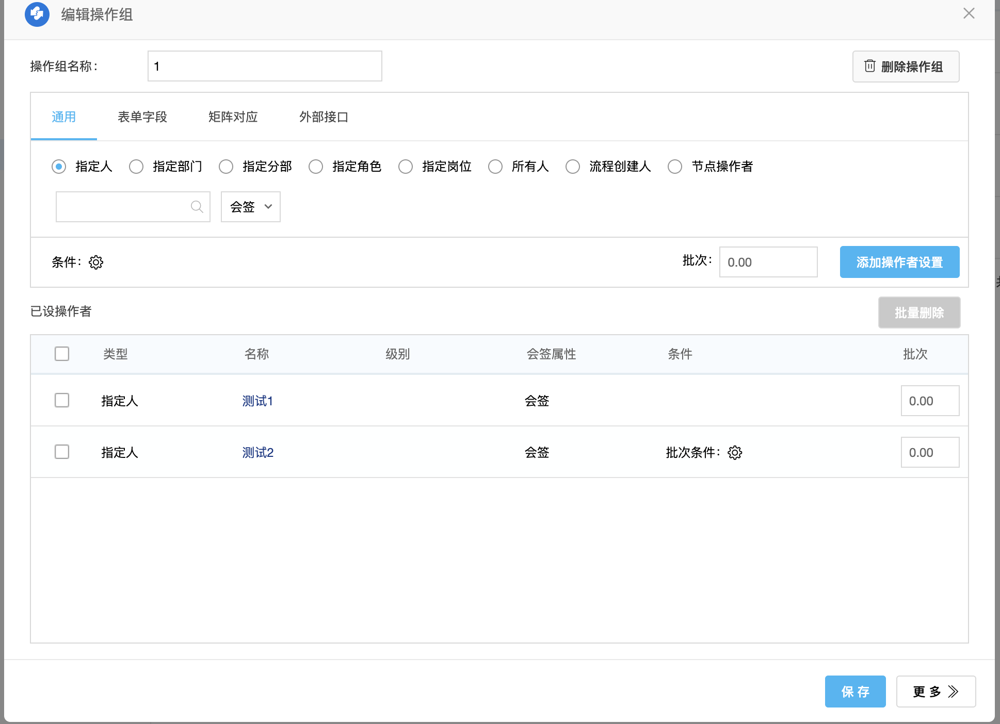

### 查询指定用户的待办

查询指定用户和指定流程的待办

```sql

SELECT
	c.WORKFLOWID,
	r.REQUESTNAME,
	c.USERID,
	c.RECEIVEDATE,
	c.RECEIVETIME
FROM
	workflow_currentoperator c
 JOIN workflow_requestbase r ON r.requestid = c.requestid 
 AND (
		ifnull( r.currentstatus,- 1 ) = - 1 
		OR (
			ifnull( r.currentstatus,- 1 )= 0 
		AND r.creater=c.USERID)) 
 AND ( r.deleted <> 1 OR r.deleted IS NULL OR r.deleted = '' )
 JOIN workflow_base b ON c.workflowid = b.id 
 AND b.isvalid IN ( '1', '3' ) 
WHERE
	c.WORKFLOWID = 55 -- 查询指定流程
 AND c.USERID = 1 -- 查询指定用户的待办
 AND c.usertype = 0 
 AND ((
			c.isremark = '0' 
			AND ( c.takisremark IS NULL OR c.takisremark = 0 )) 
 OR c.isremark IN ( '1', '5', '8', '9', '7', '11' )) 
 AND c.islasttimes = 1

```

### 查询最新版本的文档附件（包括正文）

```sql

SELECT
	t1.imagefilename,
	t1.imagefileid,
	t1.iszip,
	t2.docfiletype,
	t2.isextfile 
FROM
	imagefile t1
 join docimagefile t2 on t1.imagefileid = t2.imagefileid 
WHERE
	t2.docid =?
 AND t2.versionid = (
		SELECT
			MAX( versionid ) 
		FROM
			docimagefile 
		WHERE
		id = t2.id 
 )

```

docimagefile 表存放的是文档附件数据，也包括正文，如果附件存在多个版本，id相同，versionid不相同，可以取最大的versionid来获取最新版本的附件

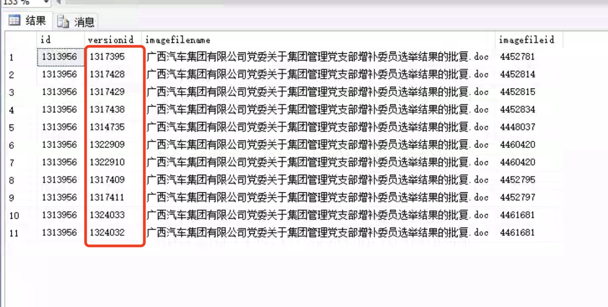

### 获取文档存放路径

查找 docid 为53 的文档文件存放路径（包含正文和附件）

```

select t1.filerealpath,t1.imagefilename,t1.imagefileid,t2.docfiletype,t2.isextfile from imagefile t1, docimagefile t2 where t1.imagefileid=t2.imagefileid and t2.docid=53

```

如果需要区分正文，可以通过 isextfile 判断，为空是正文，为1是附件

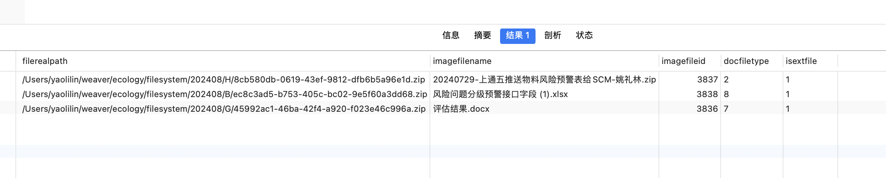

### 获取当前节点id

示例：

```sql

SELECT nownodeid FROM workflow_nownode WHERE requestid = 531592

```

workflow_nownode 存放了当前流程所处的节点

### 查询下个节点信息 workflow_nodelink

比如查询177节点下个节点的节点id

```

select destnodeid,newrule from workflow_nodelink where nodeid = 177

```

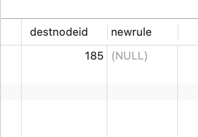

如果属于分叉节点，下个节点有多个节点将返回多个节点id

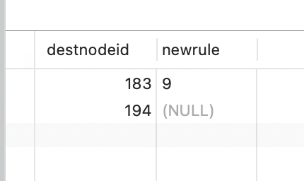

可根据 newrule 查询节点的条件，newrule 为 rule_base 表的id

```sql

SELECT * from rule_base where id = 9

```

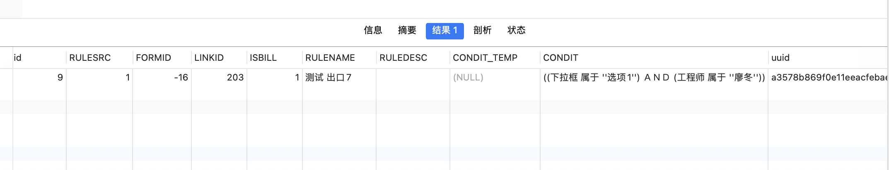

### 获取公文流程类型

通过workflow_base表字段判断

### 查询流程类型

查询指定流程的流程类型：

```sql

SELECT workflowtype from workflow_base where id=?

```

流程类型表：

workflow_type

### 根据表单id查找表单名称

```sql

SELECT TABLENAME from workflow_bill where id=-16

```

### 获取流程存为文档的文件路径

查询sql获取文件存储路径

```sql

SELECT i.FILEREALPATH,i.IMAGEFILENAME,i.IMAGEFILEID  from docdetail d,docimagefile f,imagefile i where FROMWORKFLOW =[请求id]  and d.id = f.docid and i.imagefileid = f.IMAGEFILEID

```

### 获取流程的流程存为文档的目录id

查找指定流程的流程存为文档的存放目录，查出的是存放的目录id

```

select wfdocpath from workflow_base where id =44

```

### 根据表单数据库名称查询流程

```

select w.id,w.WORKFLOWNAME,b.TABLENAME,b.id formId from workflow_base w 
join workflow_bill b on w.FORMID = b.id

```

### 查询建模表名

modeinfo 表是存储建模信息，可根据建模id查询到建模表名

```

select b.tablename from modeinfo a left join workflow_bill b on a.formid=b.id where a.id=[建模id]

```

### 获取建模表名对应的模块id（formmodeid）

sql：

```

select b.id from workflow_bill a,modeinfo b where a.tablename = 'uf_name' and b.formid = a.id

```

将“uf_name”改为要查询的表名

### 查询节点中配置的操作者

相关类：com.engine.workflow.cmd.workflowPath.node.operatorSetting.GetOperatorListCmd

数据库表：workflow_groupdetail

操作者字段：objid

操作者类型：type  3为人力资源类型，1为部门

操作组id：groupid

根据操作组id查找操作者的sql：

```sql

SELECT
	id,
	groupid,
 TYPE,
	objid,
	deptField,
	subcompanyField,
	level_n,
	level2_n,
	conditions,
	conditioncn,
	orders,
	signorder,
CASE
		WHEN signorder IN ( '3', '4' ) THEN
		10000 + signorder ELSE 1 + orders 
 END AS sort,
	IsCoadjutant,
	signtype,
	issyscoadjutant,
	issubmitdesc,
	ispending,
	isforward,
	ismodify,
	coadjutants,
	coadjutantcn,
	virtualid,
	ruleRelationship,
	jobfield,
	jobobj,
	bhxj
from  workflow_groupdetail  where groupid =  47

```

## MySQL数据库修改表单字段的浮点数位数

根据平时的项目实际情况掌握到，部分用户在上线后，提出需要将表单字段（浮点数2位）改为浮点数4位，那我们可以通过数据库实现，具体操作步骤如下：

MySQL修改字段示例(浮点数调整位数)

第一步：查询workflow_billfield表对应的数据id

-- fieldname:代表修改的主表字段名称，BILLID:代表修改字段的主表名的id，查询数据ID

举例：

select * from workflow_billfield where fieldname='mll' and BILLID='-182';

-- fieldname:代表修改的明细字段名称，detailtable:代表修改字段的明细表名，查询数据ID

语句：

Select * from workflow_billfield where fieldname='mll' and detailtable='formtable_main_182';

第二步：修改逻辑表的字段类型

--逻辑表 修改对应ID的类型【decimal(38,2) 改为 decimal(38,4)】

语句：

update workflow_billfield set fielddbtype='decimal(38,4)' where id = 10394;

第三步：修改历史数据

（1）--alter table 数据表名 add COLUMN 临时字段名称 decimal(38,4);

语句：

alter table formtable_main_182 add COLUMN payamt_tmp decimal(38,4)

（2）-- update 数据表名 set 临时字段名称=原字段名称;

语句：update formtable_main_182 set payamt_tmp = mll;

（3）-- alter table 数据表名 drop column 原字段名称;

语句：alter table formtable_main_182 drop COLUMN mll;

（4）-- alter table 数据表名 change 临时字段名称 原字段名称 decimal(38,4);

语句：alter table formtable_main_182 change payamt_tmp mll decimal(38,4);

最后通过系统访问：`http://ip:端口/commcache/cacheMonitor.jsp` 清除数据库缓存。

（先关闭缓存，再开启缓存）

参考：

https://e-cloudstore.com/doc.html?appId=7635c77c95214b89afb968a2794c167b#E9%E6%B5%81%E7%A8%8B%E8%A1%A8%E5%8D%95%E4%BF%AE%E6%94%B9%E5%AD%97%E6%AE%B5%E7%B1%BB%E5%9E%8B