## 开发资料链接集合

[[e9 开发资料链接]]
## 开发规范

### 重写组件参数和重写组件函数不能用异步

如果加上异步（async），则函数返回的是 Promise 对象，会对其它需要重写该组件的地方造成影响，因为 props 拿到的是 Promise 对象而不是参数

错误示例：不要在 fn 函数加上`async`

```javascript

ecodeSDK.overwritePropsFnQueueMapSet('Tabs', {
  fn: async (props) => {
    
  },
})

```

会造成在其它需要重写该组件的地方拿不到参数：

```javascript

ecodeSDK.overwritePropsFnQueueMapSet('Tabs', {
  fn: (props) => {
    // props 拿到的是 Promise 对象而不是参数
  },
})

```

## Ecode 开发
### ecode 应用
#### 配置文件

##### 编写配置文件

配置信息最好不要写在代码内，而是写在配置文件中。

配置文件在 config 目录中，配置信息需要写在 config.js 里。

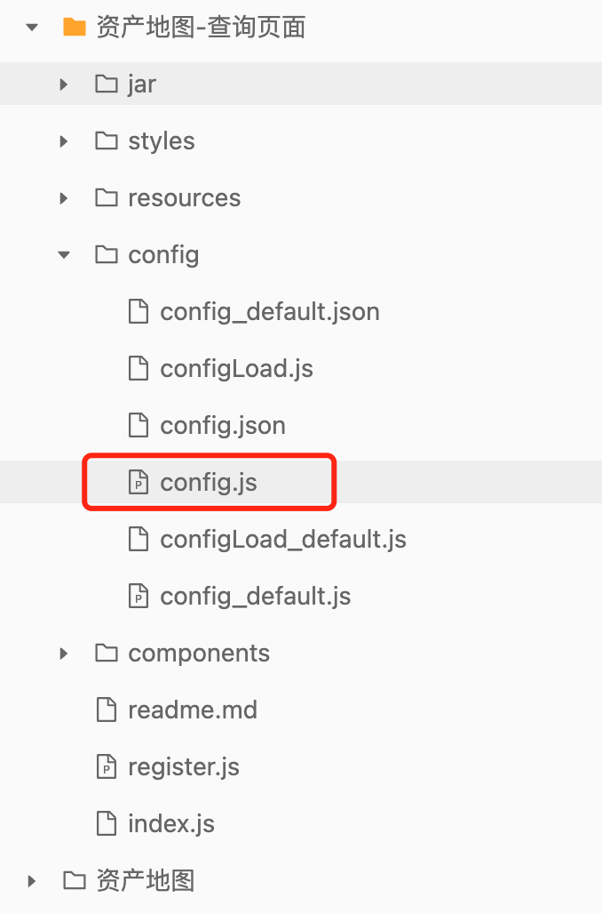

config.js 配置文件代码示例：

```javascript

const config = {
  // 高德地图key，默认使用系统自带的key
  mapKey:'53a92850ca00d7f77aef3297effd8d59',
  // 建模查询id
  searchId:106,
  // 点击可以显示地图的字段名
  showMapFieldName:'zcmc',
  // 建模的详细地址字段名
  locationFieldName:'xxdz',
  // 地图显示占据的宽度，值为页面宽度的百分比
  mapWidth:50,
  // 地图显示高度,值为页面高度的占比
  mapHeight:100,
  // 地图距离顶部高度，单位px
  mapTop:0,
  // 是否显示填写经纬度
  editPoint:true,
  // 地图上方的标题
  title:'资产位置',
}
    
ecodeSDK.setCom('${appId}','config',config);

```

配置文件是前置加载的，需要用`ecodeSDK.setCom()`对 config 对象进行发布。

##### 使用配置文件

由于配置文件发布所在的js文件是前置加载的，因此在导入配置文件时不需要异步获取，可通过`ecodeSDK.getCom()`获取，无论是在前置加载js文件还是在非前置加载js文件都能获取，例如：

第一个参数是配置文件所在的应用id，第二个参数是配置信息对象的名称，也就是发布时填入的名称。

```javascript

const config = ecodeSDK.getCom('${appId}','config');

```

示例：在替换组件时根据配置文件判断是否为指定页面

```javascript

// 替换表格组件
ecodeSDK.overwriteClassFnQueueMapSet('Table',{
  fn:(Com,props)=>{
    if(!isTargetPage() || props._noOverwrite){
      return;
    } 
    return {props,com:CustomTable}
  }
});
    
const CustomTable = (props)=>{
  const params ={
    appId:'${appId}',
    name:'CustomTable',
    isPage:false,
    noCss:true,
    props
  }
  const NewCom = props.Com;
  return window.comsMobx?ecodeSDK.getAsyncCom(params):(<NewCom {...props}/>);
}
    
function isTargetPage(){
  // 获取配置
  const config = ecodeSDK.getCom('${appId}','config');
  if(!config){
    return false;
  }
  // 根据配置中的 searchId 判断是否为指定页面
  if(location.href.includes('main/cube/search?customid='+config.searchId)){
    return true;
  }
  try{
    if(ModeList){
      var customId = ModeList.getCustomID();
      if(Number(customId) === config.searchId){
        return true
      }
    }
  }catch(e){
    
  }
    
  return false;
}

```

#### 获取资源文件

可获取 resources 文件夹内的资源文件，比如图片

路径：`${appRes}/resourceName`


### 接口拦截

#### 拦截接口请求

在接口请求时拦截，此时接口还没到后端，一般用于添加请求参数，配合后端开发，后端根据添加的请求参数进行开发。

fn 函数参数：

示例：GET 接口添加请求参数

```javascript

ecodeSDK.rewriteApiParamsQueueSet({
  fn: (url, method, params, type, fetchParams) => {
    if (url.indexOf('api/govern/pro/getProjectCount') != -1) {
      // 添加请求参数，POST 接口可能无效
      params.isSxOnly = 1;
      // 可通过添加地址参数来添加请求参数
      const urlSplit = url.split('?');
      url = urlSplit[0] + '?isSxOnly=1&' + urlSplit[1];
    }
    
    return {
      url,method,params,type, fetchParams
    }
  },
  desc: '拦截督查督办统计接口，传入参数只统计事项'
});

```

对于POST的接口，可以在 params中 或 fetchParams 添加参数。

注意，可能向 params 添加参数会无效，需要向 fetchParams.body 中添加参数，这个我也不懂为什么，在一个系统中向 params 添加参数生效，而在另一个系统中却不行。

例如

```javascript

ecodeSDK.rewriteApiParamsQueueSet({
  fn: (url, method, params, type, fetchParams) => {
    if ((location.href.includes('main/meeting/roomPlan') || location.href.includes('main/meeting/RoomPlan')) && apiUrls.includes(url)) {
      const roomType = getUrlParam(PARAM_NAME);
      if(roomType){
        // 添加请求参数
        params.meetingRoomType = roomType;
        fetchParams.body +='&meetingRoomType='+roomType
      }
    }
    return {
      url: url,
      method: method,
      params: params,
      type,fetchParams
    }
  },
  desc: '拦截会议数据请求接口，根据链接中的会议室类型过滤会议，只保留指定的会议室类型的会议'
});

```

##### 添加参数不生效问题

接口拦截一定要返回 url, method, params, type, fetchParams ,否则会导致其它接口拦截添加参数不生效

例如以下是错误的，没有返回数据

```javascript

ecodeSDK.rewriteApiParamsQueueSet({
  fn: (url, method, params, type, fetchParams) => {
    if(url.indexOf('api/workflow/reqlist/splitPageKey') !== -1){
      selectedWorkflowId = params.workflowid;
    }
    // 此处没有 return 数据
  },
  desc: '获取待办流程列表的指定流程id'
});

```

正确的是需要返回数据对象

```javascript

ecodeSDK.rewriteApiParamsQueueSet({
  fn: (url, method, params, type, fetchParams) => {
    if(url.indexOf('api/workflow/reqlist/splitPageKey') !== -1){
      selectedWorkflowId = params.workflowid;
    }
    return {
      url, method, params, type, fetchParams
    }
  },
  desc: '获取待办流程列表的指定流程id'
});

```

对于 POST 接口，只向 params 添加参数可能不起作用，需要向 fetchParams.body 添加参数，例如：

```javascript

fetchParams.body +='&meetingRoomType='+roomType

```

#### 拦截接口返回数据

接口调用后进行拦截，此时接口已经请求到数据，一般用于对接口数据进行处理，比如过滤接口中的数据。

```javascript

ecodeSDK.rewriteApiDataQueueSet({
   fn:(url,params,datas)=>{
    
    if(url.indexOf('api/hrm/resource/getResourceCard') ==-1){
      return datas;
    }
    
    const cards = datas.result;
    for(i =0;i<cards.length;i++){
      if(cards[i].title == '基本信息'){
        cards[i].items = cards[i].items.slice(0,6);
      }
    }
    return datas;
  },
  desc:'人员信息查看页面过滤部分信息'
})

```

##### 修改返回数据不生效原因

返回新的对象不会生效，只能修改对象中的属性

```javascript

ecodeSDK.rewriteApiDataQueueSet({
   fn:(url,params,datas)=>{
    
    if(url.indexOf('api/hrm/resource/getResourceCard') ==-1){
      return datas;
    }
    // 不生效
    // const newData = {value:1};
    // return newData;
    // 正确示例
    datas.value=1;
    return datas;
  },
  desc:'人员信息查看页面过滤部分信息'
})

```

### 组件导入导出与发布

#### 导出组件

导出使用`ecodeSDK.exp()`进行导出，与 js 的导出语句 export 类似，导出的组件只在当前应用可获取。

```xml

class ListSqlQuery extends React.Component{
    
  render(){
    return (
      <div>
      </div>
    )
  }
}
    
ecodeSDK.exp(ListSqlQuery)

```

#### 导入组件

导出组件使用`ecodeSDK.imp()`,传入组件的名称。只能导入当前应用通过`ecodeSDK.exp`导出的组件。

```javascript

const ListSqlQuery = ecodeSDK.imp(ListSqlQuery);

```

#### 发布组件

使用`ecodeSDK.setCom()`进行发布，第1个参数为当前应用id，可通过`${appId}`字符串获取，第二个参数为发布的组件名，第3个参数为组件类。

发布的组件可在其它应用内获取。

```

ecodeSDK.setCom('${appId}','DevToolsPage',DevToolsPage);

```

#### 获取发布的组件

可获取任意应用发布的组件。

无论是在前置加载文件还是非前置加载组件，都需要异步获取组件，除非组件在前置加载js发布，如配置文件。

##### ecodeSDK.getCom 获取组件

只适合组件定义在前置加载页面（如配置文件中发布的配置对象），可在前置加载文件和非前置加载文件同步获取组件。

```javascript

// appId 组件发布所属应用id，comName 组件发布的名称
const com = ecodeSDK.getCom('appId','comName');

```

##### ecodeSDK.getAsyncCom 异步获取组件

该方法适合在非前置加载文件定义的组件，在前置加载文件或非前置加载文件进行获取，可用于将组件渲染到页面或将组件传入到组件替换钩子函数中。

该方法可能对将其作为 React 组件的子组件无效。

先定义一个变量，获取组件，修改 params 中的 appId 和 name 这两个参数，修改为组件发布所在应用id和组件发布的名称。

pc端：

```javascript

const newBrowser = (props)=>{
  const params ={
    appId:'${appId}',
    name:'NewBrowser',
    isPage:false,
    noCss:true,
    props
  }
  return ecodeSDK.getAsyncCom(params);
}

```

移动端：

```javascript

const NewTabs = (props)=>{ //此函数不允许写在复写方法内，会导致实例重复创建，也就是dimout不断执行
  const acParams = {
      appId:'${appId}', //appId会自动识别
      name:'NewTabs', //模块名称
      isPage:false, //是否是路由页面
      noCss:true, //是否禁止单独加载css，通常为了减少css数量，css默认前置加载
      props
  }
  return ecodeSDK.getAsyncCom(acParams);
}

```

将组件渲染到页面：

```javascript

const PartyRemindPersonal = (props)=>{
  const params ={
    // 组件发布所在应用id
    appId:'${appId}',
    // 组件发布的名称
    name:'PartyRemindPersonal',
    isPage:false,
    noCss:true,
    props
  }
  return ecodeSDK.getAsyncCom(params);
}
    
function addModal(){
    const div = document.createElement("div");
    div.id = 'rdzn';
    document.getElementById('container').appendChild(div);
    // 使用发布的组件
    ReactDOM.render(<PartyRemindPersonal/>,div);
}

```

在组件替换函数中使用发布的组件：

```javascript

ecodeSDK.overwriteClassFnQueueMapSet('WeaEchart', {
  fn: (Com,props) => {
    // 一定要加 props._noOverwrite，不然会报错，防止无限重写
    if(!location.href.includes('/main/cube/search?customid=588') || props._noOverwrite){
      // 条件不满足，不进行替换
      // 如果判断不为目标组件，返回空即可，切勿返回自己写的组件，否则会导致目标组件一直被替换为自己写的组件，令其它组件替换不生效
      return;
    }
    
    // 使用发布的组件
    return{
      com:report,
      props:props
    }
  },
  desc: '修改统计饼图的样式，图例显示在右边'
});
    
// 获取发布的组件
const report = (props)=>{
  const params ={
    appId:'${appId}',
    name:'Report',
    isPage:false,
    noCss:true,
    props
  }
  const NewCom = props.Com;
  return window.comsMobx?ecodeSDK.getAsyncCom(params):(<NewCom {...props}/>);
}

```

##### 在组件内使用发布的组件

该方法适合将发布的组件作为子组件使用，例如：

```xml

<div>
    // 发布的组件作为子组件
    <YourCom />
</div>

```

需要用到 Ecode 的一个接口，用来加载组件发布所属的 ecode 应用，当加载完成后会执行 cb 回调函数，此时就能获取到该 ecode 应用内的所有发布的组件了，可以在此处使用`ecodeSDK.getCom`获取到发布的组件。

```

ecodeSDK.load(
    {
        id: 'appId',
        cb: () => {
            // ecode 应用加载完成回调，在此处获取组件
        }
    },
);

```

获取发布组件的方法如下：

```javascript

class App extends React.Component {
    constructor(props){
        super(props);
        this.state={
            homeLoaded:false,
            Home:null
        }
    }
    
    componentDidMount() {
        ecodeSDK.load(
            {
                id: 'ab8f5aa5721e44d0bbec52aaa6d21d53',
                cb: () => {
                    // 获取该 ecode 应用内的 home 组件
                    const Home = ecodeSDK.getCom('ab8f5aa5721e44d0bbec52aaa6d21d53', 'home');
                    // 将获取的组件传入 state 中
                    this.setState({
                        homeLoaded: true,
                        Home
                    });
                }
            },
        );
    }
    
    render() {
        const {homeLoaded,Home,user} = this.state;
        const rightIcon = ;
    
        return (
            <div>
                {
                    homeLoaded ? <Home user={user}>
                        <List>
                            <Item extra={rightIcon} onClick={()=> this.toGoodBenefitsPage() }>好福利首页</Item>
                        </List>
                    </Home> : null
                }
    
            </div>
    
        )
    
    }
}

```

### 组件参数复写

组件参数复写的作用是改变组件的参数，从而实现改变组件的功能、数据、样式等。

调用`ecodeSDK.overwritePropsFnQueueMapSet(name,obj)`方法，第一个参数是组件名称，第二个参数为一个对象，里面包含必要的 fn 属性，fn 中的 props 参数为组件参数。

必需写在前置加载文件中。

以下是重写 WeaReqTop 组件参数的示例：

```

ecodeSDK.overwritePropsFnQueueMapSet('WeaReqTop',{
  fn:(props)=>{
    // 执行必要的判断，是不是要重写参数的组件，可根据页面链接、ecId判断
    if(location.href.includes('spa/workflow/static4form/index.html') && props.buttons.length > 0){
    
    }
  }
});

```

#### 示例-为流程页面右上角菜单的按钮添加点击事件

```javascript

/**
 * @author 姚礼林
 * @desc pc端流程联系管理员按钮添加点击动作，显示管理员信息对话框
 */
ecodeSDK.overwritePropsFnQueueMapSet('WeaReqTop',{
  fn:(props)=>{
    if(location.href.includes('spa/workflow/static4form/index.html') && props.buttons.length > 0){
      const buttons = props.buttons;
      buttons.forEach(i=>{
        if(i.props.title ==='联系管理员'){
          i.props.onClick = ()=>{
            showManagerDetail();
          }
        }
      });
      const dropMenus = props.dropMenuDatas;
      if(dropMenus.length>0){
        dropMenus.forEach(i=>{
          if(i.content ==='联系管理员'){
            i.onClick=()=>{
              showManagerDetail();
            }
          }
        })
      }
    }
  }
});

```

#### 示例-新建流程页面添加页签

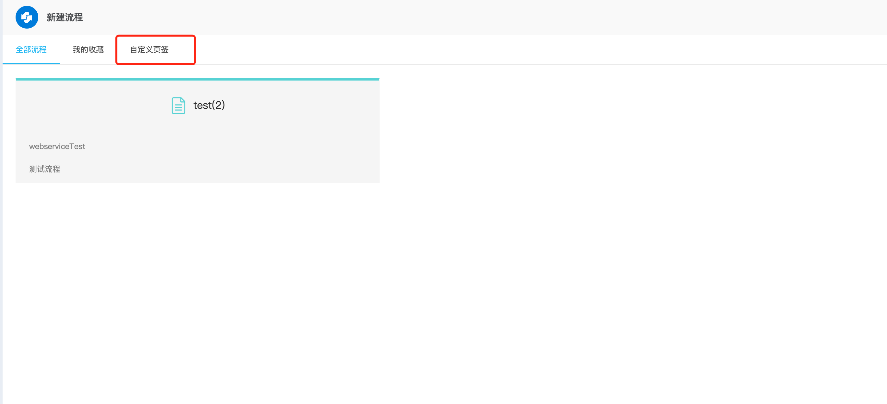

重写 WeaTab 组件参数，在参数的 datas 中添加页签数据

```javascript

ecodeSDK.overwritePropsFnQueueMapSet('WeaTab',{
  fn:(newProps,name)=>{
    debugger
    const url = window.location.href;
    if(url.indexOf('main/workflow/add?')==-1){
      return;
    }
    const tabData = {
        title: "自定义页签",
        key: "3"
    }
    if(newProps.datas.length==0){
      return newProps;
    }
    let isAdded = false;
    newProps.datas.forEach( i =>{
      if(i.key =="3"){
        isAdded = true;
      }
    });
    if(!isAdded){
      newProps.datas.push(tabData);
    }
    return newProps;
  },
  order:5,
  desc:'在新建流程页面添加一个页签'
});

```

### 组件替换（重写）

很多都可以通过重写组件参数来对组件进行二开，如果组件参数重写不能实现才使用组件替换，组件替换就是将原来的组件替换成你写的组件，可以实现更加复杂的功能。

以及比较适用于需要在原本组件内添加组件的场景。

必需写在前置加载文件中。

register.js

```javascript

ecodeSDK.overwriteClassFnQueueMapSet('WeaEchart', {
  fn: (Com,props) => {
    // 一定要加 props._noOverwrite，不然会报错，防止无限重写
    if(!location.href.includes('/main/cube/search?customid=588') || props._noOverwrite){
      // 条件不满足，不进行替换
      // 如果判断不为目标组件，返回空即可，切勿返回自己写的组件，否则会导致目标组件一直被替换为自己写的组件，令其它组件替换不生效
      return;
    }
    
    return{
      com:report,
      props:props
    }
  },
  desc: '修改统计饼图的样式，图例显示在右边'
});
    
// 获取自己写的组件
const report = (props)=>{
  const params ={
    appId:'${appId}',
    name:'Report',
    isPage:false,
    noCss:true,
    props
  }
  const NewCom = props.Com;
  return window.comsMobx?ecodeSDK.getAsyncCom(params):(<NewCom {...props}/>);
}

```

在非前置加载页面创建组件，原本的组件将替换为自己的组件，注意组件渲染时一定要加上 _noOverwrite 参数

```javascript

const {WeaEchart} = ecCom;
    
class Report extends React.Component{
    
  render(){
    
    return(
      <div>
        <WeaEchart {...this.props} _noOverwrite/>
      </div>
    )
  }
}
    
ecodeSDK.setCom('${appId}','Report',Report);

```

#### 示例-公文流转提交时填写办理时限

![[公文流转选择节点时添加办理时限日期选择-公文耗时开发.zip]]

#### 案例

[[复写table组件]]
### 如何知道是什么组件

#### 通过样式名判断

通过开发者工具查看组件的样式，可以看到该组件的样式名有 ant-table，则可以知道它是 table 组件，不过这种方式有时不太准，也不是很明确。

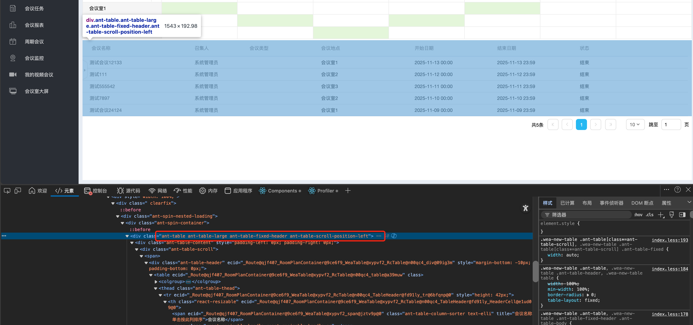

#### 通过 ecId 判断

每个组件都有一个 ecId ，这是组件的唯一标识，ecId 通常带有组件名称。

通过开发者工具查看组件元素中的 ecId ，找到组件名，比如下图中的组件名是 WeaTable。这种方式可以很明确的告诉是使用什么组件。

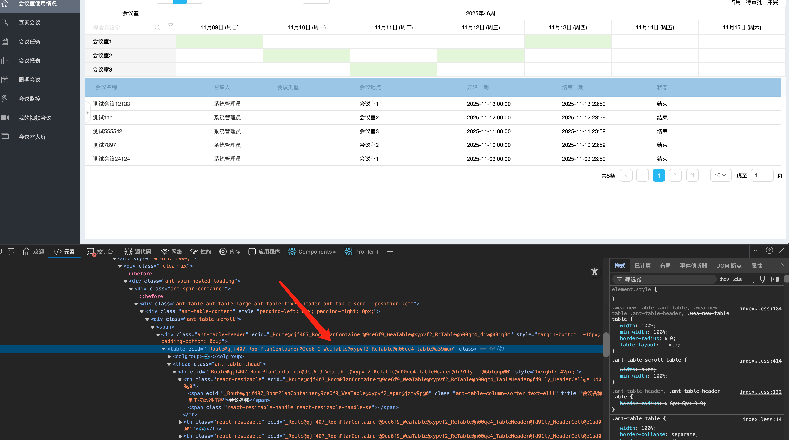

#### 使用 React 插件判断

需要在浏览器安装 React Developer Tools 插件，在应用商店搜索即可找到。

使用 React 插件进行元素审查，就可以看到用的是什么组件，还可以看到组件的参数和状态，建议都安装这个插件，对开发很方便。

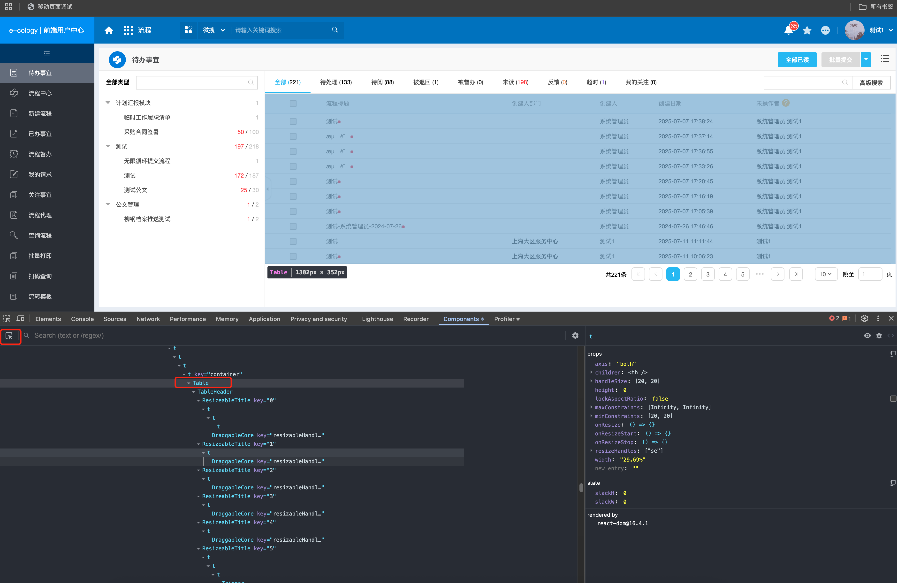

### 对组件进行二开时确定是否为目标组件

可根据组件的 ecId 进行判断，ecId 为组件的唯一标识，不同页面组件相同，ecId 会不一样。

ecId 可通过审查元素查看

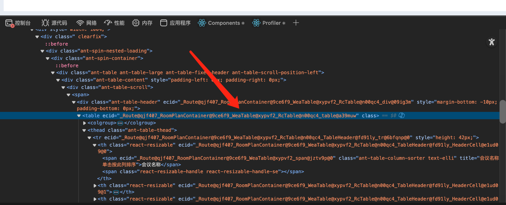

例如这个组件的 ecId 为：_Route@dv9054_WeaTable@gpscn3_RcTable@n00qc4_table@a39muw，组件为 WeaTable ，则可根据组件名称后面的@xxx字符串进行判断，例如 ecId 是否包含 WeaTable@gpscn3。

注意不是每个组件都有 ecId 参数，需要判断有没有 ecId 参数

示例代码：

```javascript

ecodeSDK.overwriteClassFnQueueMapSet('WeaTable',{
  fn:(Com,props)=>{
    try{
      if(location.href.includes('spa/workflow/static4form/index.html') && props.ecId 
          && props.ecId.includes('WeaTable@gwk4pc') && isEnable() && !props._noOverwrite){
            
          return {com:customNodeListTable,props}
      }
    }catch(e){
      console.error('重写table组件出错',e)
    }
  }
});

```

### 新页面开发

在前置加载文件注册新页面

下面代码中需修改 cpParams 中的 name ，name 为页面组件发布的名称。

```javascript

/**
 * @author 姚礼林
 * 链接：/spa/custom/static/index.html#/main/cs/app/d00f6dbd87f444cf8096f2887f31e000_DevToolsPage
 */
ecodeSDK.rewriteRouteQueue.push({
  fn:(params)=>{
    const {Com,Route,nextState} = params;
    const cpParams = {
      path:'main/cs/app', //路由地址
      appId:'${appId}',
      name:'DevToolsPage', //具体页面应用id
      node:'app', //渲染的路由节点，这里渲染的是app这个节点
      Route,
      nextState
    }
    if(ecodeSDK.checkPath(cpParams)) { //判断地址是否是要注入的地址
      const acParams = {
        appId:cpParams.appId,
        name:cpParams.name, //模块名称
        props:params, //参数
        isPage:true, //是否是路由页面
        noCss:true //是否禁止单独加载css，通常为了减少css数量，css默认前置加载
      }
      //异步加载模块${appId}下的子模块pageSimple
      return ecodeSDK.getAsyncCom(acParams);
    }
    return null; //这里一定要返回空，不然会干扰到其它新页面
  },
  order:10,
  desc:'开发者工具页面'
});

```

创建页面组件：

```javascript

const {Menu} = antd;
const ListSqlQuery = ecodeSDK.imp(ListSqlQuery);
const CacheManage = ecodeSDK.imp(CacheManage);
const LogFetch = ecodeSDK.imp(LogFetch);
    
class DevToolsPage extends React.Component{
    
    constructor(props){
      super(props);
      this.state={
        menuKey : '1'
      }
    }
    
    handleClick =(obj)=>{
      this.setState({menuKey:obj.key});
    }
    
    getContent = ()=>{
      const {menuKey} = this.state;
      if(menuKey === '1'){
        return <ListSqlQuery />
      }else if(menuKey === '2'){
        return <CacheManage />
      }else if(menuKey === '3'){
        return <LogFetch />
      }
    }
    
    render(){
      const {menuKey} = this.state;
    
      return (
        <div style={{display:'flex'}}>
          <Menu onClick={this.handleClick}
            style={{ width: 240,height:'100vh' }}
            defaultOpenKeys={['1']}
            selectedKeys={[this.state.menuKey]}
            mode="inline"
            theme={'dark'}
          >
            <div style={{textAlign:'center',color:'white'}}>开发者工具</div>
            <Menu.Item key="1">获取列表sql</Menu.Item>
            <Menu.Item key="2">缓存管理</Menu.Item>
            <Menu.Item key="3">日志</Menu.Item>
          </Menu>
          <div style={{padding:20,width:'100%',height:'100vh',overflow:'hidden'}}>
            {this.getContent()}
          </div>
        </div>  
      )
    }
}
    
ecodeSDK.setCom('${appId}','DevToolsPage',DevToolsPage);

```

### mobx 使用

Mobx 是一个 React 组件状态管理框架，可对业务和显示层进行分离，即对于组件状态的业务代码交由 Mobx 管理，而组件定义中更多的只负责渲染组件，这样能解决组件定义中业务代码和组件渲染代码混合在一起导致的庞大臃肿，让组件更加直观。

我个人认为小的项目用不到，大的项目才会有用，因为使用 mobx 本来会使项目变得复杂，小项目代码不多，不使用 mobx 管理状态在代码的可读性和维护性上也不会有太大问题。

mobx 的使用方法：

1. 新建状态管理文件（store)

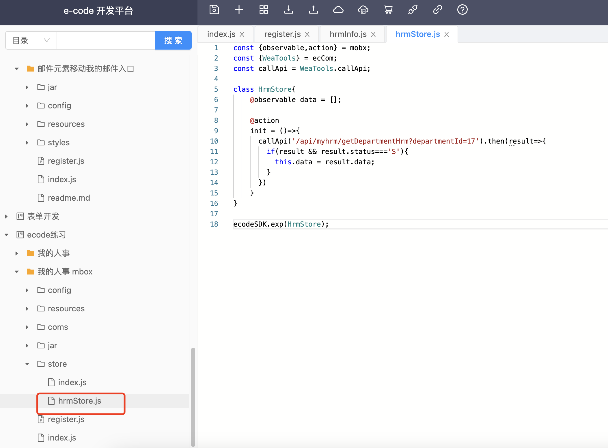

2. index用于导出所有的store

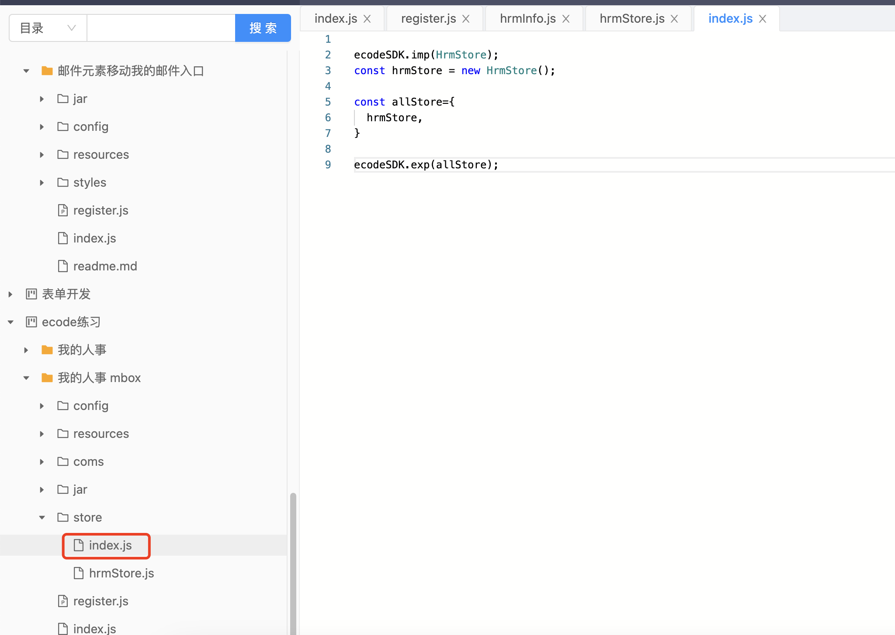

3. 组件最上层使用Provider包裹，并引入第二部中的allStore

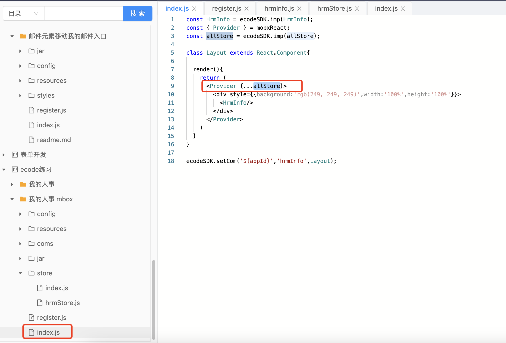

4. 在组件中使用inject和observer注解 ，inject注解里写本组件要引入store的名称

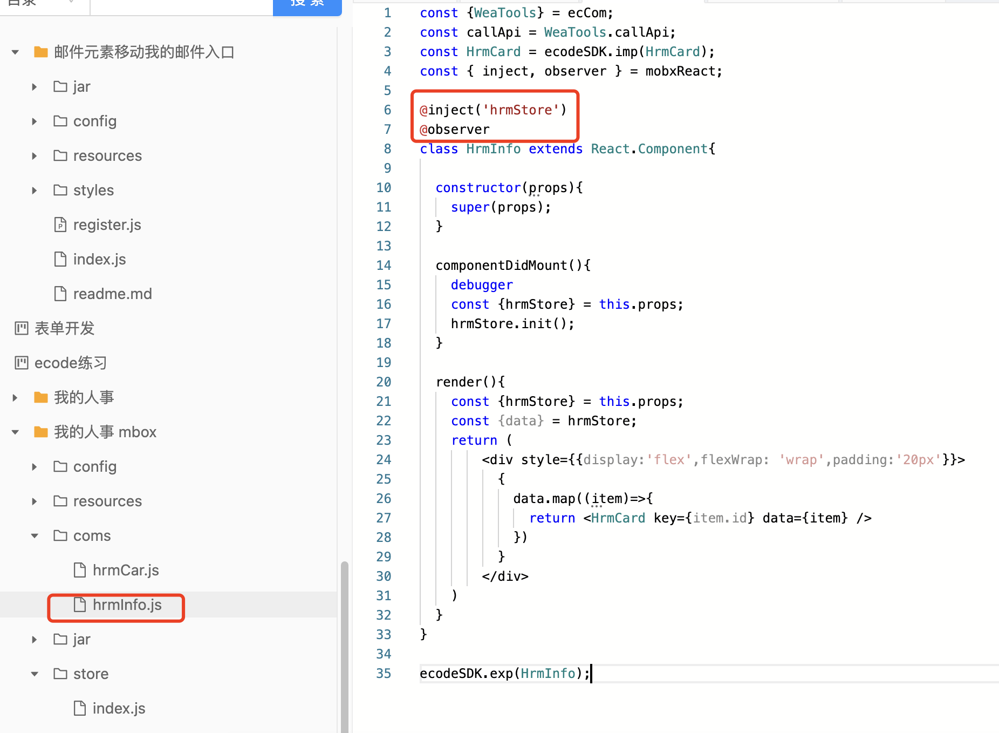

5. 在组件中使用const {storeName} = this.props;即可调用store

```javascript

const {hrmStore} = this.props;
    hrmStore.init();
    // 引入store的变量
    const {data} = hrmStore;

```

6. 要在store内使store内的变量发生变化，用this.fieldName = value

```javascript

@observable data = [];
    @action 
    init = ()=>{
      callApi('/api/myhrm/getDepartmentHrm?departmentId=17').then(result=>{
        if(result && result.status==='S'){
          this.data = result.data;
        }
      })
}

```

#### 源码

![[我的人事 mbox.zip]]

### js 动态加载 ecdoe 应用内的样式文件

应用场景：在页面内动态加载 ecode 应用的样式文件

要获取style里的样式文件，可以使用这个路径：/cloudstore/release/${appId}/fileName.css，此样式文件可以是非前置加载的。

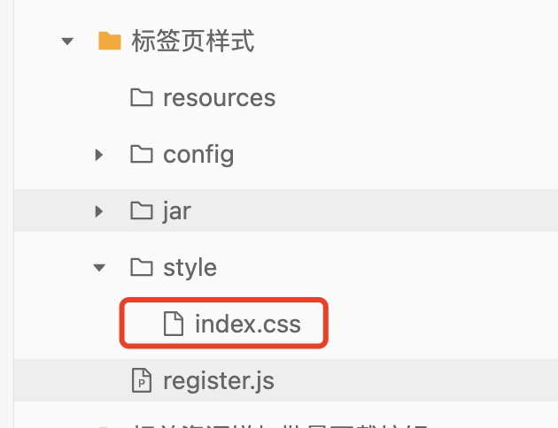

css文件都是放在应用文件夹根目录的 ecology/cloudstore/release/[appId]

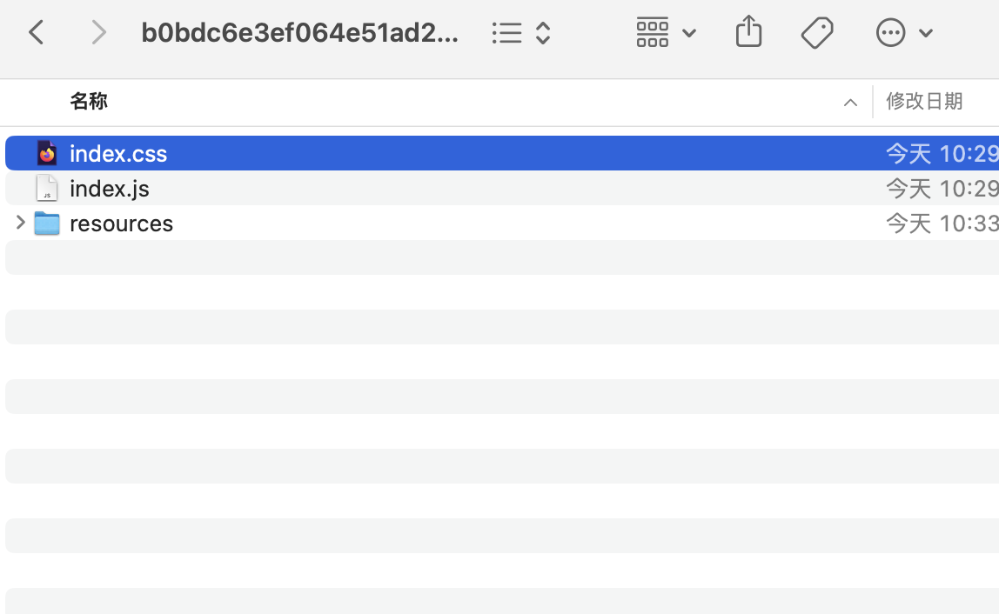

这样就可以使用js为页面添加css文件中的样式，例如在流程页面中添加样式：

前置加载文件：

```javascript

$(()=>{
  if(location.href.includes('/spa/workflow/static4form/index.html') || location.href.includes('spa/workflow/static4mobileform/index.html')){
    var link = document.createElement("link");
    link.rel = "stylesheet";
    link.href = '/cloudstore/release/${appId}/index.css';
    document.head.appendChild(link);
  }
})

```

使用这个方法加载css要注意，如果css文件有变动需要清除浏览器缓存才能生效

### 组件管理数据

复写的组件的数据来自 props ,如果需要用组件的状态管理数据，该如何管理呢？

#### 场景

比如在 Action 配置中，重写参数设置中的 Table 组件，实现在打开配置窗口时能够自动获取 Action 参数，为了能够在组件内部调用接口获取 Action 参数后，将新参数添加到组件数据中，需要将数据放入状态中管理。

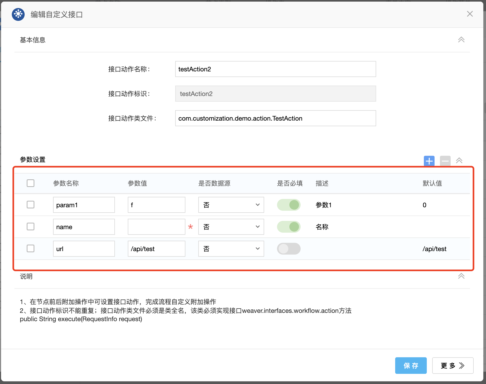

#### 方法

在执行重写组件的钩子函数，创建组件时，已经传入了加载完组件的参数，所以可以在构造函数中初始化状态，默认为组件参数中的数据。

```

constructor(props) {
        super(props);
        // 初始化状态
        this.state = {
            data: props.dataSource ? props.dataSource : []
        }
    }

```

还需要添加 componentWillReceiveProps() 函数，能够接收新的组件参数，不然组件的数据可能不会更新。

```

/**
     * 组件接收新参数时更新组件数据
     */
    componentWillReceiveProps(newProps) {
        console.log('接收新参数')
    
        if (newProps.dataSource) {
            this.setState({data: newProps.dataSource});
        }
    }

```

这样就完成组件的数据管理了

## Ecode 接口

### 获取用户信息

注意：这种方式不一定能获取到用户信息，比如在手机端上可能获取不了

```javascript

//获取登录人信息
const user = ecodeSDK.getEcodeParams(['ecode_params'])._user
// 从缓存中获取用户id
const { ls } = WeaTools;
const themeAccount = ls.getJSONObj('theme-account');
let userid = themeAccount ? themeAccount.userid : ''; //userid

```

在浏览器中查看登陆人信息

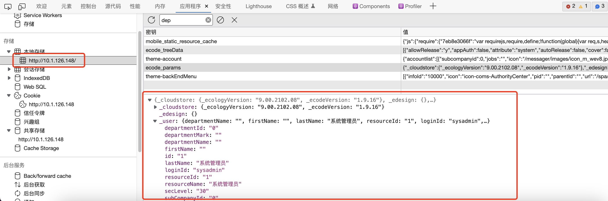

### 接口异步请求

组件说明：Ecology 9

[Ecology 9](https://cloudstore.e-cology.cn/#/pc/component/WeaTools_fetch/demo-0)

注意，该请求工具的请求参数不支持 json，可以使用 FORM 表单参数。

使用示例：

```javascript

const {WeaTools} = ecCom;
const { callApi } = WeaTools;
    
callApi('/api/ec/dev/table/datas', 'POST', params).then(data => {
    console.log(data) // jsonObj or text
});

```

POST 接口请求参数为 FORM 的调用示例：

```javascript

function createWorkflow(){
  const {WeaTools} = ecCom;
  const callApi = WeaTools.callApi;
  console.log('createWorkflow');
  const params = {
    requestName:'临时/延期开标申请审批表',
    workflowId:160,
    mainData:"[{'fieldName':'zbdhwb','fieldValue':'"+zbNumber+"'}]",
    otherParams:"{'isnextflow':0}"
  }
  callApi('/api/workflow/paService/doCreateRequest','POST',params).then(result=>{
    if(result && result.code ==='SUCCESS'){
      ModeList.showMessage("创建流程成功",3,3);
    }else{
      ModeList.showMessage("创建流程失败："+result.code,2,5);
    }
  })
}

```

#### 问题：使用 callApi 调用后端 POST 接口 接收不到参数

如果接口的接收参数类型为 JSON，callApi 调用时是传不了 JSON 的，可以将接收参数改为 FORM 类型，在后端中使用`ParamUtil.request2Map(request);`来接收参数。

## 流程JS代码

### 流程表单信息接口

`WfForm.getLayoutStore()`可获取表单信息，包括主表字段、明细字段信息和布局信息

`WfForm.getGlobalStore()`可获取流程内一些组件的数据

### 在表单中执行 ecode 应用代码

常用于用ecode写流程表单的js

在代码块加入：

```

ecodeSDK.load({
    id:'fa6c623b8e1d4843b8f1788e21295a2b',
    noCss:true,
    cb:()=>{}
  });

```

cb:()=>{} : 执行代码后的回调。

注意：id 和 cb 两个参数是必填的，如果漏了 cb 会导致执行出错

当执行`ecodeSDK.load`后，就会执行 ecode 应用中的非前置加载js文件中的代码，例如下面 ecode 应用中的 index.js 文件，可以将流程js代码写在 index.js 文件中，不一定命名为 index.js ，也可以自己命名。

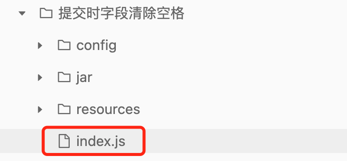

### ecode 实现模块化JS

建议如果不是非常少的js代码（不超过100行），可以将代码放到 ecode 中。

为什么？

我见过很多表单代码超过 1000 行的，并且很多功能混合在一起，你能看出哪一块代码是哪一个功能的吗？这就像有一个 js 函数，然后在里面写了 1000 行代码，功能划分不清。使用 ecode 编写流程代码就能很好处理这个问题，将一个功能划分到一个 ecode 应用中，并在应用内编写实现说明文档，这样就能很好维护对应功能的代码，还能避免代码间的相互干扰，各节点还能复用代码。

优点如下：

如何实现：

在 ecode 创建应用，应用内需要有非前置加载的js 文件，例如 index.js 文件，在该文件内编写 js 代码。

然后在流程代码块内加载该 ecode 应用，执行 js 代码，代码块内插入以下代码：

id 填写 ecode 应用id

```

ecodeSDK.load({
    id:'fa6c623b8e1d4843b8f1788e21295a2b',
    noCss:true,
    cb:()=>{}
  });

```

### 将组件渲染到流程表单

参考：

ecode使用说明 (e-cology.com.cn)

[ecode使用说明 (e-cology.com.cn)](https://www.e-cology.com.cn/spa/document/index.jsp?id=9575060&router=1#/main/document/detail?_key=65s4sd)

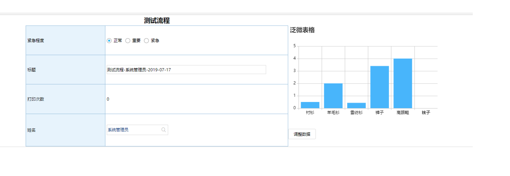

需要在表单的单元格上添加元素id，id名称自己命名，之后会将组件渲染到此单元格中。

设置了元素id后，有两种方法可将组件渲染到表单中：

```

// WeaChartComp 是自己创建的组件
ReactDOM.render(React.createElement(WeaChartComp, {}), document.getElementById('echar'));

```

```javascript

var params = {
    domId:'echar', //渲染位置的domId，也就是表单上创建的
    id:'c49d64e79263462bbfbc76782c1637e8', //appId，也就是根目录的UUID，发布ID
    name:'WeaChartComp', //调用的组件名字，setCom时定义的
    cb:function() { //渲染完成回调
         console.log('success!');
     },
    noCss:true, //是否禁止单独加载css，通常为了减少css数量，css默认前置加载
    props:{} //表单的参数传入组件的方法
}
// 在渲染组件
ecodeSDK.render(params);

```

将ecode组件嵌入表单：

```javascript

ecodeSDK.load({
    id: "02d39a56e52f4c3e81bb0367a80e5c29", 
    noCss:true, 
    cb:function () {
      var dbduxxid = JSON.parse(localStorage.getItem('dbduxxid'));
      // 获取到组件
    	 var Com = ecodeSDK.getCom("02d39a56e52f4c3e81bb0367a80e5c29", "dlGysProcessTabs");
      var dataObj = { title: '多轮信息', xylx: 0, xyid: urlData.billid }
      // 将组件渲染到表单中
    	 ReactDOM.render(React.createElement(Com, {...dataObj }), document.getElementById('dliframe'));
    }
  });

```

### 隐藏明细的列

```javascript

$(document).ready(function(){
  
   WfForm.bindFieldChangeEvent("field34281",function(obj,id,value){   
    if(value==="0"){
        //.ycsx_id_swap：通过网页找到带有刚才设置的class名称前缀的clas名称
       $(".ycsx_id_swap").hide();
    }else
    {
       $(".ycsx_id_swap").show();
    }
  
});
  
});

```

1.选择需要隐藏明细的列的表头和字段

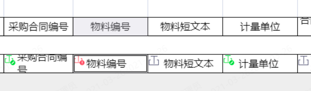

2.设置自定义属性class

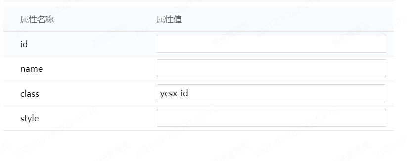

3.保存之后打开该流程的页面，使用选择工具选中明细的表头，找到带有刚才设置的class名称的前缀class名称

4.使用js代码隐藏

### 流程引用js文件修改后不生效解决方法

js修改过代码后，需要在引用的js后面任意增加一串不同的字符串，

例如：

```html
<script type="text/javascript" src= "/test/a.js?V123" >
```

考虑到开发阶段若每次都手工修改后面的字符串会比较麻烦，故可给字符串加上一个自动生成的随机数，每次都加载一个新的js，这样就不需要每次手工修改，等系统上线后，再换成src形式。

```javascript
var js = "<script type='text/javascript' src='/kangmindong/js/kwah_01.js?v"+Math.random()+"'></"+"script>";

document.write(js);
```

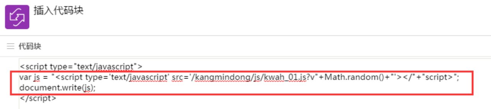

## 组件使用

### WeaEchart

改变数据时重新绘制图表

如果只改数据统计图是不会变化的，需要使用chart.clear()和chart.paint()重新绘制图表，useDefault参数需要为true

```javascript

class Report extends React.Component {
    
    constructor(props) {
        super(props);
    }
    
    render() {
        const { option } = this.props;
        return (
            <div>
                <Button onClick= {()=> {
                    let itemStyle = {
                        normal: {
                            label: {
                                position: 'top',
                                show: true
                            }
                        }
                    }
                    let newSeries = [
                        {
                            data: ['20'],
                            name: '梅林',
                            type: 'bar',
                            itemStyle
                        },
                        {
                            data: ['10'],
                            name: '制造大楼文书',
                            type: 'bar',
                            itemStyle
                        },
                    ];
                    // 改变数据并且重新绘制图表
                    this.props.option.series = newSeries;
                    this.refs.chart.clear();
                    this.refs.chart.props.option = this.props.option;
                    this.refs.chart.paint();
                }
                }> 改变 < /Button>
                < WeaEchart ref={'chart'} {...this.props} useDefault={true} option = { option } _noOverwrite />
            </div>
        )
    }
}

```

### WeaBrowser

### 建模浏览框添加表单字段查询条件

这是一个开发的浏览框，用来实现和表单建模浏览框一样的功能。

如果表单的建模浏览框设置了用表单字段作为查询条件，则需要在浏览框参数中的 dataParams 添加额外的参数

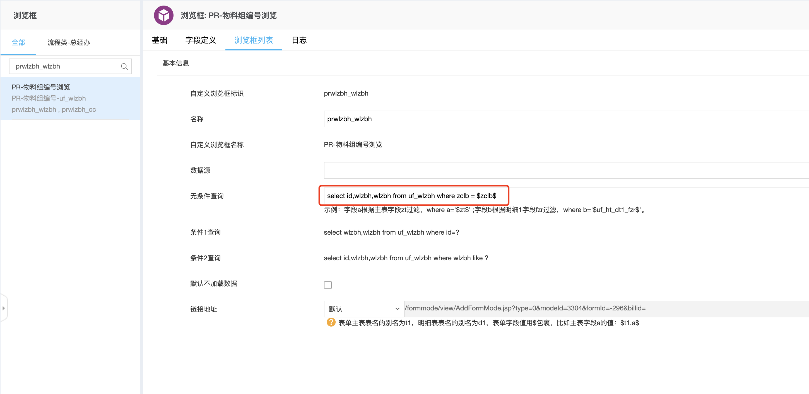

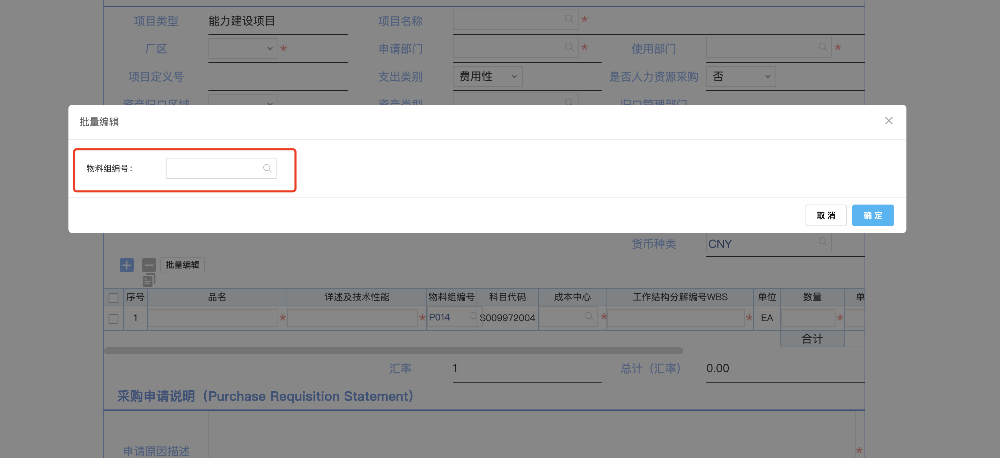

添加额外参数，添加的参数字段名为表单的条件字段名 +'_'+当前时间戳，比如表单上的条件字段名为'cglx',则字段名为 'cglx_'+时间戳，值为条件字段的值

```javascript

const time = new Date().getTime();
const otherParams ={};
if(conditionField){
   otherParams[conditionField+'_'+time] = WfForm.getFieldValue(WfForm.convertFieldNameToId(conditionField));
}

```

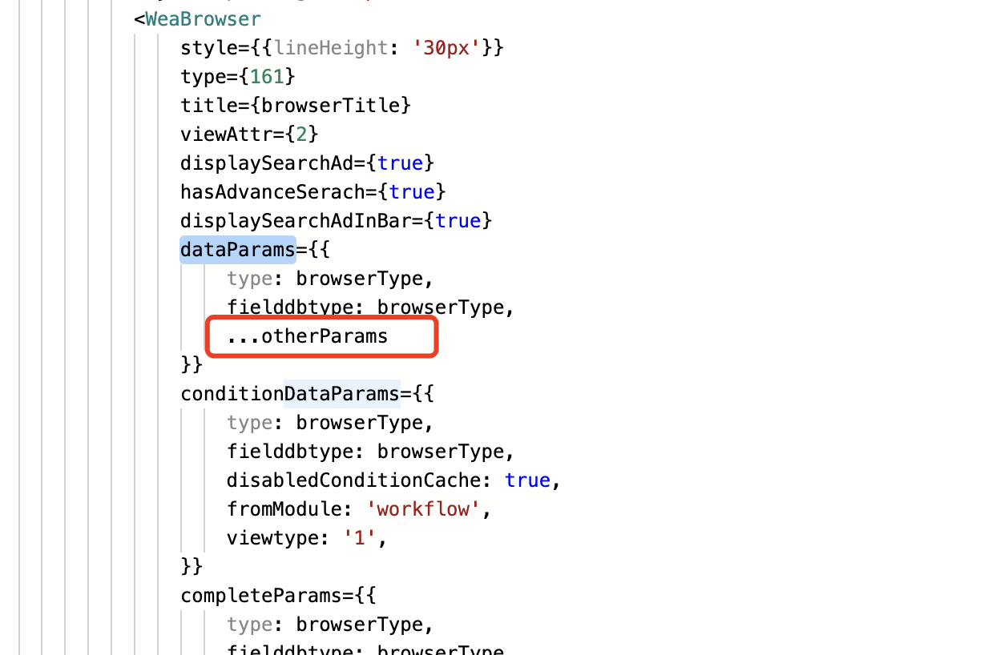

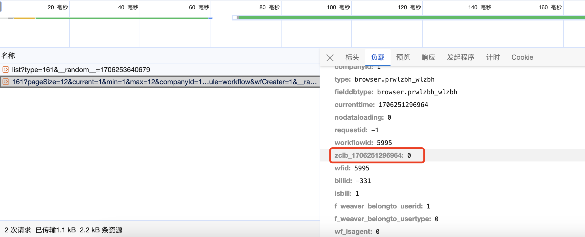

### 对话框

#### 系统样式确认框如何换行

在文件内容添加 </br> 即可

```javascript

const text = "按公司规定，未经发布的文件无效，请确保完成以下2个步骤：</br>"+
                "1、打开文件添加“文档共享”，建议按照公司或部门设置（含下级），确保需要执行的相关区域能查看文件；</br>"+
                "2、对适用范围内人员，通过邮件等方式通知文件发布信息，发布模板参考如下。"
  ModeList.showConfirm(text, onClickOk, null, {
    title: "提示",       //弹确认框的title，仅PC端有效     
    okText: "确定",          //自定义确认按钮名称    
    cancelText: "返回"     //自定义取消按钮名称 
  })

```

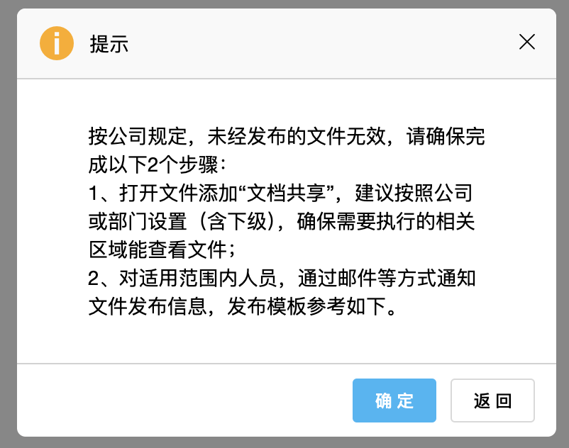

## 页面开发

### 在页面中添加组件

可以在页面中渲染自己的组件，比如说想在页面中添加一个弹窗，那么可以将弹窗组件渲染到页面中。

以下代码可在适当的地方添加，比如说在页面加载完后执行。

```javascript

// 获取发布的组件
const Main = (props)=>{
    const params ={
        appId:'${appId}',
        name:'Main',
        isPage:false,
        noCss:true,
        props
    }
    const NewCom = props.Com;
    return window.comsMobx?ecodeSDK.getAsyncCom(params):(<NewCom {...props}/>);
}
    
// 获取 id 为 container 的元素，很多页面都有这个元素，在这个元素里面创建一个子元素，来渲染自己的组件
const div = document.getElementById('container');
// 创建子元素
const node = document.createElement('div');
node.id = 'moregysdiv';
div.appendChild(node);
// 将自己创建的组件：Main ，渲染到子元素中
ReactDOM.render(<Main/>, document.getElementById('moregysdiv'));

```

注意：如果太早将组件添加到页面，比如页面刚开始加载时，可能会报错，最好等到页面加载完后再添加组件

以下为错误案例, 加载组件太早

```javascript

let loaded = false;
ecodeSDK.overwritePropsFnQueueMapSet('WeaReqTop',{
    fn:(props)=>{
        if(location.href.includes('spa/workflow/static4form/index')){
            // 加载组件太早，会导致报错
            if (!loaded) {
                loaded = true;
                // 添加组件到页面
                loadTool();
            }
        }
    }
});
    
const FormTool = (props)=>{
    const params ={
        appId:'${appId}',
        name:'FormTool',
        isPage:false,
        noCss:true,
        props
    }
    const NewCom = props.Com;
    return window.comsMobx?ecodeSDK.getAsyncCom(params):(<NewCom {...props}/>);
}
    
function loadTool(){
    debugger
    const div = document.getElementById('container');
    // 创建子元素
    const node = document.createElement('div');
    div.appendChild(node);
    // 将自己创建的组件：Main ，渲染到子元素中
    ReactDOM.render(<FormTool />, node);
}

```

以下为正确案例，在获取组件参数时判断参数是否齐全，如果齐全则说明页面已经加载差不多了

```

ecodeSDK.overwritePropsFnQueueMapSet('WeaReqTop',{
    fn:(props)=>{
        // 判断参数是否齐全，如果齐全则说明页面已经加载差不多了
        if(location.href.includes('spa/workflow/static4form/index') && props.buttons && props.buttons.length > 0){
            if (!loaded) {
                loaded = true;
                // 添加组件到页面
                loadTool();
            }
        }
    }
});

```

### 处理页面延迟加载元素的修改

应用场景：

页面上的一些元素可能会延后渲染，比如流程中的表单字段，需要对这些元素进行修改，如果在一开在页面加载时尝试获取这些元素，可能获取不到。

获取延迟加载的元素：

方法一：简单粗暴的方法，就是进行轮询获取，创建一个定时器，每隔一段时间就尝试获取元素，直到获取成功或超过指定时间。

方法二：使用`MutationObserver`

`MutationObserver`是一个用来监听页面元素更改的 js API，可以通过它，当这些延迟加载元素创建后，就会被监听到，对比轮询的好处是，它只会在元素发生改变时执行，它会一直监听页面元素，除非你设置超时。

使用案例：

`tryChangeMeetingLink`函数用来根据 class 样式名获取元素，并修改 div 元素中的 a 标签链接，如果找到元素并修改成功，则会返回 true ，否则返回 false。使用`MutationObserver`,当元素发生改变时，就调用`tryChangeMeetingLink`,直到修改元素成功。

```javascript

/**
 * 修改指定样式名的div内的 a 标签链接，在链接后面添加参数
 * 支持延迟加载的元素，使用 MutationObserver 监听 DOM 变化
 */
function changeMeetingLink(className,paramName,paramValue) {
    // 先尝试立即执行一次
    const success = tryChangeMeetingLink(className, paramName, paramValue);
    
    // 如果已经成功修改，则不需要继续监听
    if (success) {
        return;
    }
    
    let timeout = null;
    
    // 使用 MutationObserver 监听 DOM 变化
    const observer = new MutationObserver(() => {
        const success = tryChangeMeetingLink(className, paramName, paramValue);
        if (success) {
            observer.disconnect();
            if (timeout) {
                clearTimeout(timeout);
            }
            console.log('changeMeetingLink: 成功修改链接');
        }
    });
    
    // 设置超时时间，避免无限等待（30秒）
    timeout = setTimeout(() => {
        observer.disconnect();
        console.warn('changeMeetingLink: 超时未找到目标元素');
    }, 30000);
    
    // 开始观察整个文档的变化
    observer.observe(document.body, {
        childList: true,      // 监听子节点的添加和删除
        subtree: true         // 监听所有后代节点
    });
}

```

## 文档

### 查看文档正文的文件id

在文档页面查看api/doc/detail/basicInfo 接口的返回结果，查看rightMenus 参数

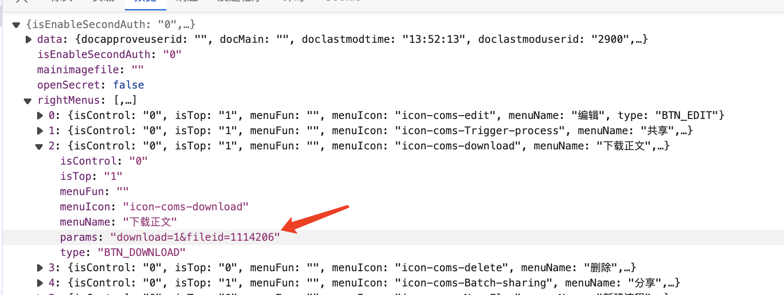

使用js请求接口获取

```javascript

async function getDocMainBodyId(docId){
    const {WeaTools} = ecCom;
    const {callApi} = WeaTools;
    const result = await callApi(`/api/doc/detail/basicInfo?docid=${docId}`,'GET',{});
    const {rightMenus} = result;
    for (let i = 0; i < rightMenus.length; i++) {
        const item = rightMenus[i];
        if (item.type === 'BTN_DOWNLOAD') {
            const fileId = item.params.substring(item.params.indexOf('fileid=') + 7);
            console.log('fileId:' + fileId);
            return fileId;
        }
    }
    return null;
}

```

### 上传文件到知识目录

可用于将文件作为附件，上传到知识目录中

#### 接口1：/api/doc/upload/uploadFile2Doc

该接口传输文件二进制

前端调用示例：

```javascript

uploadFile=(file,fileName)=>{
    const uploading = message.loading('上传中...', 0);
    let formData = new FormData();
    formData.append("file", file);
    formData.append('category',config.uploadDir);
    formData.append('name',fileName);
    const thisCom = this;
    $.ajax({
      type:'post',
      url:'/api/doc/upload/uploadFile2Doc',
      data:formData,
      contentType:false,
      processData : false,
      success : function(result){
        if(!result){
          uploading();
          message.error('上传失败',3);
          return;
        }
        const json = JSON.parse(result);
        const fileid = json.data.fileid;
        let fieldValue = thisCom.createFieldValue(thisCom.state.data);
        fieldValue +=fieldValue ? ","+fileid : fileid;
        thisCom.initList(fieldValue);
        WfForm.changeFieldValue(fieldId,{value:fieldValue});
        uploading();
        message.success('上传成功',3);
      },
      error:function(){
          uploading();
          message.error('上传失败',3);
      }
    })
  }

```

```javascript

<input type="file" id="file-input" style={{display:'none'}} onChange={(v)=>{
            // 上传附件input变化时代表已进行选择文件操作，开始上传文件
            if(v.target.files.length === 0){
              return
            }
            const file = v.target.files[0];
            const fileName = v.target.value;
            this.uploadFile(file,fileName);
 }}/>

```

#### 接口2：/api/doc/upload/uploadForBase64

需要传文件base64

base64 格式需要注意，需要把base64的前缀去掉

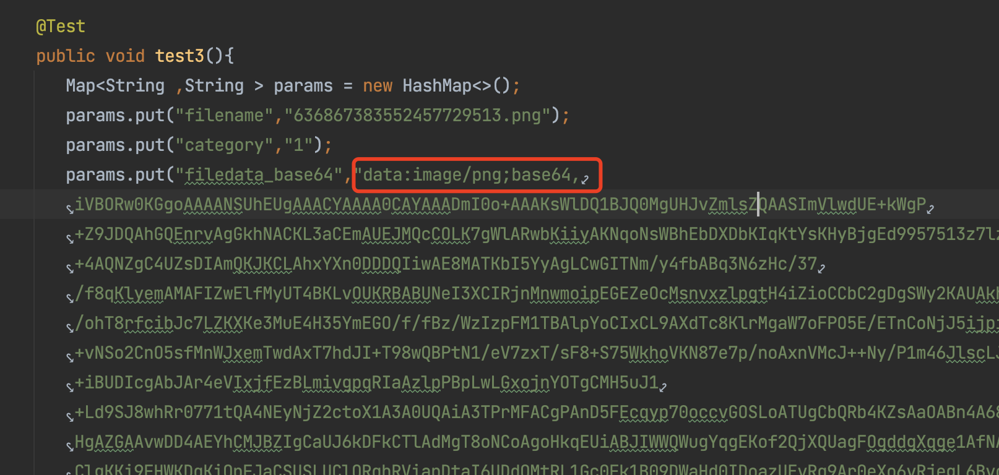

### 使用标准url下载文档和附件

### 下载单个附件

/weaver/weaver.file.FileDownload?fileid=[附件id]&download=1

### 下载多个附件

如果下载多个附件，fieldids参数值的末尾一定要带上逗号，不然只能下载单个文件

onlydownloadfj=1 表示只下载附件，如果你加这个参数也可以下载正文，但如果不加这个参数是不能下载多个正文的，会提示没有权限，如果想下载正文可以在fieldids参数填上正文的文件id

/weaver/weaver.file.FileDownload?onlydownloadfj=1&download=1&labelid=32407&fieldids=[附件id，如：4621,3456,]

### 批量下载文档附件

fieldvalue参数填文档id，会下载文档里的所有附件

/weaver/weaver.file.FileDownload?fieldvalue=[文档id，如44,36]&download=1&downloadBatch=1

## 门户

### 门户主题事件注册

可在登录前、登录后注册事件，执行开发逻辑

e-cology9.0门户主题事件注册(1)

[e-cology9.0门户主题事件注册(1)](note://WEBcb11d4cd541c4b1c8066358c51857fa4)

### 页面等比缩放适配方案

用于在不同分辨率下保持一致的显示效果

## E-Mobile 移动端

### 流程表单跳转到新页面后返回不了

#### 问题描述

移动端的一个流程需要进入表单后跳到外部页面，但点击已返回后没有反应

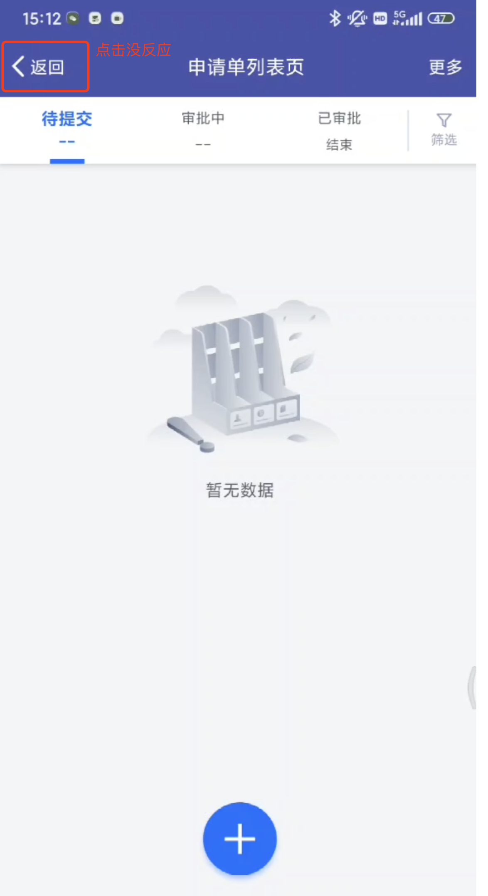

#### 解决方法

在表单js使用location.href() 和 location.replace() 打开新页面会导致这种问题，需要使用window.showHoverWindow()进行打开，标准API有说明

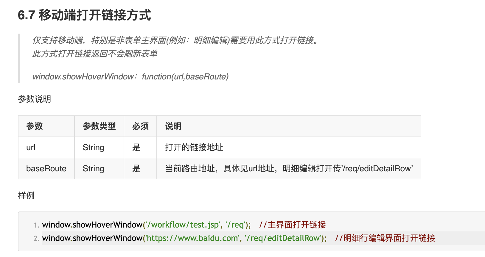

## 页面调试

### 使用Chii工具调试手机端页面

[[使用Chii工具调试手机端页面]]

### 使用eruda调试手机端页面

[[使用eruda调试手机端页面]]
## 第三方集成

### 飞书

#### 判断页面是否是在飞书打开

就是判断接口请求头的这个地方有没有包含 Lark

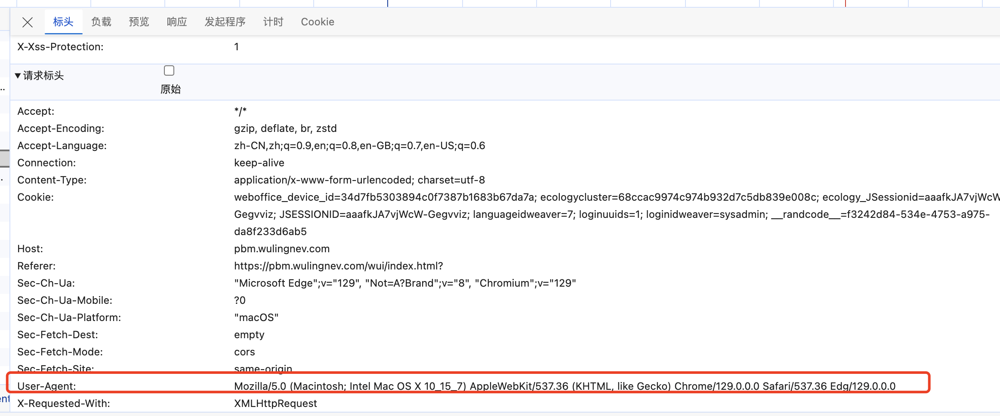

```

var ua = navigator.userAgent;
if (ua.indexOf("Lark") !== -1) {
  // 为飞书打开
}

```

后端也可以进行判断

```

public boolean isInFeiShu(HttpServletRequest request){
    String userAgent = request.getHeader("user-agent");
    return userAgent.contains("Lark");
}

```

## 疑难杂症

### 组件无法渲染，报 Minified React error #130 错误

这种错误通常很难排查，控制台的异常栈中找不到报错的位置。错误的原因是在组件渲染时引入了非组件类型的元素，比如引入了 undefind 组件，可以在每个组件的构造函数中输入 debuger ,打断点，看是在哪个组件中中断，然后看这个组件的`render()`函数中有没有引入 undefind 组件，以及不正确类型的组件（非 React 组件，比如字符串）。

如果使用异步获取组件，如果无必要不要获取参数中的 Com，如 ：`props.Com`，除非你在参数中传入了 Com，这种写法在组件重写中是可以的，除此之外，可能会在异步获取组件时获取到 undefind 组件，因为 props 中没有传入 Com，如以下代码：

```javascript

const FormTool = (props) => {
  const params = {
    appId: '${appId}',
    name: 'FormTool',
    isPage: false,
    noCss: true,
    props
  }
  // NewCom 可能为 undefind ，导致出现 Minified React error #130 错误
  const NewCom = props.Com;
  return window.comsMobx?ecodeSDK.getAsyncCom(params):(<NewCom {...props}/>);
}

```

可以改为以下写法：

```javascript

const FormTool = (props) => {
  const params = {
    appId: '${appId}',
    name: 'FormTool',
    isPage: false,
    noCss: true,
    props
  }
  
  return ecodeSDK.getAsyncCom(params);
}

```

## 案例

### 建模

[[ecode-重写建模查询菜单点击事件以及右键菜单点击事件]]

[[前端-案例-改变查询页面查询条件日期的值，并进行查询]]

### 流程

[[ecode添加流程顶部按钮]]

[[前端-案例-流程一键流转，点击按钮流转到指定节点]]

[[新建流程页面添加页签（复写组件参数）]]

[[添加流程页签]]
#### 隐藏流程tab页签

只显示流程表单页签

```javascript
ecodeSDK.overwritePropsFnQueueMapSet('WeaReqTop',{
  fn:(props)=>{
    if(location.href.includes('spa/workflow/static4form/index.html')){
      const user = ecodeSDK.getEcodeParams(['ecode_params'])._user;
      if(Number(user.secLevel) < 0){
        props.tabDatas = props.tabDatas.filter(i => i.title === '流程表单')
      }
    }
  }
})
```

#### 修改流程顶部按钮动作

示例-修改打印按钮的动作，点击打印跳转到指定页面

```javascript
ecodeSDK.overwritePropsFnQueueMapSet('WeaReqTop', {
  fn: (props) => {
    if (location.href.includes('spa/workflow/static4form/index.html')) {
      if (WfForm) {
        const workflowId = WfForm.getBaseInfo().workflowid;
        if (config.workflowId.indexOf(workflowId) !== -1) {
          props.buttons.forEach(i => {
            if (i.props.title === '打印') {
              i.props.onClick = customPrintPage;
            }
          })
          const buttons = props.dropMenuDatas;
          buttons.forEach(i => {
            if (i.content === '打印') {
              i.onClick = customPrintPage
            }
          })
        }
      }
    }
  }
});
```


### 门户

[[案例-政治生日提醒]]

### 其它案例

#### 单点登录-移动端页面跳转到第三方系统

##### 需求

需要在手机端上点击图标，单点登录跳到第三方系统页面。
##### 单点登录实现

需要在一个链接地址中添加工号、时间戳和token，token通过md5加密工号和时间戳生成，生成的链接如下：

[http://113.15.231.21:180/sys/simple_sso_login?username=18622231518&timeline=1685504931&token=ab9c106210f11edf9e91c9b790d0912e&path=/static_file_dingding1/](http://113.15.231.21:180/sys/simple_sso_login?username=18622231518&timeline=1685504931&token=ab9c106210f11edf9e91c9b790d0912e&path=/static_file_dingding1/)

由这个链接跳转到第三方系统实现认证

工号取当前泛微系统登录人的工号

##### 实现步骤

1.新建一个移动应用页面，里面执行js

2.使用js生成单点登录链接，在当前页面跳转到该链接