## 方法一：重写接口的响应体添加按钮

### 步骤

1.ecodeSDK.rewriteApiDataQueueSet()方法重写接口的响应体


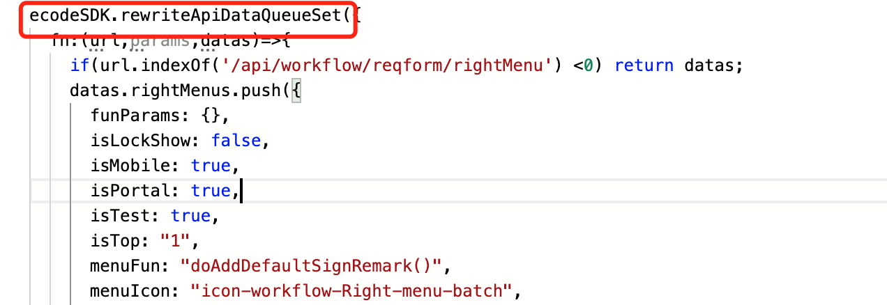


就是当我们进入流程的时候会返回rightMenu这个接口，这个接口是获取右键菜单数据的，但为什么不是重写顶部菜单的接口呢？因为rightMenu这个接口的菜单只要设置了按钮isTop为1，就可以放到顶部菜单了。我们需要重写接口里面的响应体


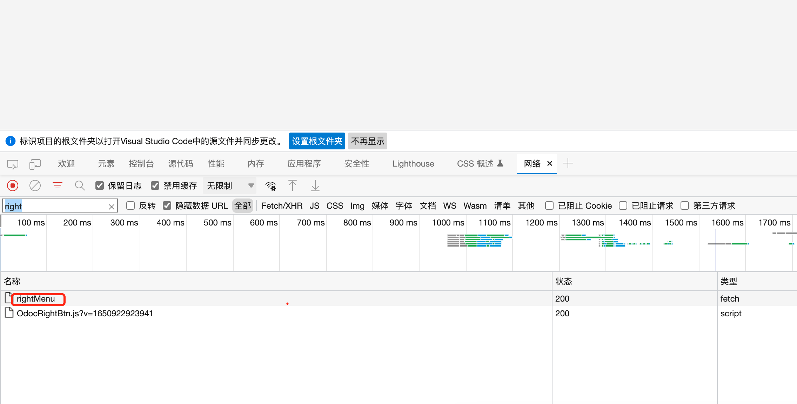


我们进入响应体看看都有啥，可以看到rightMenus数组就是存放菜单数据的，那么我们要重写这个数组


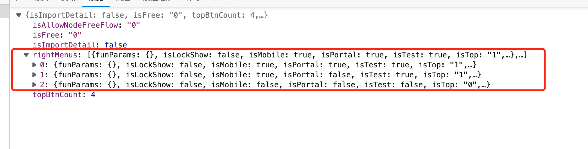


2.重写接口的响应体

使用datas获取响应体里的rightMenus数组，然后往里面添加一组数据，数据照着其它按钮的参数写就可以了，menuName写菜单的名称，注意isTop要为1，这样才能把按钮放到顶部


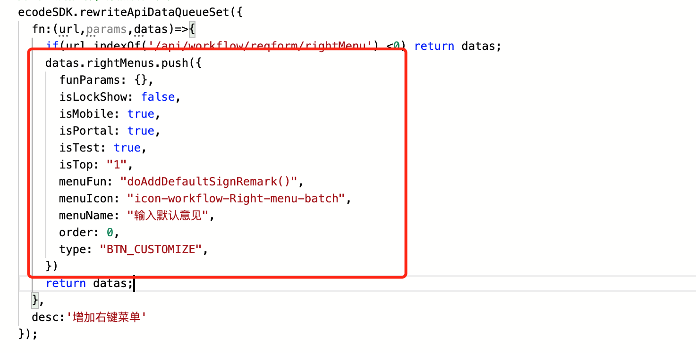


menuFun参数是指点击按钮后要执行的函数，我们可以把函数放到表单的js里，但这样只能一个个流程和节点去配置，下面的方法就能实现全局


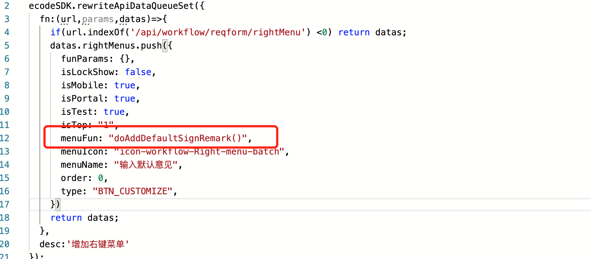


3.我们已经重写好接口的响应体了，流程里也出现了我们添加的顶部菜单，接下来要配置一个全局的函数，让按钮点击后能执行这个函数

我们还要用ecodeSDK.overwritePropsFnQueueMapSet()这个方法来重写组件


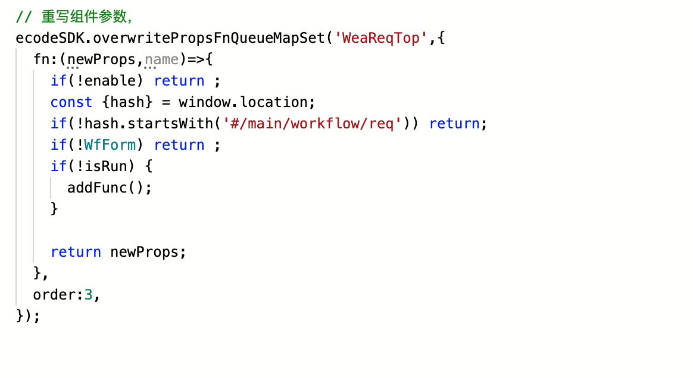


重写的组件是WeaReqTop，也就是流程里的这个组件


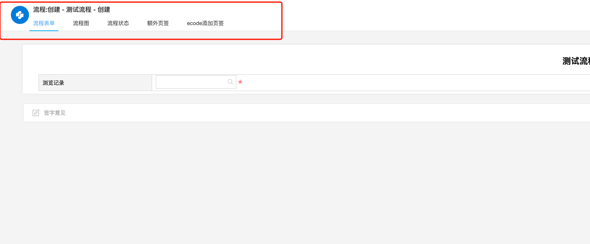


我们不重写组件里的参数，只是在组件运行时执行我们的addFunc()函数


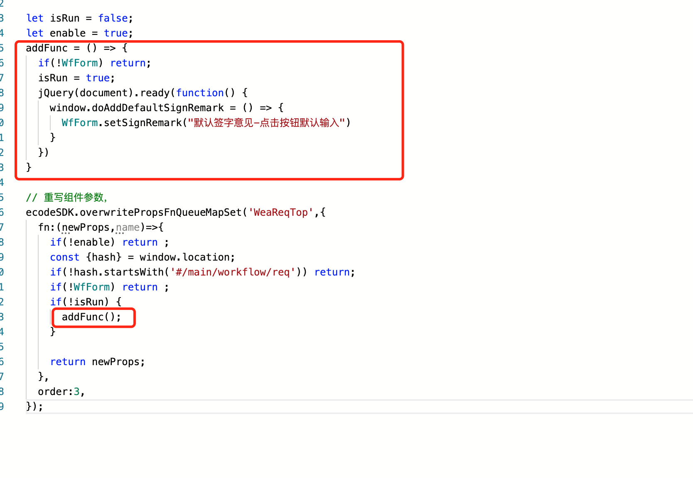


addFunc()函数是往window对象添加了一个doAddDefaultSignRemark(),在这个函数里面执行了输入意见


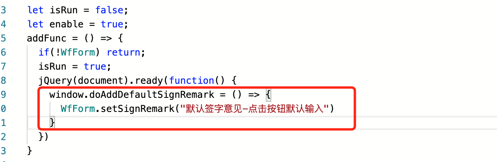


这样就能全局的实现在流程中添加doAddDefaultSignRemark()函数了

### 源码

register.js

注意register.js要前置加载

```javascript
// 拦截响应体，添加流程菜单
ecodeSDK.rewriteApiDataQueueSet({
  fn:(url,params,datas)=>{
    if(url.indexOf('/api/workflow/reqform/rightMenu') <0) return datas;
    datas.rightMenus.push({
      funParams: {},
      isLockShow: false,
      isMobile: true,
      isPortal: true,
      isTest: true,
      isTop: "1",
      menuFun: "doAddDefaultSignRemark()",
      menuIcon: "icon-workflow-Right-menu-batch",
      menuName: "输入默认意见",
      order: 0,
      type: "BTN_CUSTOMIZE",
    })
    return datas;
  },
  desc:'增加右键菜单'
});
    
let isRun = false;
let enable = true;
addFunc = () => {
  if(!WfForm) return;
  isRun = true;
  jQuery(document).ready(function() {
    window.doAddDefaultSignRemark = () => {
      WfForm.setSignRemark("默认签字意见-点击按钮默认输入")
    }
  })
}
    
// 重写组件参数，
ecodeSDK.overwritePropsFnQueueMapSet('WeaReqTop',{
  fn:(newProps,name)=>{
    if(!enable) return ;
    const {hash} = window.location;
    if(!hash.startsWith('#/main/workflow/req')) return;
    if(!WfForm) return ;
    if(!isRun) {
      addFunc();
    }
   
    return newProps;
  },
  order:3,
});
```


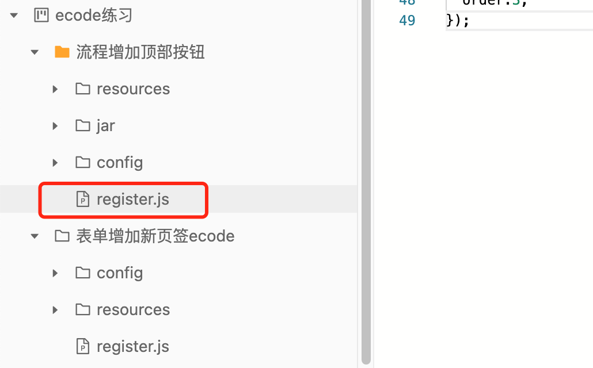


## 方法二：重写组件参数添加按钮

### 步骤

1.检查下元素，发现按钮是包含在这快区域里面的，然后根据class名称在组件库里搜索一下相关组件，使用top搜索发现有一个组件比较相似，就是这个组件了


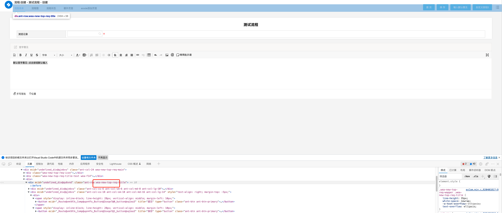


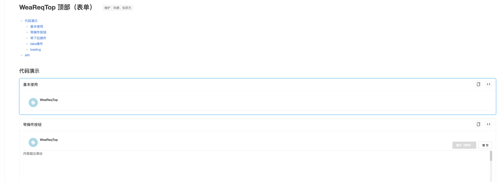


2.流程里的这几个按钮就是组件里的这几个按钮，所以我们需要在组件里添加一个按钮


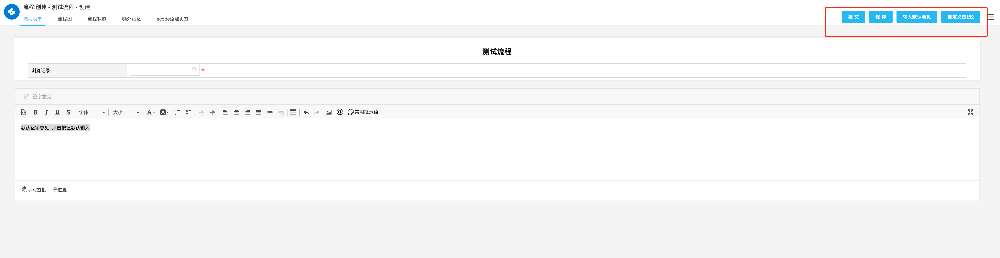


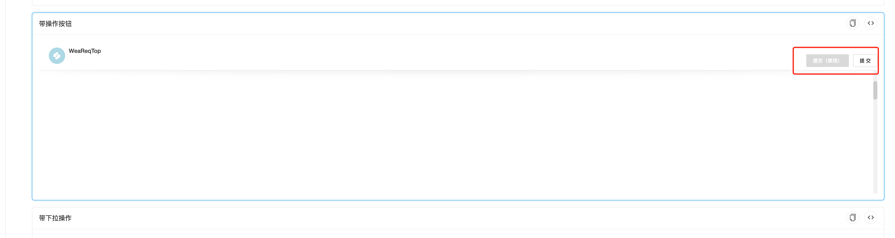


3.查看代码示例，找到按钮的相关参数，可以看到buttons就是按钮的数据了


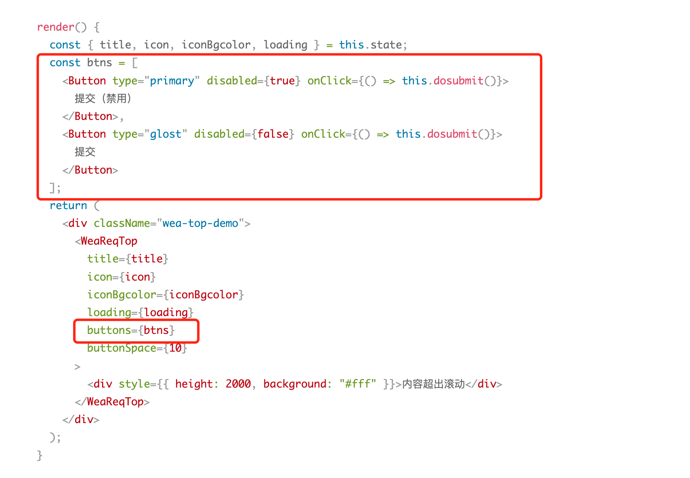


4.然后在ecode里的register.js文件重写WeaReqTop组件的参数，从newProps获取到buttons这个按钮数据，然后往里面添加添加一个按钮

```javascript
ecodeSDK.overwritePropsFnQueueMapSet('WeaReqTop', {
  fn: (newProps, name) => {
    const url = window.location.href;
    if (url.indexOf('/main/workflow/req') == -1) return;
    const { Button } = antd;
    newProps.buttons.push(
      <Button type="primary" disabled={false} onClick={() => {WfForm.setSignRemark("默认签字意见-点击按钮默认输入")}}>
        自定义按钮2
      </Button>
    )
    return newProps;
  },
  order: '3',
  desc: '增加一个顶部菜单'
});
    
```

在添加按钮时设置了onClick，就是点击按钮的事件，在onClick里面可以直接使用表单的js接口，所以就不用像方法一那么复杂，要做一个全局的函数


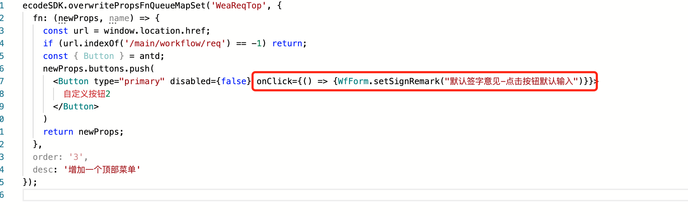


注意：一般重写组件参数和拦截接口都要使用前值加载，不然没有效果


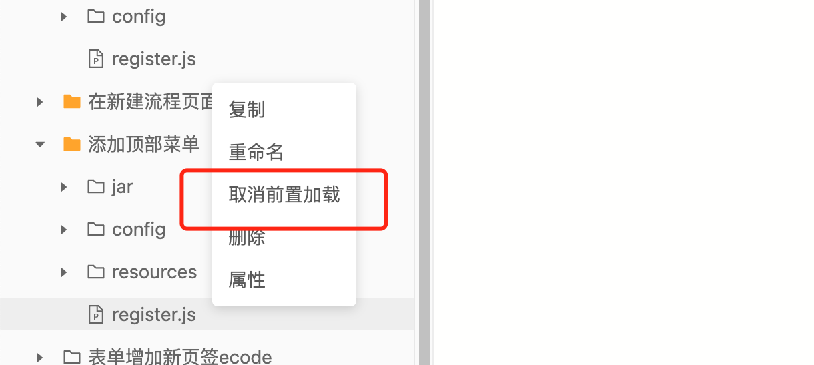


### 实现效果：


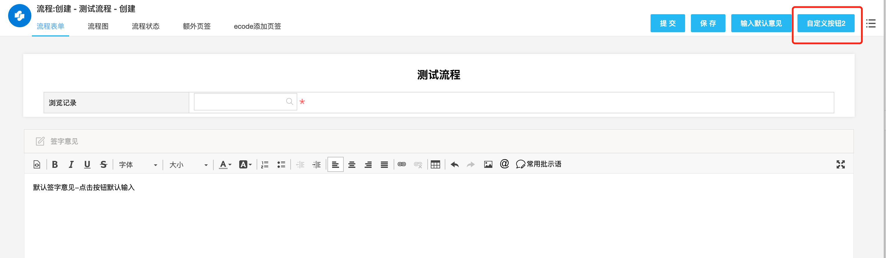
