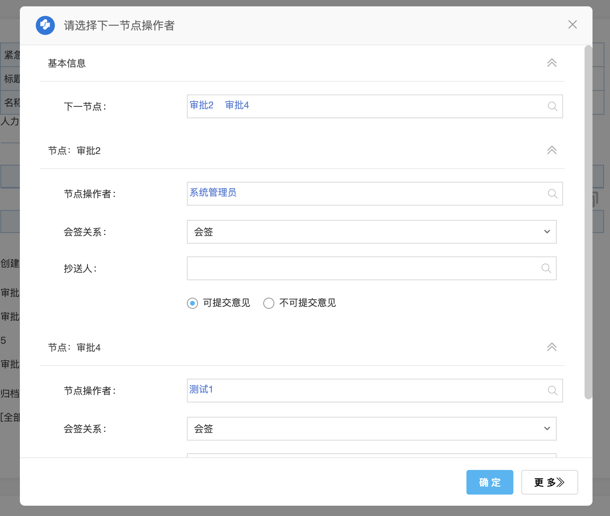
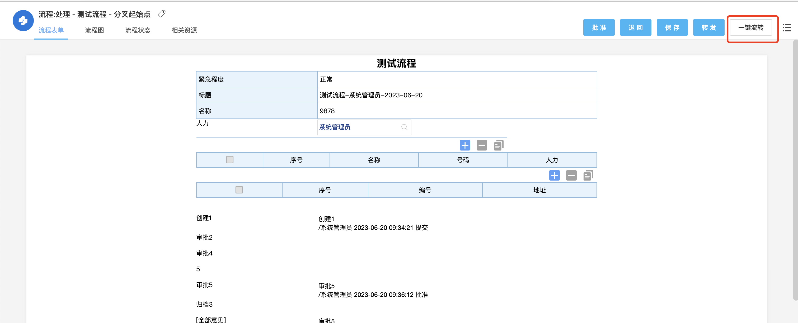
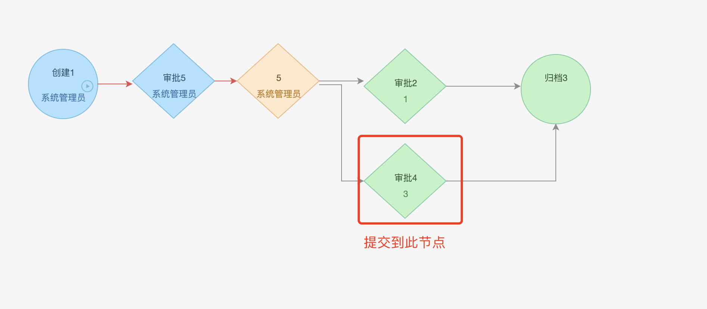
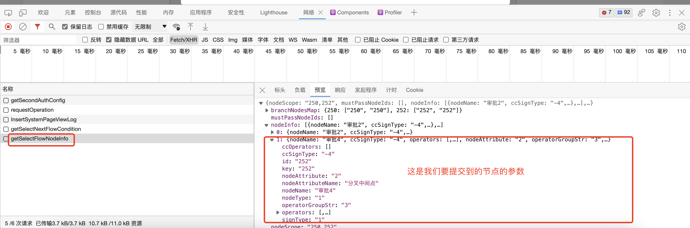
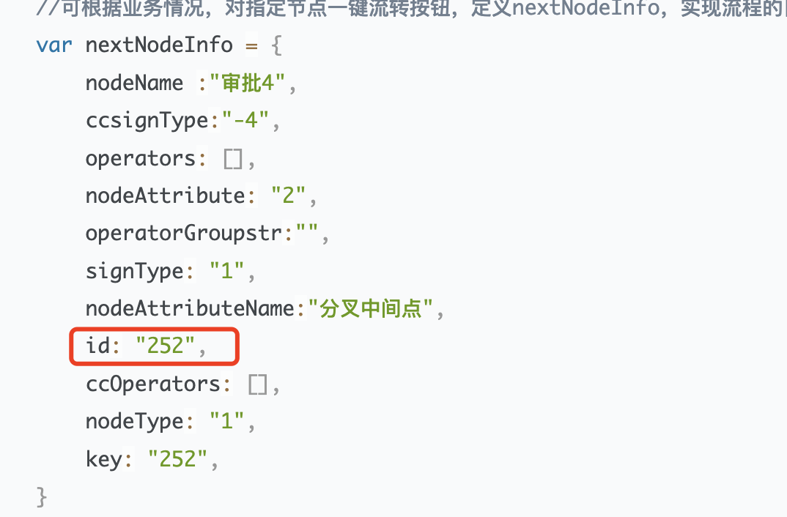

## 场景说明

流程开启指定流转后，点击提交按钮可以选择要提交到的节点





而某些领导他不想去选择节点，他想点提交时就流转到某个节点

## 需求说明

“5”节点为分叉开始节点，“审批2”和“审批4”为分叉中间点，在“5”节点点击“一键流转”按钮流转到“审批4”节点，提交时不需要去选择节点，“审批4”节点的操作者提交时固定








## 实现说明

### 实现思路

1.我们可以通过重写组件参数的方式加上“一键流转”按钮，在该按钮绑定点击事件，点击时提交流程

2.我们要往WfForm.getGlobalStore()添加一些提交参数，这样提交时就会提交到指定节点，这些参数可以从getSelectFlowNodeInfo接口中获取，我们从这个接口中获取节点参数，在点提交弹出选择节点对话框时会调用该接口，该接口返回可选择节点的信息，我们就可以获取到“一键流转”提交到的节点的节点信息





### 实现步骤

1.在ecode中重写组件参数，添加“一键流转按钮”

```javascript
ecodeSDK.overwritePropsFnQueueMapSet('WeaReqTop',{
  fn:(props)=>{
    const url = window.location.href;
    if(url.indexOf('spa/workflow/static4form/index.html') === -1) return;
    if(WfForm === undefined){
      return;
    }
    const info =WfForm.getBaseInfo();
    if(info.workflowid !== 63 && info.nodeid !== 253) return;
    // 这里可以设置一些业务逻辑，判断哪些操作者可以进行一键流转
    if(props.buttons.length !== 0){
      const {Button} = antd;
      const newButton = <Button onClick={()=>yjlzsubmit()}>一键流转</Button>;
      props.buttons.push(newButton);
    }
  }
});
```

2.编写yjlzsubmit()函数，添加提交参数进行流程提交

```javascript
const yjlzsubmit = () => {
    var canSubmit ='-4';//是否可提交意见 -4:可提交意见 -3:不可提交意见
    var nodeOperators =89;//下一节点操作者
    //nextNodeInfo可以通过抓请求/api/workflow/reqform/getSelectFlowNodeInfo 查看
    //可根据业务情况，对指定节点一键流转按钮，定义nextNodeInfo，实现流程的自动流转
    var nextNodeInfo = {
        nodeName :"审批4",
        ccsignType:"-4",
        operators: [],
        nodeAttribute: "2",
        operatorGroupstr:"",
        signType: "1",
        nodeAttributeName:"分叉中间点",
        id: "252",
        ccOperators: [],
        nodeType: "1",
        key: "252",
    }
    WfForm.getGlobalStore().commonParam.selectNextFlow= 1;//1是否指定流转
    WfForm.getGlobalStore() .submitParam. SignType_0 = nextNodeInfo.signType;//会签类型 ：非会签 1:会签2:依次逐个处理
    WfForm.getGlobalStore().submitParam.ccOperator_0 = nextNodeInfo.ccOperators;
    WfForm.getGlobalStore().submitParam.canSubmit_O=canSubmit;
    WfForm.getGlobalStore().submitParam.selectNodeFlow_nodeId_0=nextNodeInfo.id+'_'+nextNodeInfo.nodeType+'_'+nextNodeInfo.nodeAttribute
    WfForm.getGlobalStore().submitParam.selectNodeFlow_operator_0=nodeOperators;
    WfForm.getGlobalStore().submitParam.selectNodeFlow_canFlowNextNode=1;
    WfForm.getGlobalStore().submitParam.selectNodeFlow_nodeIds=nextNodeInfo.id;
    WfForm.getGlobalStore().submitParam.nodeoperator_0 = nodeOperators;//抄送人
    WfForm.getGlobalStore().submitParam.isSelectNextFlow=1; 
    WfForm.getGlobalStore().submitParam.selectNextFlowMode=1;
    // 体检流程
    WfForm.doSubmit();
}
```

## 可能遇到的问题

1.提交失败，提示节点操作者错误

可能提交参数的节点id未设置正确，确认该节点id是否为要提交到的节点的节点id



