## 需求说明

1.列表左侧显示圆点


2.鼠标移到文档名称文字变红


2.日期为灰色


## 实现思路

1.通过审查元素可以判断这是一个table组件，所以我们需要复写table组件


2.在复写时需要往左侧这一列添加一个圆点的元素


3.在其他两列为他们设置一个class样式，写入样式即可


## 实现方法

1.在门户里添加一个文档中心元素，显示文档列表。

首先新建一个coms目录用来存放组件，里面再新建一个js文件用来重写我们的组件，js文件名称你可以随便起


2.新建一个style目录用来存放样式文件，在里面新建一个index.css文件，用来写我们的样式


3.在你的组件文件里先写个类，用来声明组件


4.新建一个index.js文件，用来发布我们的组件，写入一些代码

```javascript
const NewTables = ecodeSDK.imp(NewTables)
const {Provider} = mobxReact;
const allStore = ecodeSDK.imp(allStore);
    
class NewTableCom extends React.Component {
  render(){
    return (
      <Provider {...allStore}>
        <NewTables {...this.props} />
      </Provider>
    )
  }
}
    
// 导出到全局
ecodeSDK.setCom('${appId}','NewTableCom',NewTableCom);
```

在导入组件时“NewTables”指的是组件名称，根据你的实际组件名称填写


你的组件名称在你的组件文件里面看，比如我这里的class名称是NewTables，我的组件名称就是NewTables


这个是引用上面这个的，确保名称一样


这段代码是要把组件导出到全局，${appId}是获取当前模块的appId，第二个参数是组件名称，第三个参数是要导出的组件，就是我们上面写的这个类


5.我们写的组件已经导出到全局了，然后要再写个register.js文件，引入刚才导出的组件，对原组件进行替换，注意register.js文件需要前置加载


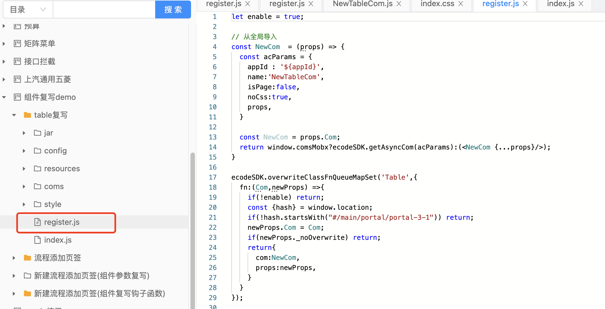


这段代码就是获取刚才导出的组件


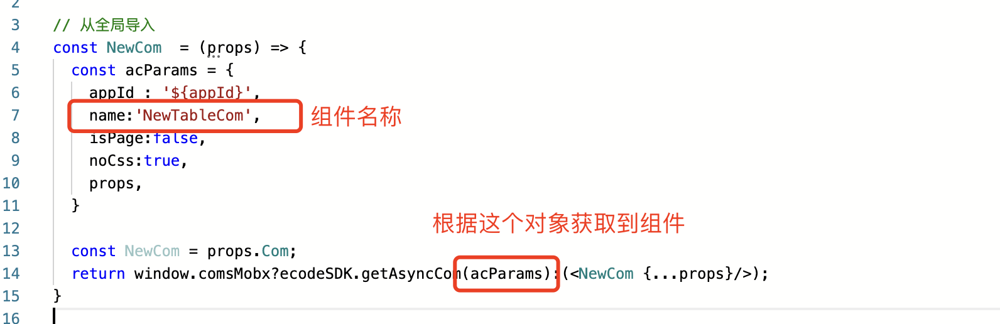


这里是设置对原有组件进行重写，就是替换了原有组件


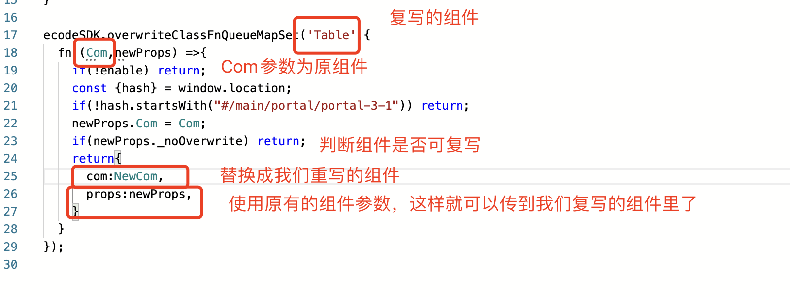


6.接下来复写table组件，在组件文件里输入这段，这是固定的写法

```
constructor(props) {
    super(props);
    this.states = {
        
    }
  }
    
  componentDidMount() {
    
  }
```


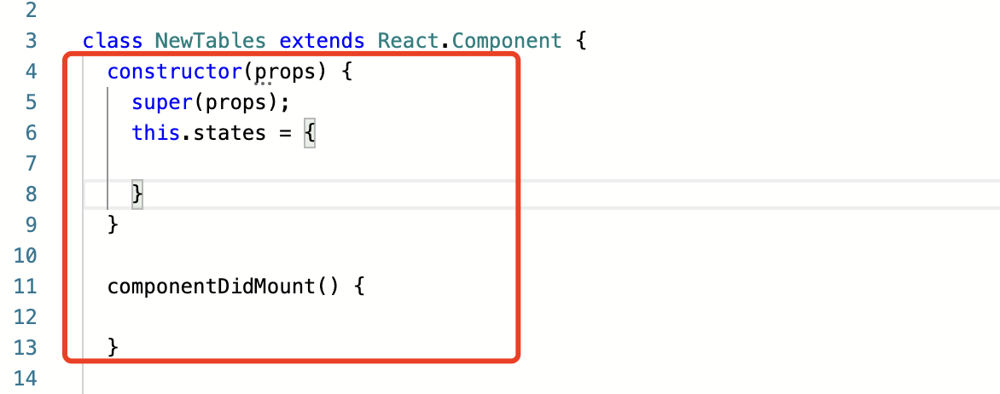


7.render里就是我们重写的内容了，我们先获取到原有组件参数


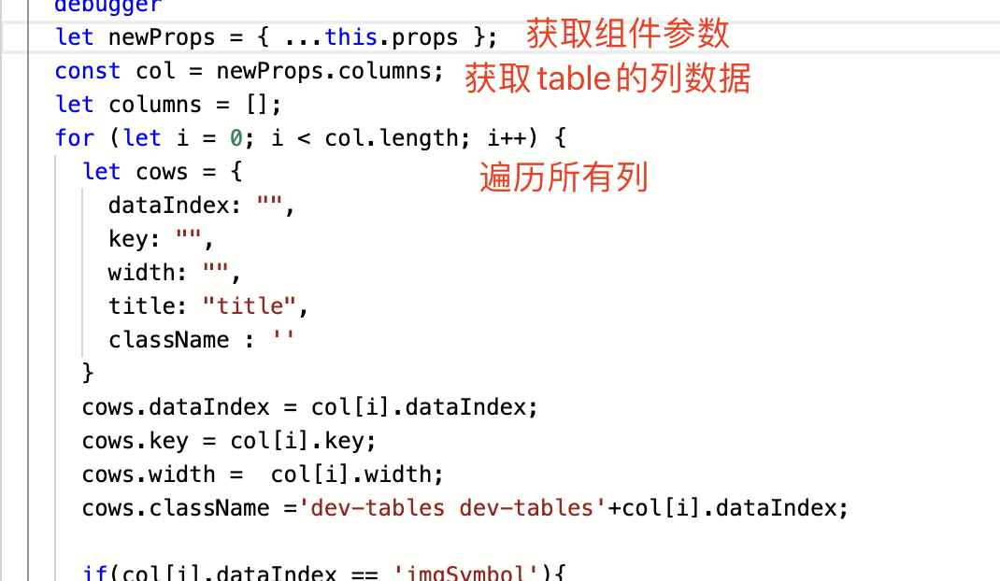


8.先看一下table都有什么参数，转到组件库查看table的代码，可以看到有columns参数，应该就是列的数据


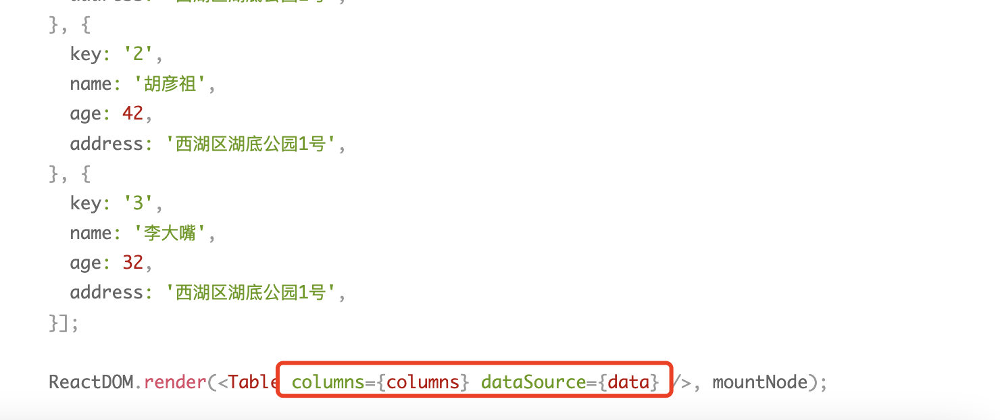


列的数据结构是这样的，可以看到代码里面定义了姓名、年龄、住址、操作这几个列


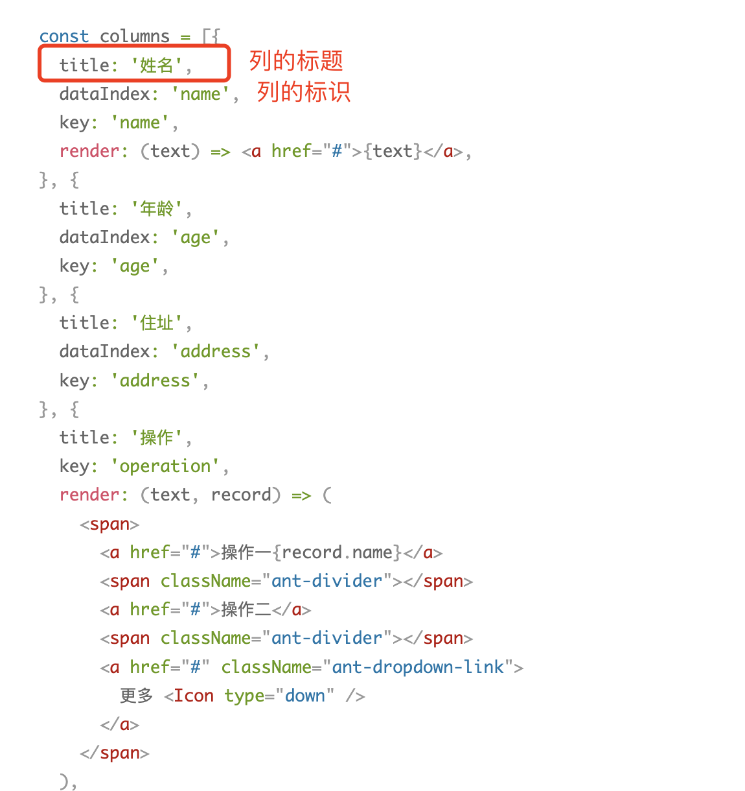


然后再看看dataSource的结构


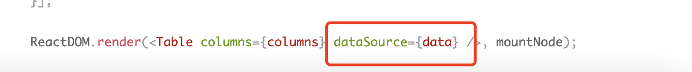


dataSource的数据结构如下，其中name、age都是对应列的dataIndex的，就是对应的是哪一列

dataSource可以看出是表格的数据


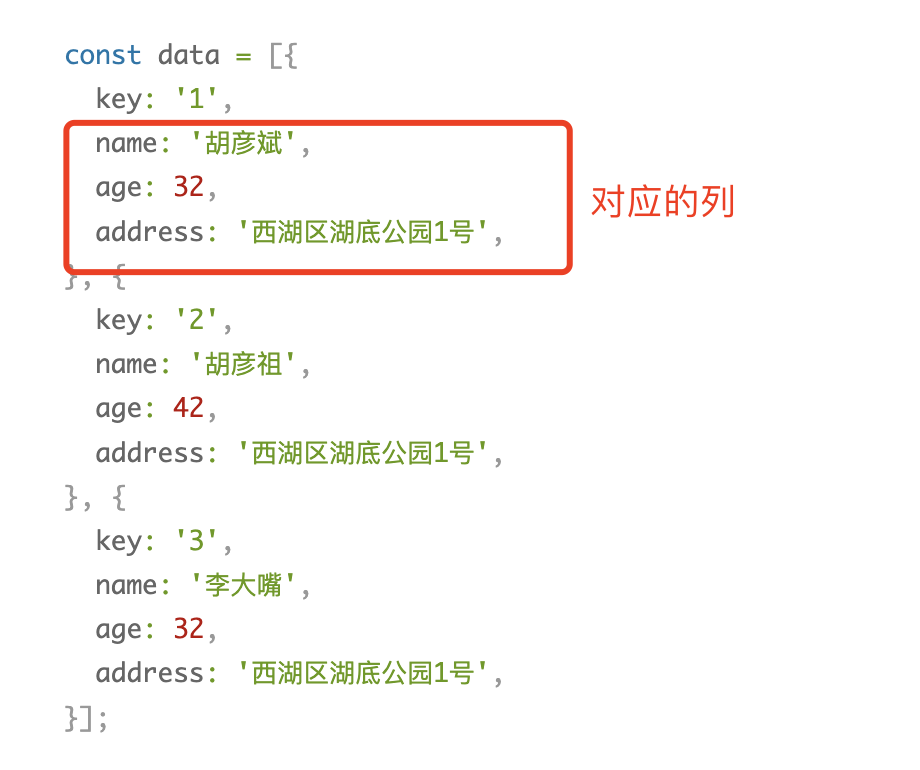


9.清除了组件的参数之后就可以进行对应的重写了，我们获取表格的列数据，然后遍历列数据，修改对应的列数据

把原有的数据赋值到我们创建的对象里


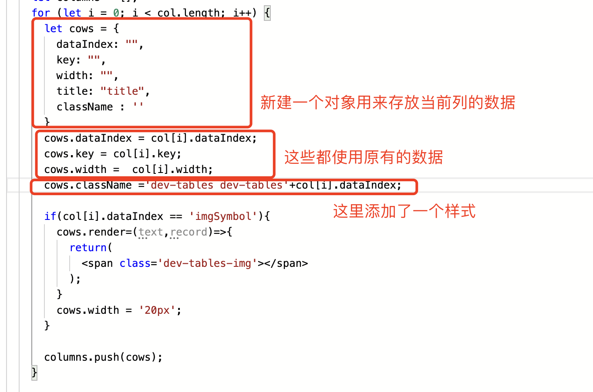


但是我怎么知道列的对象里都有哪些字段呢？像width、className在刚才的组件库代码里都没有呀

我们可以在render里debugger，然后去查看列的对象数据，就可以知道有哪些字段了，不过要先把ecode发布。


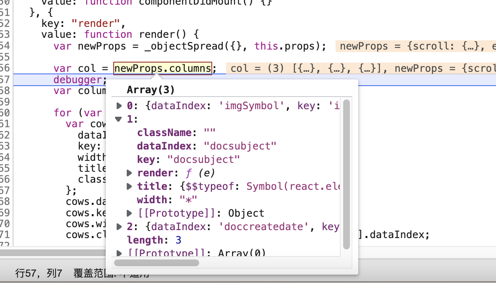


10.接下来我们要实现在列表左边添加圆点，审查元素看一下这一列，也就是imgSymbol这一列，td下面是有两个元素的，我们要把这两个元素去掉，换成我们自己加的元素


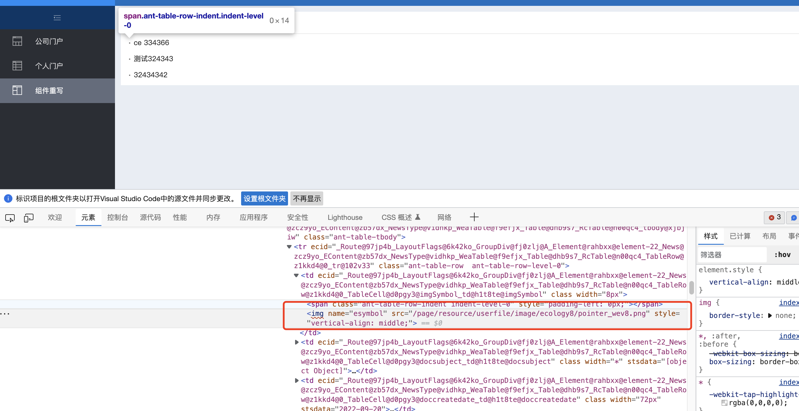


在遍历列时我们可以通过dataIndex判断是哪一列，当为imgSymbol这一列时我们就对列的render进行修改，返回一个我们自己写的元素，每一列都有render对象，render对象就是用来渲染单元格的


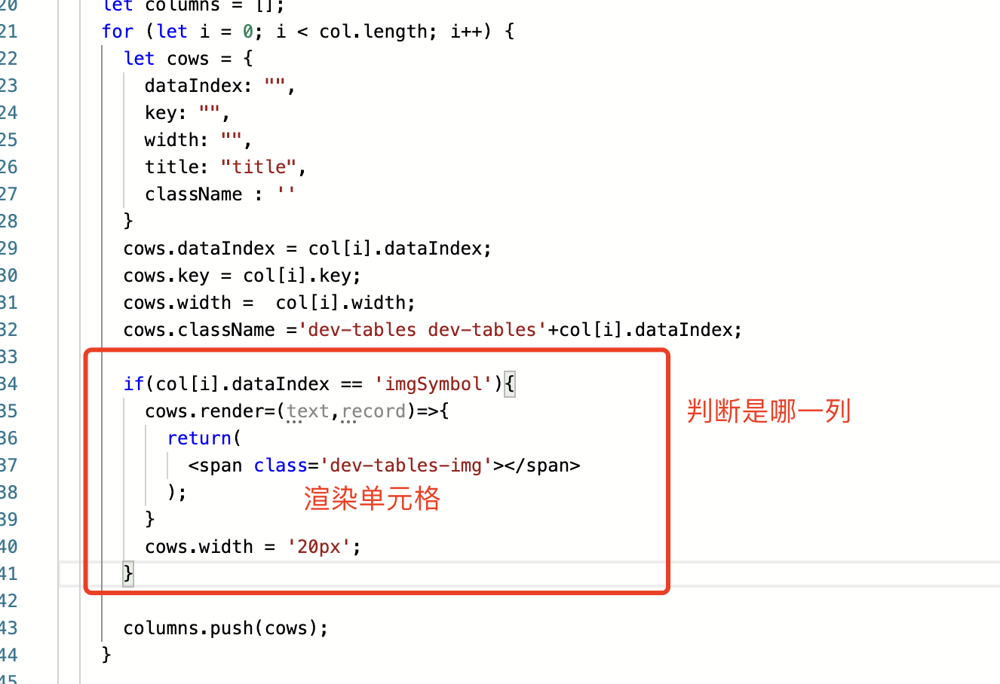


在span元素设置了一个class属性：dev-tables-img，用来定义样式显示圆点

11.然后我们就要添加列表数据了，遍历原组件参数的dataSource，获取dataSource里面的数据赋值到我们创建的对象datas里面，如果我们不执行此步骤，表格就没有内容


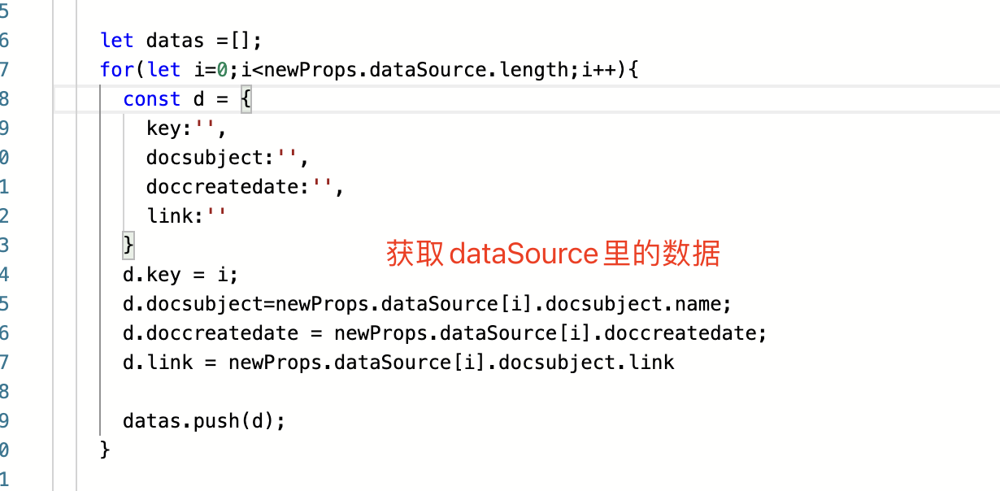


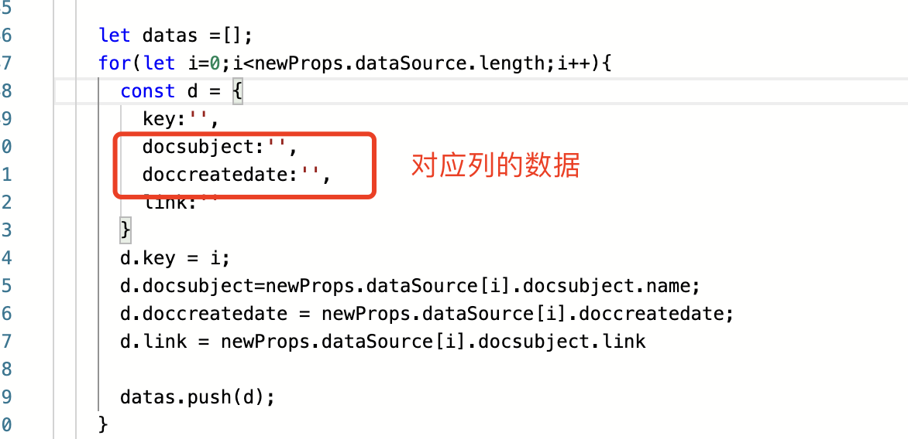


原组件的参数dataSource是什么？

我用的是门户里的文档中心，所以表格显示的是文档列表，通过调试知道dataSource是文档的数据


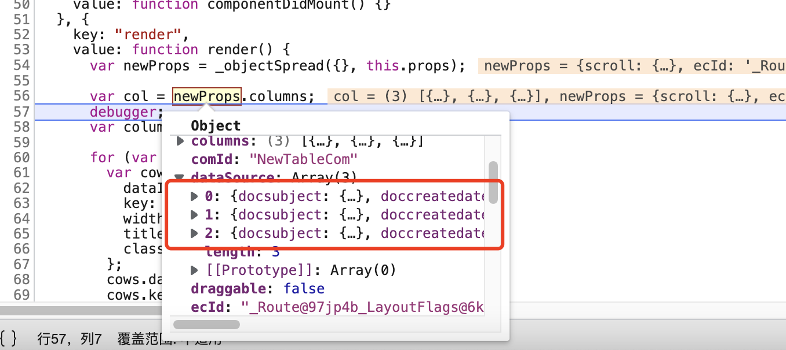


12.设置render的return返回值，返回的是一个table组件，把列数据和表格数据都传到组件里，还有其它的参数例如pagination到组件库去查一下是什么作用的就可以了


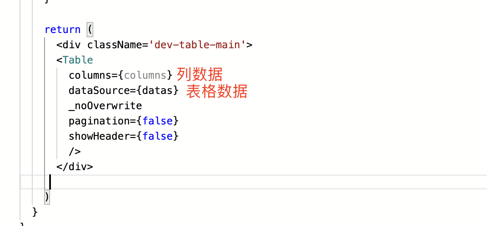


13.现在整个组件文件的代码已经写完了，然后还差3个样式，编辑index.css文件，输入：

```
.dev-tables-img{
  background:#ccc;
  display: block;
  width: 10px;
  height: 10px;
  border-radius: 45px;
}
.dev-tablesdocsubject:hover{
  color:red;
}
.dev-tablesdoccreatedate{
  color: #ccc;
}
    
```

.dev-tables-img是小圆点的

.dev-tablesdocsubject是文档名称的样式，鼠标悬浮时文字变红

我们是样式叫.dev-tablesdocsubject呢？因为在组件里定义样式时是把dev-tables加上了列的dataIndex


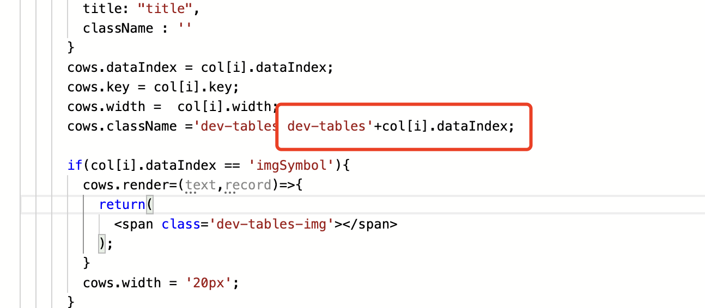


注意我们重写组件的样式时需要保留组件的原有class


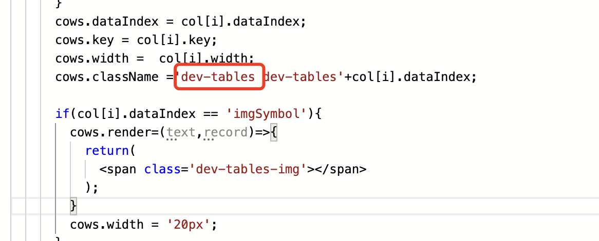


14.现在组件已经重写好，发布ecode

## 源码

**附件：** [table复写.zip](./files/table复写.zip)


ecode导出文件

register.js

```javascript
let enable = true;
    
// 从全局导入
const NewCom  = (props) => {
  const acParams = {
    appId : '${appId}',
    name:'NewTableCom',
    isPage:false,
    noCss:true,
    props,
  }
  
  const NewCom = props.Com;
  return window.comsMobx?ecodeSDK.getAsyncCom(acParams):(<NewCom {...props}/>);
}
    
ecodeSDK.overwriteClassFnQueueMapSet('Table',{
  fn:(Com,newProps) =>{
    if(!enable) return;
    const {hash} = window.location;
    if(!hash.startsWith("#/main/portal/portal-3-1")) return;
    newProps.Com = Com;
    if(newProps._noOverwrite) return;
    return{
      com:NewCom,
      props:newProps,
    }
  }
});
    
```

index.js

```javascript
const NewTables = ecodeSDK.imp(NewTables)
const {Provider} = mobxReact;
const allStore = ecodeSDK.imp(allStore);
    
class NewTableCom extends React.Component {
  render(){
    return (
      <Provider {...allStore}>
        <NewTables {...this.props} />
      </Provider>
    )
  }
}
    
// 导出到全局
ecodeSDK.setCom('${appId}','NewTableCom',NewTableCom);
```

NewTableCom.js

```javascript
const {Table} = antd;
    
class NewTables extends React.Component {
  constructor(props) {
    super(props);
    this.states = {
        
    }
  }
    
  componentDidMount() {
    
  }
    
  render() {
    
    let newProps = { ...this.props };
    const col = newProps.columns;
    debugger
    let columns = [];
    for (let i = 0; i < col.length; i++) {
      let cows = {
        dataIndex: "",
        key: "",
        width: "",
        title: "title",
        className : ''
      }
      cows.dataIndex = col[i].dataIndex;
      cows.key = col[i].key;
      cows.width =  col[i].width;
      cows.className ='dev-tables dev-tables'+col[i].dataIndex;
    
      if(col[i].dataIndex == 'imgSymbol'){
        cows.render=(text,record)=>{
          return(
            <span class='dev-tables-img'></span>
          );
        }
        cows.width = '20px';
      }
  
      columns.push(cows);
    }
    
    let datas =[];
    for(let i=0;i<newProps.dataSource.length;i++){
      const d = {
        key:'',
        docsubject:'',
        doccreatedate:'',
        link:''
      }
      d.key = i;
      d.docsubject=newProps.dataSource[i].docsubject.name;
      d.doccreatedate = newProps.dataSource[i].doccreatedate;
      d.link = newProps.dataSource[i].docsubject.link
    
      datas.push(d);
    }
    
    return (
      <div className='dev-table-main'>
      <Table
        columns={columns}
        dataSource={datas}
        _noOverwrite
        pagination={false}
        showHeader={false}
        />
      </div>
     
    )
  }
}
```

index.css

```
    
.dev-tables-img{
  background:#ccc;
  display: block;
  width: 10px;
  height: 10px;
  border-radius: 45px;
}
.dev-tablesdocsubject:hover{
  color:red;
}
.dev-tablesdoccreatedate{
  color: #ccc;
}
    
```

项目结构


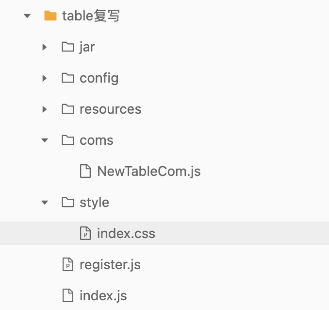
