## 所需技术前提

## 本教程可获得的知识

## 前言

本教程会详细地讲开发实现的逻辑，比如怎么弹窗，弹窗顺序怎么控制，如何实现一天只提醒一次等，但对于组件的样式就不详细描述，后端代码比较简单，所以也不会进行说明，想了解的话直接看源码就行

## 项目背景

客户需要在进入门户时多加两个提醒，一个是入党周年提醒（政治生日提醒），就是按你入党日期来算的，跟生日提醒差不多，可以看个人的政治生日提醒也可以看到其他人的政治生日提醒，另一个是入税务系统周年提醒，这个跟入职周年提醒差不多

## 项目难点


## 分享价值

在门户做提醒应该是比较常见的一个开发，可以教大家怎么在门户做提醒，如果有遇到提醒不能重叠这种需求的话本分享也能给很大的帮助。自动循环滚动列表也是一个常见场景，新闻和公告里面用的比较多，大家可以参考我是怎么做的。我会从原理上进行说明，解释代码，尽量能让人理解，明白原理之后相信大家也会学到不少动西。

## 开发效果

## 需求简要

在门户做几个弹窗提醒，保证每次进入门户时只能有一个弹窗提醒，不能同时弹出多个，还要保证提醒的顺序，比如第一次进入时进行提醒A，第二次进入时进行提醒B，控制一天只能弹出一次。

## 需求描述

需要在用户进入门户时，作以下几个提醒，一天只提醒一次

### 政治生日提醒

1.当前用户登录系统后，如果该用户的入党时间满周年，则进行提醒，如下图所示。需要根据个人信息里的入党日期来判断是否提醒。


2.如果有其他人过政治生日（自己没有过），则用户登录后展示过政治生日的人员列表，人员列表可以自动滚动。可以送祝福给过政治生日的人。


### 入税务系统周年提醒

如果当前用户满入职税务系统周年，则进行提醒


需要根据个人信息里的自定义字段“入税务系统日期”来判断是否需要提醒（该字段要手动添加）


### 入职周年提醒

修改入职周年提醒样式如下（这是系统标准的入职周年提醒）


提醒中的背景图可以在后端中配置


### 其他

以上几个提醒不能重叠，也就是不能同时进行提醒，一次只能有一个弹窗，如果一天有多个提醒，需要在每次进入门户时分别弹出，这次进入门户弹出A提醒，下次进入门户时弹出B提醒

控制提醒顺序：1.系统入职周年提醒或生日提醒 2.税务系统入职周年提醒 3.个人政治生日提醒 4.其他人政治生日提醒

## 各功能点实现说明

### 弹窗逻辑结构

首先要判断当前用户有没有生日提醒或入职提醒，如果都有则只弹出其中一个，下次再弹出另一个，接着就进入我们自己开发的React组件，去弹出额外开发的几个弹窗,先判断有没有入税务系统周年提醒，如果有则弹出，如果没有再接着判断有没有个人政治生日提醒，如果有则弹出，如果没有再接着判断有没有其他人的政治生日，如果有则弹出。


### 控制生日提醒和入职周年提醒不能同时提醒

当进入门户时会请求生日提醒接口和入职提醒接口，拦截这两个接口，根据接口数据以及缓存判断生日或者入职周年是否需要提醒，当其中一个要提醒时就阻止另一个提醒。

判断是否需要提醒

拦截接口时我们要知道这个提醒是否需要提醒，可以根据接口返回数据和缓存判断是否需要提醒，如果接口返回有提醒数据，就表示要提醒，当提醒过后会存入一个缓存，缓存的值为今天日期，则今天都不会再次提醒，所以可以根据是否有缓存来判断是否要提醒。

（查看接口的调用堆栈，可找到接口发起的代码位置，此为入职周年提醒的接口）


在代码中看到入职周年提醒使用了缓存，当缓存中的日期不等于今天日期时才会调用接口


在生日提醒的接口中也能看到使用了缓存


此代码判断了是否有入职周年提醒缓存，使用WeaTools获取到缓存，然后判断缓存中的日期是否为今天日期。入职周年提醒的缓存名称可以从调用接口的代码中找到（上图已给出）

生日提醒的缓存获取也是一样的

关于如何使用缓存可以看官方的介绍：[Ecology 9 (e-cology.cn)](https://cloudstore.e-cology.cn/#/pc/component/WeaTools_storage/demo-0)

```javascript
/**
 * 是否有入职周年提醒缓存
 */
function isHaveEntryRemindCache() {
    const {WeaTools} = ecCom;
    const ls = WeaTools.ls;
    let cacheDate = ls.getStr('hrm-anniversary-date');
    if(cacheDate === '' || cacheDate === undefined){
        return false;
    }
    cacheDate += ' 00:00';
    cacheDate = new Date(cacheDate);
    const today = new Date(getToday());
    return cacheDate.getTime() === today.getTime();
}
```

如何阻止提醒

比如判断了入职周年提醒有提醒后，需要在生日接口拦截中阻断生日提醒。在拦截接口中清除接口返回数据里面的值就可以阻止提醒，同时还需要清除缓存，如果没有清除缓存，则下次进入门户时它就不会调用接口，就不会再次提醒了。


保证只弹出一个提醒

我们需要设置两个标识，分别为isBirthdayRemind和isEntryRemind，分别用来判断是否需要生日提醒和是否需要入职周年提醒，当在接口拦截中判断了需要生日提醒时，就把isBirthdayRemind设为1，这样在拦截入职周年提醒时如果 isBirthdayRemind=1 ，那就阻断入职周年提醒，因为这两个接口的执行顺序不能保证一样，可能是生日提醒接口先拦截到，也可能是先拦截到入职周年提醒接口，所以在入职周年提醒接口拦截中也要根据是否需要提醒而设置isEntryRemind的值，然后在生日提醒接口拦截中 判断isEntryRemind的值来是否阻断提醒。


关键代码：


### 开发的弹窗提醒

当提醒完生日和入职周年提醒之后，就进行自定义开发提醒，也就是入税务系统周年提醒和政治生日提醒

在register.js文件里有一个addModal()函数，此函数是用来进行自定义开发弹窗提醒的，每次拦截生日接口和入职周年接口都会执行addModal()函数，函数内有个条件，当满足 isBirthdayRemind === 0 && isEntryRemind === 0 后就进行自定义开发提醒，也就是不需要提醒生日和不需要提醒入职周年提醒时才进行自定开发提醒


为了防止有了缓存没有请求生日接口和入职周年接口，需要在载入时判断是否需要提醒生日和是否需要提醒入职周年

```
$(() => {
  if (isEntryRemind === -1 && isHaveEntryRemindCache()) {
    isEntryRemind = 0;
  }
  if (isBirthdayRemind === -1 && isHaveBirthdayDateCache()) {
    isBirthdayRemind = 0;
  }
  addModal();
})
```

#### 将弹窗组件加载到页面

Remind组件里包含了开发的提醒，需要将这个组件加载到页面才能显示开发的提醒

首先创建一个div元素

const div = document.createElement("div");

然后将此元素添加到id为container的元素，该元素是门户页面的父级容器

document.getElementById('container').appendChild(div);

最后使用 ReactDOM 加载组件到新建的div元素中

ReactDOM.render(<Remind/>, div);

完整代码：

```javascript
const Remind = (props) => {
    const params = {
        appId: '${appId}',
        name: 'Remind',
        isPage: false,
        noCss: true,
        props
    }
    const NewCom = props.Com;
    return window.comsMobx ? ecodeSDK.getAsyncCom(params) : (<NewCom {...props}/>);
}
    
// 添加开发的提醒窗口
function addModal() {
    console.log('isBirthdayReminded:' + isBirthdayRemind + ",isEntryReminded:" + isEntryRemind);
    if (isBirthdayRemind === 0 && isEntryRemind === 0) {
        if (isAdded) return;
        isAdded = true;
        console.log('进行政治生日提醒');
        const div = document.createElement("div");
        document.getElementById('container').appendChild(div);
        ReactDOM.render(<Remind/>, div);
    }
}
```

### 复写入职周年提醒

根据需求，标准的入职周年提醒样式不满足，需要进行复写

在register.js中注册组件复写，对入职周年提醒的组件Modal进行复写

```java
/**
 * @author 姚礼林
 * 复写入职周年提醒对话框，因为标准的对话框样式不符合需求
 */
ecodeSDK.overwriteClassFnQueueMapSet('Modal',{
    fn:(Com,props)=>{
        if(props.ecId === undefined || props.ecId.indexOf('_HrmAnniversary@6vvnpk_WeaDialog@bymi48_Modal') ===-1){
            return{
                com:Com,
                props:props
            }
        }
        props.isEntryReminded = isEntryRemind;
        return{
            com:entryRemind,
            props:props
        }
    }
});
    
const entryRemind = (props)=>{
    const params ={
        appId:'${appId}',
        name:'EntryRemind',
        isPage:false,
        noCss:true,
        props
    }
    const NewCom = props.Com;
    return window.comsMobx?ecodeSDK.getAsyncCom(params):(<NewCom {...props}/>);
}
```

在复写注册时，可以根据组件的ecId来判断是否是我们要复写的组件，ecId可以在组件的元素中找到，不能取全部的ecId来判断，这会判断不成功，通常是取<span style="color:red">@*组件名</span>之前的文本

比如<span style="color:red">ecId为  _HrmAnniversary@6vvnpk_WeaDialog@bymi48_Modal@dlbnq3_Dialog@wo4l61_LazyRenderBox@</span>[jdqr1b_div@nreky5](http://jdqr1b_div@nreky5/)<span style="color:red"></span>，组件为Modal,则取<span style="color:red">_HrmAnniversary@6vvnpk_WeaDialog@bymi48_Moda</span>这一段用来判断ecId。如果你不知道这是什么组件，则也可以根据ecId进行判断，比如前面这个ecId为里面有几个看起来像组件名称的文字，比如WeaDialog、Modal、Dialog，再结合元素的样式名称判断组件，在组件库中查找有没有该组件，在用这个组件名进行拦截，看有没有被拦截到

组件库地址：[Ecology 9 (e-cology.cn)](https://cloudstore.e-cology.cn/#/pc/doc/common-index)


（结合样式名来判断组件）


EntryRemind组件复写到原来的组件，实现弹窗提醒， 在EntryRemind组件内初始化中调用系统标准的<span style="color:red">getEntryRemindInfo</span>接口，获取提醒的背景图片、提醒文本等信息


用WeaDialog组件作为弹窗组件，里面放自定义的内容


### 入税务系统周年提醒

每次拦截生日提醒接口和入职周年提醒接口后都会执行addModal()，在此函数中判断是否有生日提醒或入职周年提醒，如果都没有才会加载Remind组件，在该组件进行入税务系统周年提醒和政治生日提醒

```javascript
function addModal() {
    console.log('isBirthdayReminded:' + isBirthdayRemind + ",isEntryReminded:" + isEntryRemind);
    if (isBirthdayRemind === 0 && isEntryRemind === 0) {
        if (isAdded) return;
        isAdded = true;
        console.log('进行政治生日提醒');
        const div = document.createElement("div");
        div.id = 'rdzn';
        document.getElementById('container').appendChild(div);
        ReactDOM.render(<Remind/>, div);
    }
}
```

在Remind组件中，在初始化时调用接口，该接口属于自己开发的，返回了入税务系统的周年数，如果没有满周年则会返回0，通过该接口判断是否需要进行入税务系统周年提醒

为了实现一天只提醒一次，这里也用了缓存，提醒后存入缓存，下次执行时判断缓存里有没有今天的日期，如果有则不进行提醒


TaxSystemRemind是用来显示入税务系统周年提醒的组件，判断需要进行入税务系统周年提醒时就会显示该组件


在TaxSystemRemind组件内使用了WeaDialog组件用来展示提醒


### 个人政治生日提醒

如果不需要进行入税务系统周年提醒，则判断是否需要进行个人政治生日提醒，该提醒也是用了缓存，来实现今天不重复提醒

调用了开发的接口<span style="color:red">/api/hrm/dev/partyRemind/getRemindInfo</span>，该接口返回政治生日的周年数，如果没满周年会返回0 ，通过该接口判断是否需要进行个人政治生日提醒


当要进行个人政治提醒时，就显示PartyRemindPersonal组件，该组件内使用了WeaDialog组件作为弹窗组件


### 其他人政治生日提醒

当不满足政治生日提醒之后（没满周年），则展示其他人的政治生日

需要调用开发的接口<span style="color:red">/api/hrm/dev/partyRemind/getPersonalList</span>来获取当天过政治生日的人


效果：


#### 送祝福


在点击政治生日人员列表中的送祝福按钮后弹出该窗口，该功能和标准的生日送祝福一样，虽然看起来和标准的送祝福一样，但界面都是自己写的。贺卡背景是固定的，存放在ecode中，祝福语也是固定的。当点击发送时调用标准的<span style="color:red">/api/hrm/birthday/saveBlessingForm</span>接口，送祝福给指定人


一些具体逻辑省略描述，大家可以看源码，送祝福弹窗组件在 bless.js 文件中

#### 自动循环滚动的实现

政治生日人员列表需要进行持续滚动（如下图），它会进行一个循环滚动，也就是最后一条数据会接第一条数据继续滚动。当鼠标移动到弹窗内时停止滚动。鼠标滚轮可以手动滚动。


实现持续滚动的方法是我们需要做两个内容一样的列表放到滚动容器里（如下图所示），这样就可以实现收尾拼接的效果


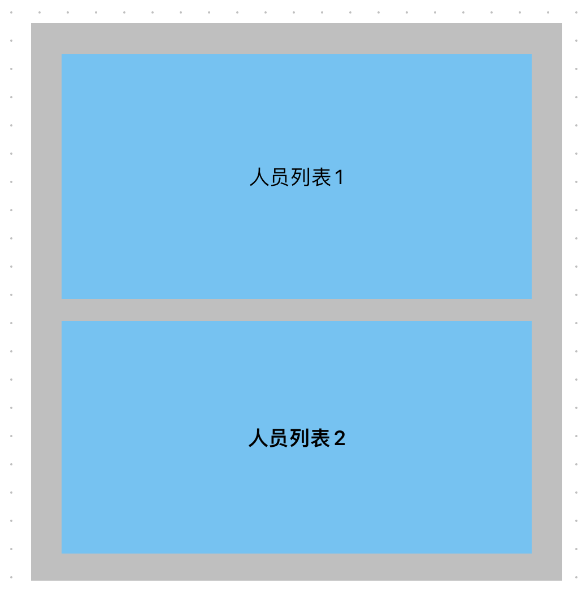


一开始展示是这样的，只显示人员列表1:


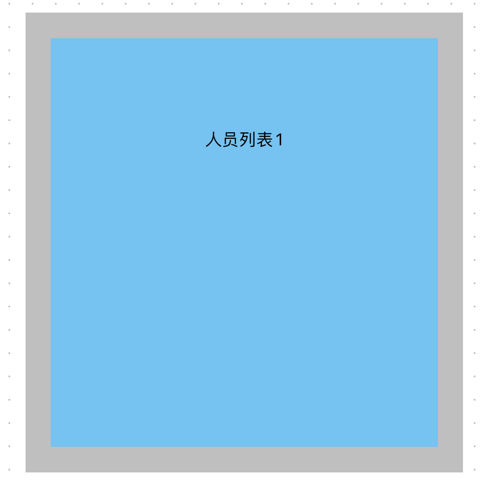


当滚动到人员列表1结尾时，就会显示人员列表2，因为这两个列表的内容是一模一样的，造成循环滚动的现象


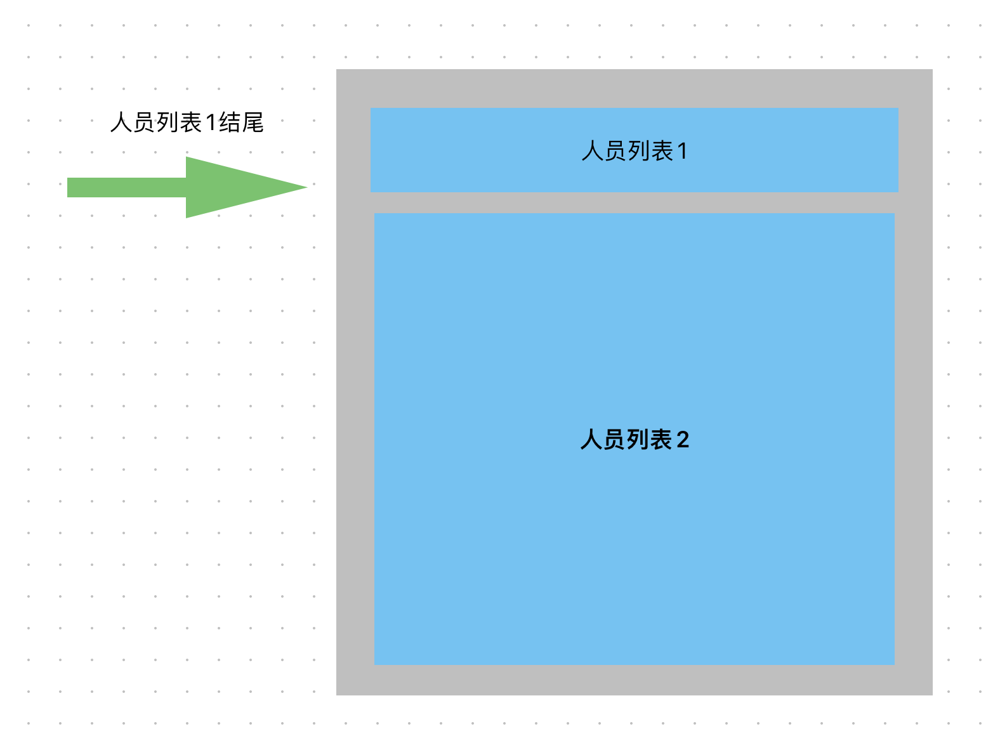


当人员列表1滚动完后，也就是滚动距离等于人员列表1的高度，重新开始滚动（如下图所示）


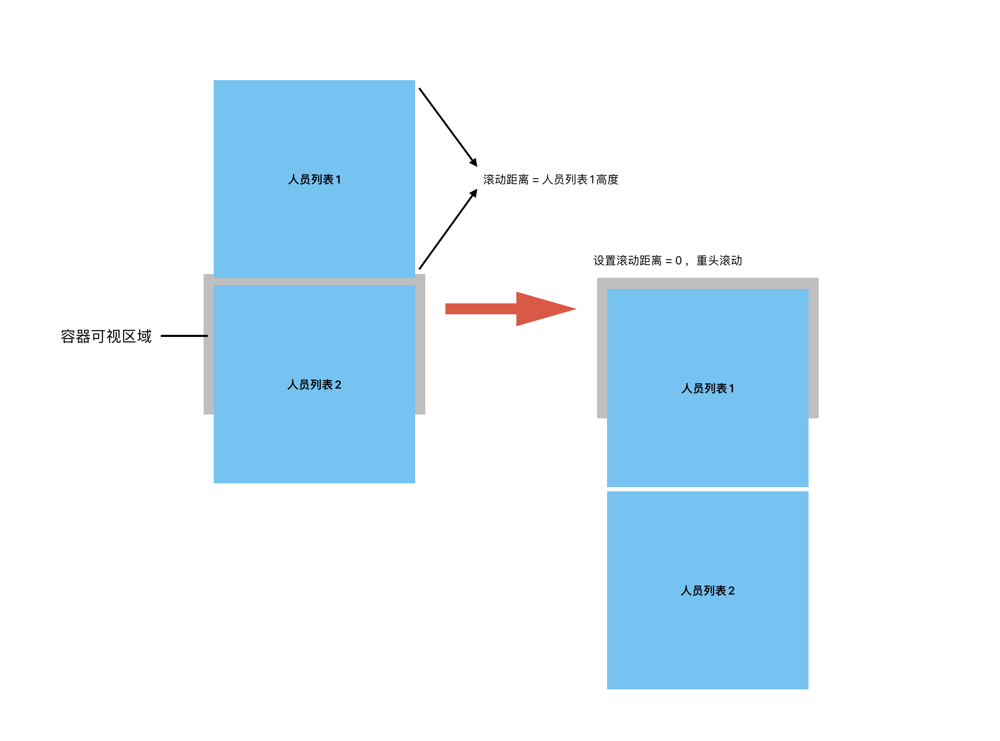


（在滚动容器中放置两个一样的列表）


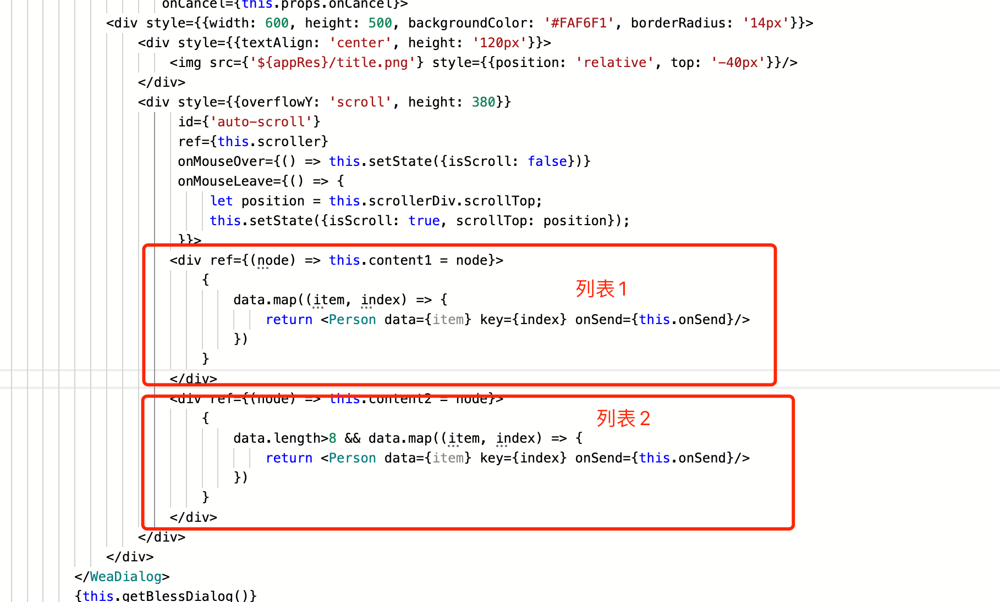


当滚动到人员列表1正好消失时，也就是容器的滚动距离 = 人员列表1的滚动高度，设置容器的滚动距离为0，从头开始滚动

我们需要在弹窗组件渲染后获取到滚动容器元素，创建一个定时器，每50毫秒设置滚动容器的滚动距离+1，这样就可以实现组件的持续滚动

可以用ref获取到react渲染后的元素，该属性的参数接收一个函数，该函数包含一个参数，可以通过该参数得到元素对象


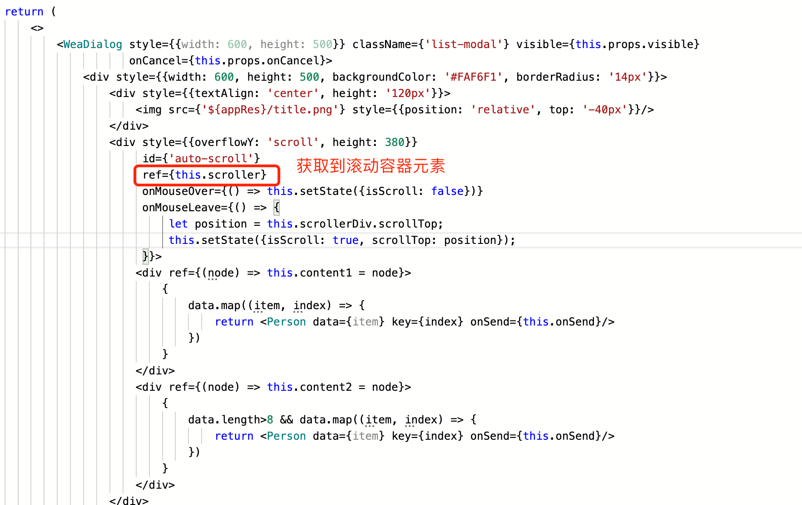


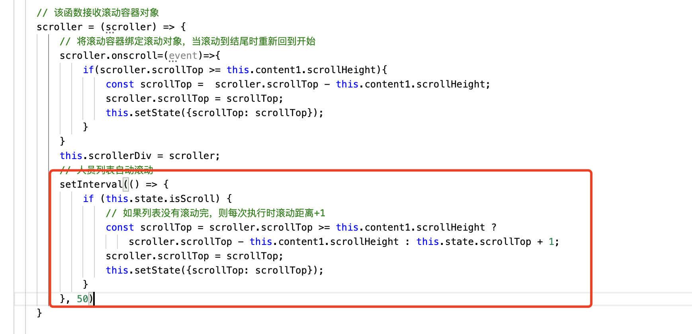


状态里存放scrollTop，记录滚动距离，当更新滚动距离时就会渲染元素，让列表滚动，状态存放isScrolll，记录是否滚动


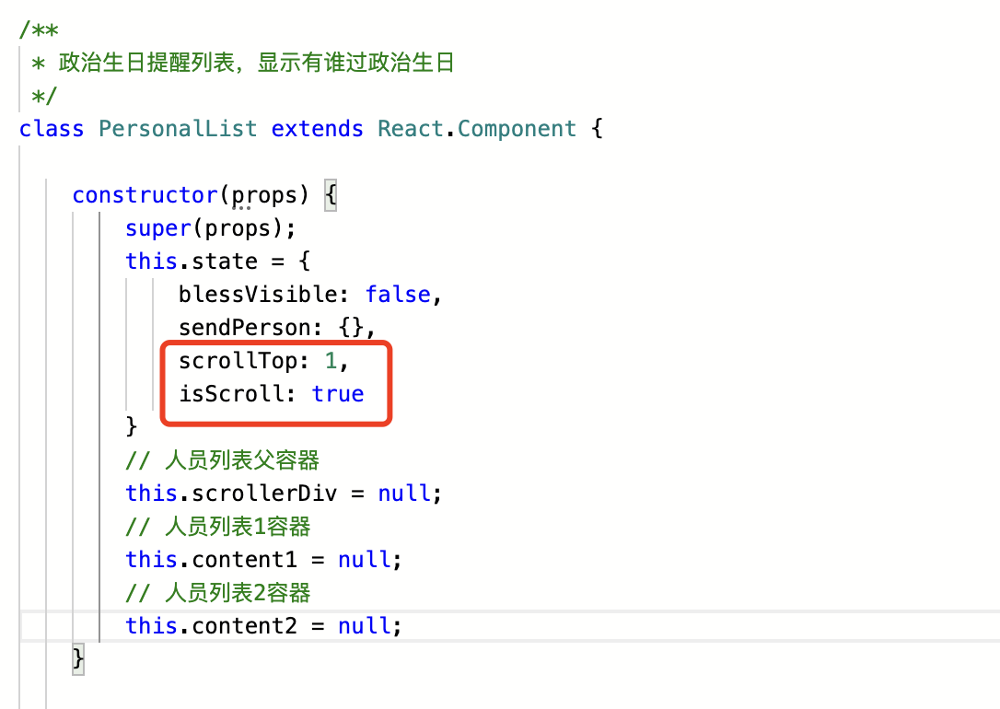


此外我们还有手动滚动的情况，我们添加一个滚动事件，每次滚动时都会执行该事件，当滚动距离>人员列表1滚动高度时，就重头滚动


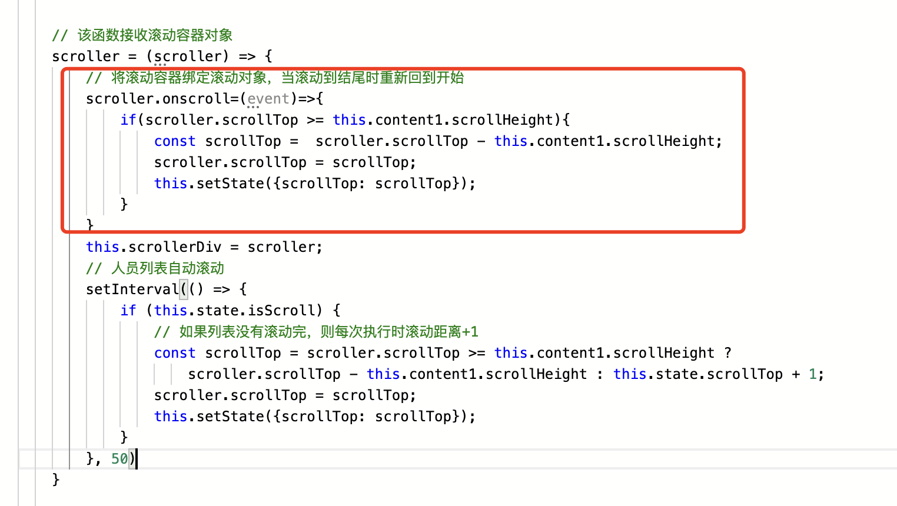


当鼠标移到列表时就停止滚动，离开列表就继续滚动，需要在滚动容器加一个鼠标停留和鼠标离去的事件，当鼠标停留时更新状态isScroll为false（停止滚动），离开时恢复为true（继续滚动），同时记录当前滚动距离，并更新状态总的scrollTop


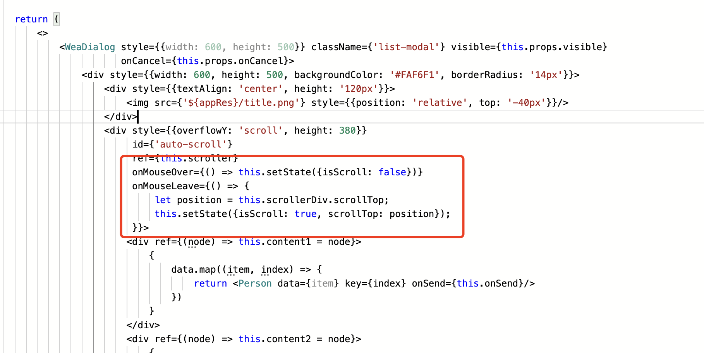


当状态的isSroll为false时，定时器中的滚动事件就不会执行，列表也就不会自动滚动


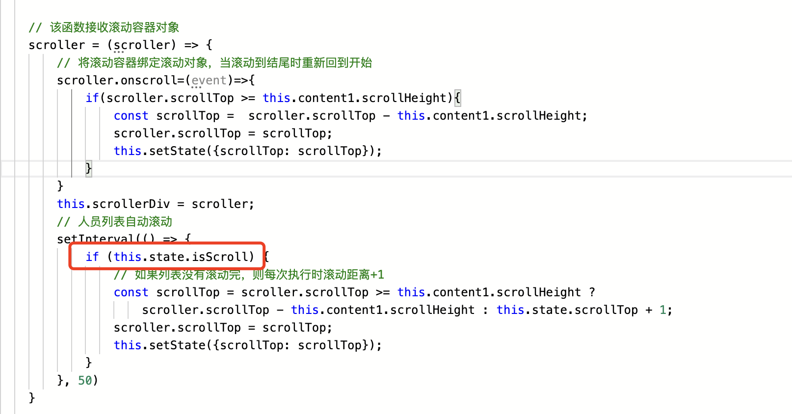


## 源码

**附件：** [20230615-v1-测试包-税局入党周年提醒-姚礼林.zip](./files/20230615-v1-测试包-税局入党周年提醒-姚礼林.zip) (2.16MB)