## 一、使用代理添加页签

代理GetFormTabCmd类，添加页签

```java
@CommandDynamicProxy(target = GetFormTabCmd.class,desc = "拦截流程tab页签接口" )
public class AddCustomTab extends AbstractCommandProxy<Map<String, Object>> {
    
    @Override
    public Map<String, Object> execute(Command<Map<String, Object>> command) {
        Map<String ,Object> result = nextExecute(command);
        GetFormTabCmd cmd = (GetFormTabCmd) command;
        Map<String ,Object> params = cmd.getParams();
    
        // "customTabs"为GetFormTabCmd暴露出来的，方便添加tab
        List<TabEntity> customTabs = (List<TabEntity>) result.get("customTabs");
        TabEntity tabBean = new TabEntity();
        tabBean.setKey(GetFormTabCmd.IFRAME_TAB_PREFIX+"testtab");
        tabBean.setTitle("额外页签");
        tabBean.setTitleText("额外页签");
        tabBean.setAppendPC(true);
        tabBean.setAppendMobileDrop(false);
        tabBean.setAppendMobileTab(false);
        customTabs.add(tabBean);
        result.put("customTabs",customTabs);
        return result;
    }
}
```

效果：


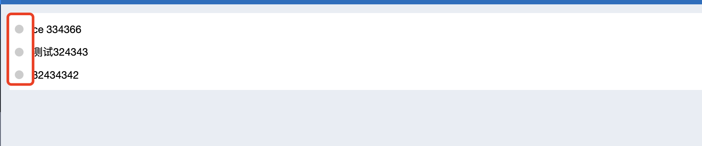


## 二、ecode添加页签

使用代理添加页签是不能设置页签页面内容的，使用ecode就能在页签添加一些内容

在ecode的rigister.js编写：

```javascript
let enable = true; //总开关
    
// 重写组件参数
ecodeSDK.overwritePropsFnQueueMapSet('WeaReqTop',{
  fn:(newProps,name)=>{
    if(!enable) return ;
    const {hash} = window.location;
    if(!hash.startsWith('#/main/workflow/req')) return;
    const baseInfo = WfForm.getBaseInfo();
    if(baseInfo.workflowid!==3) return ;
    const {Button} = antd;
    newProps.tabDatas.push({
      title:"ecode添加页签",
      key:"newTab1"
    });
    
    if(newProps.selectedKey==="newTab1") {
      newProps.children.push(<Button>ecode添加的tab内容在这里</Button>)
    }
    
    return newProps;
  },
  order:5,
  desc:'增加一个新的页签'
});
    
```

### 原理：

ecodeSDK.overwritePropsFnQueueMapSet()方法就是重写组件参数的，可以在这里面获取到组件参数，然后进行重写，返回新的组件参数


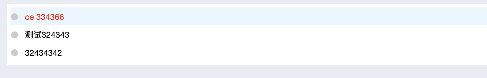


这里重写的是WeaReqTop的组件参数，可以到组件库里搜一下这个组件，[Ecology 9 (e-cology.cn)](https://cloudstore.e-cology.cn/#/pc/component/WeaReqTop/demo-3?code=0)

那我怎么知道这个组件有哪些参数呢？

到组件库里看一下这个组件


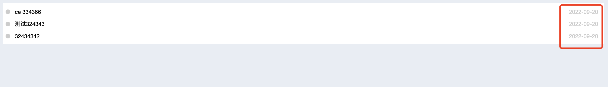


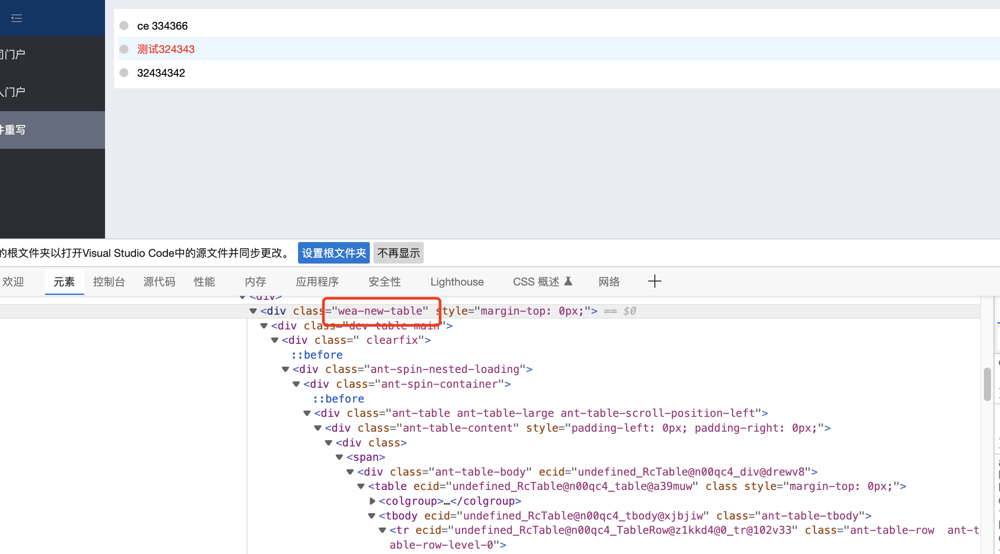


可以看到这个组件就是在流程中的这个地方


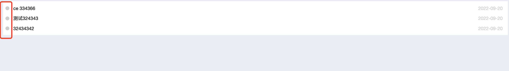


我们只需要重写组件里的tab标签就可以了

点击查看代码块，里面告诉了我们使用这个组件的示例


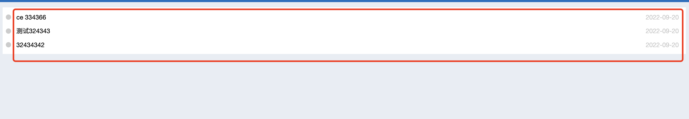


往下滑，这里就是组件的参数了，我们只需要重写需要的参数就可以了


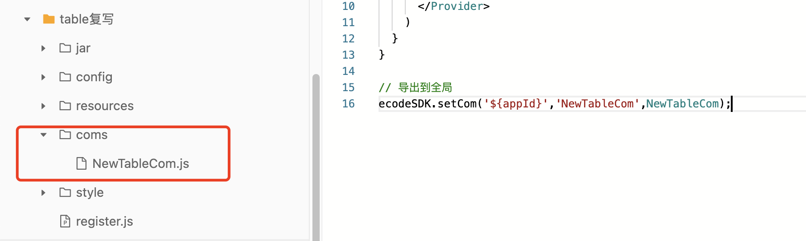


我们要重写的是tabDatas这个参数，tabDatas就是页签数据，而这个参数是引用了上面的一个变量，可以看到它的变量结构


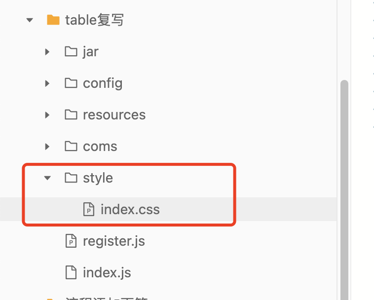


然后再重写参数时用newProps这个参数，取到组件里tabDatas这个参数，再往tabDatas里添加一个元素就可以了，也就是添加页签数据


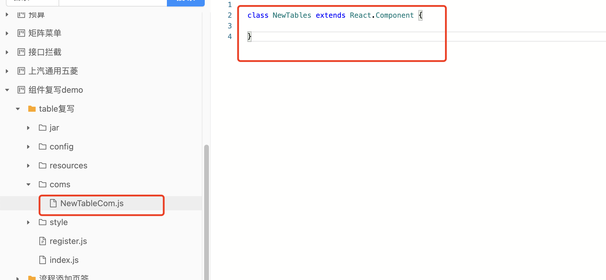


还有要切换到我们自己添加的页签时，在页签页面上添加一个按钮，这个可以判断组件的selectedKey参数，如果是我们添加的页签的key，就添加一个子组件，也就是一个按钮


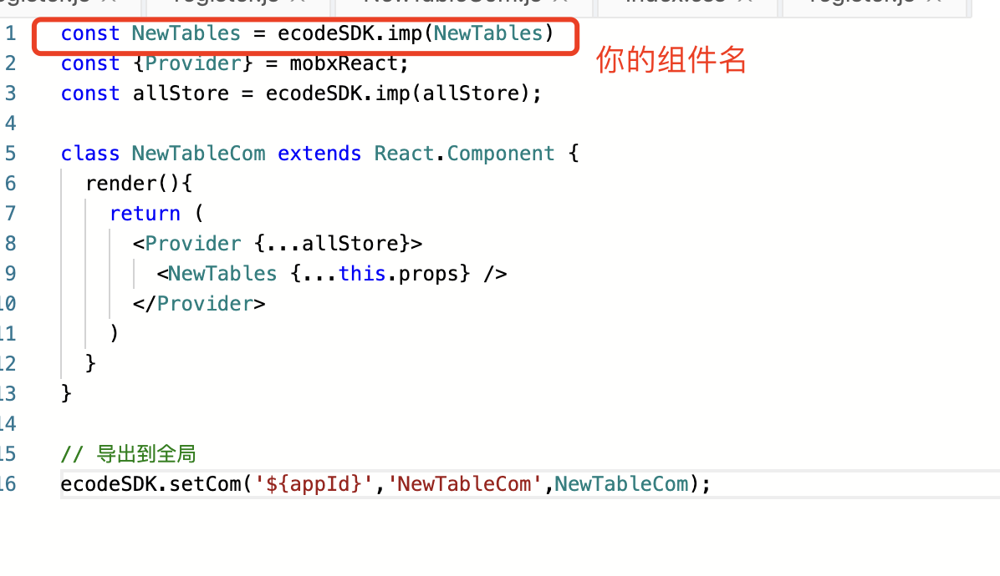


也就是组件的selectedKey变化时，就会执行我们的判断


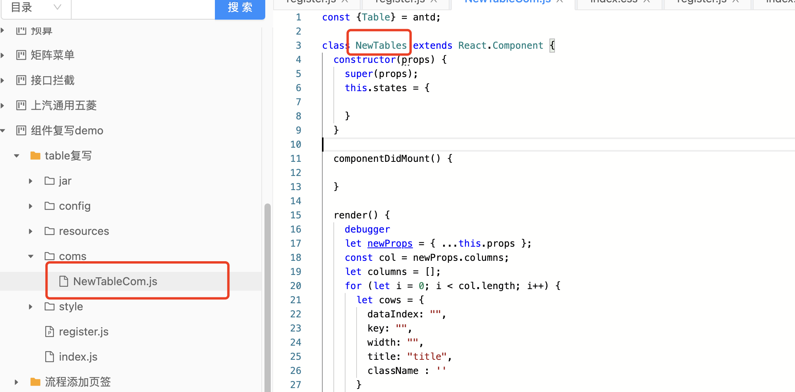


这是关于children参数的说明，它是一个子组件，就是页签页面显示的内容，参数类型是组件对象


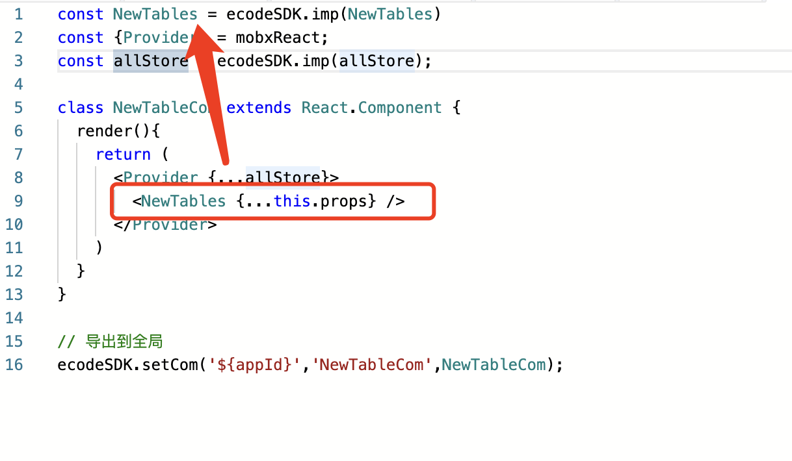


<span style="color:red">注意rigister.js文件需要前置加载</span>

### 效果：


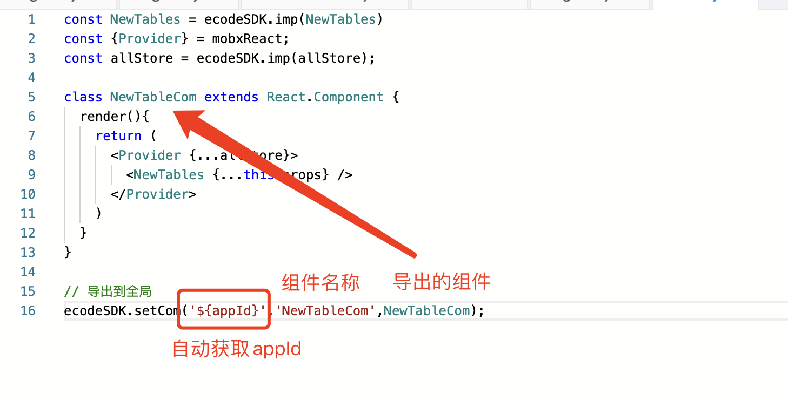
