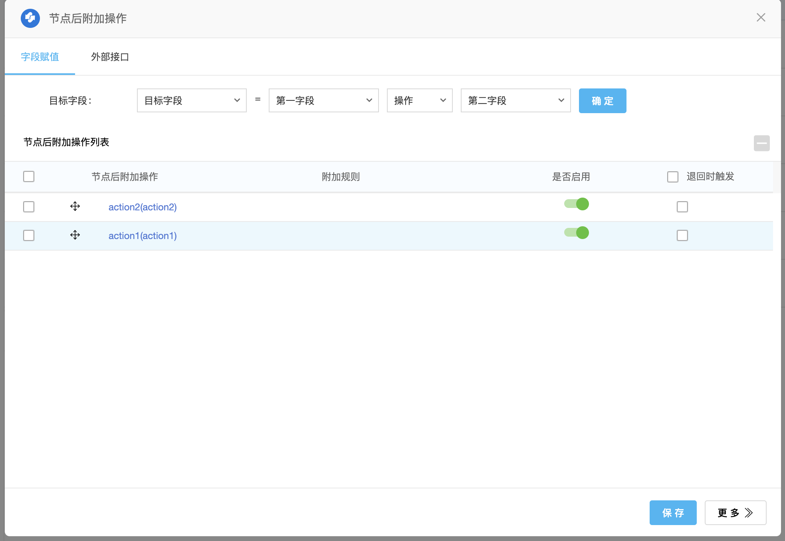
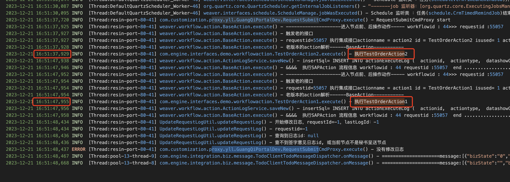
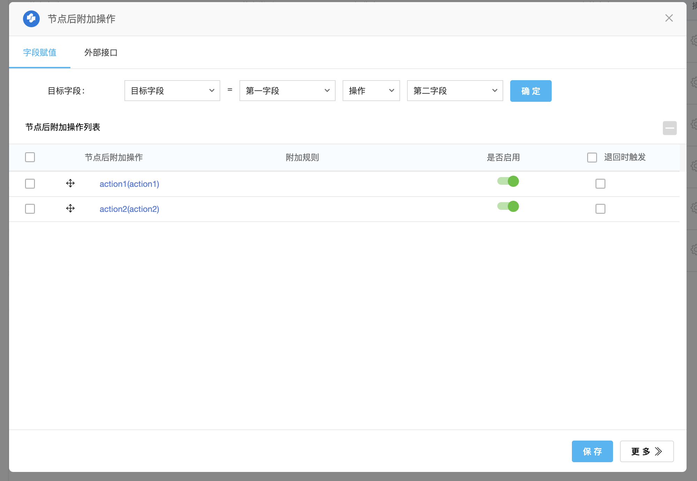
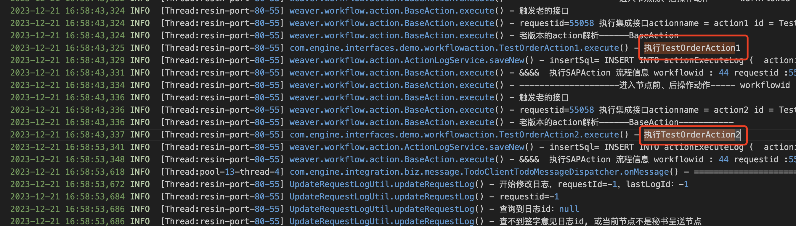
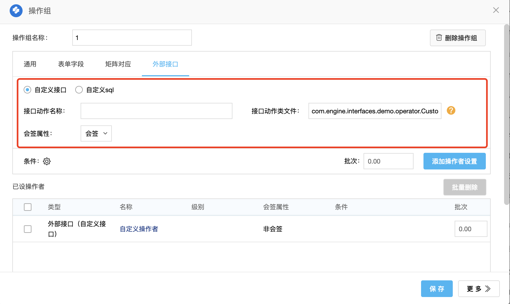

## 流程 Action

流程 Acton 可用于在流程流转时执行动作，常用场景是在流程提交时推送流程表单数据到第三方系统，或对流程提交进行校验，比如做预算控制，或控制流程流转，比如实现自动提交。

类中的成员 String 类型参数可作为配置参数传入 Action 中，注意不能为 final，例如传入第三方系统的接口地址、应用id等。

```java

package weaver.spdbank.action;
    
import weaver.general.Util;
import weaver.hrm.User;
import weaver.interfaces.workflow.action.Action;
import weaver.soa.workflow.request.Cell;
import weaver.soa.workflow.request.DetailTable;
import weaver.soa.workflow.request.Property;
import weaver.soa.workflow.request.RequestInfo;
import weaver.soa.workflow.request.Row;
import weaver.workflow.request.RequestManager;
    
import javax.servlet.http.HttpServletRequest;
    
/**
 * <Description>  项目开发培训：自定义接口动作（流程） <br>
 * @author han.mengyu <br>
 * @version 1.0 <br>
 * @createDate 2022/4/19 <br>
 * @see weaver.spdbank.action <br>
 */
public class DevWorkflowAction implements Action {
    /**
     * 自定义参数
     */
    public String defaultParam;
    
    @Override
    public String execute(RequestInfo requestInfo) {
        RequestManager requestManager = requestInfo.getRequestManager();
        HttpServletRequest request = requestManager.getRequest();
    
        String requestId = requestInfo.getRequestid();//请求ID
        String reqId = Util.null2String(request.getParameter("requestid"));//请求ID
        String requestLevel = requestInfo.getRequestlevel();//请求紧急程度
        //当前操作类型 submit:提交/reject:退回
        String src = requestManager.getSrc();
        String workflowId = requestInfo.getWorkflowid();//流程ID
        String tableName = requestManager.getBillTableName();//表单名称
        int billId = requestManager.getBillid();//表单数据ID
        User usr = requestManager.getUser();//获取当前操作用户对象
        String requestName = requestManager.getRequestname();//请求标题
        String remark = requestManager.getRemark();//当前用户提交时的签字意见
        int formId = requestManager.getFormid();//表单ID
        int isBill = requestManager.getIsbill();//是否是自定义表单
    
        //取主表数据
        Property[] properties = requestInfo.getMainTableInfo().getProperty();// 获取表单主字段信息
        for (Property property : properties) {
            String name = property.getName();// 主字段名称
            String value = Util.null2String(property.getValue());// 主字段对应的值
        }
        //取明细数据
        DetailTable[] detailTable = requestInfo.getDetailTableInfo().getDetailTable();// 获取所有明细表
        if (detailTable.length > 0) {
            // 指定明细表
            for (DetailTable dt : detailTable) {
                Row[] s = dt.getRow();// 当前明细表的所有数据,按行存储
                // 指定行
                for (Row r : s) {
                    Cell[] c = r.getCell();// 每行数据再按列存储
                    // 指定列
                    for (Cell c1 : c) {
                        String name = c1.getName();// 明细字段名称
                        String value = c1.getValue();// 明细字段的值
                    }
                }
            }
        }
        //控制流程流转，增加以下两行，流程不会向下流转，表单上显示返回的自定义错误信息
        requestManager.setMessagecontent("返回自定义的错误信息");
        requestManager.setMessageid("错误信息编号");
    
        // return返回固定返回`SUCCESS`,
        // 当return `FAILURE_AND_CONTINUE`时，表单上会提示附加操作失败
        return SUCCESS;
    }
    
    
    public String getDefaultParam() {
        return defaultParam;
    }
    
    public void setDefaultParam(String defaultParam) {
        this.defaultParam = defaultParam;
    }
}

```

### 向前端显示错误信息

在 Action 中可调用以下语句来向前端显示错误信息，可用于在 Action 执行错误时向前端显示错误信息，需要 Action 返回`FAILURE_AND_CONTINUE`。

```

requestManager.setMessagecontent("返回自定义的错误信息");

```

### 在 Action 中获取流程字段

可使用 Action 中的`RequestInfo`类来获取字段值

```java

package com.customization.demo;
    
import com.api.formmode.page.util.Util;
import weaver.soa.workflow.request.*;
    
import java.util.ArrayList;
import java.util.HashMap;
import java.util.List;
import java.util.Map;
    
public class WorkflowUtil {
    /**
     * 获取指定主表字段
     *
     * @param requestInfo requestInfo
     * @param fieldName   要获取字段的字段名
     * @return 返回字段的值
     */
    public static String getMainFieldValue(RequestInfo requestInfo, String fieldName) {
        String fieldValue = "";
        //取主表字段集合
        Property[] properties = requestInfo.getMainTableInfo().getProperty();
        // 遍历主表字段
        for (Property property : properties) {
            // 主字段名称
            String name = property.getName();
            // 主字段对应的值
            String value = Util.null2String(property.getValue());
            if (name.equals(fieldName)) {
                fieldValue = value;
            }
        }
        return fieldValue;
    }
    
    /**
     * 获取明细数据
     *
     * @param detailTable detailTable
     * @param fieldNames  要获取明细字段的字段名
     * @return 返回明细数据
     */
    private List<Map<String, String>> getDetailData(DetailTable detailTable, String[] fieldNames) {
        // 存放明细数据，每一行对应一个map对象，map存放字段名对应的字段值
        List<Map<String, String>> detailList = new ArrayList<>();
        // 获取明细所有行
        Row[] s = detailTable.getRow();
        // 遍历明细行
        for (Row r : s) {
            Map<String, String> fieldMap = new HashMap<>();
            // 获取明细列
            Cell[] c = r.getCell();
            // 遍历列数据
            for (Cell c1 : c) {
                // 明细字段名称
                String fieldName = c1.getName();
                // 明细字段的值
                String value = c1.getValue();
                // 获取想要的字段
                for (String name : fieldNames) {
                    // 判断该列的字段是否是想要获取的字段
                    if (name.equals(fieldName)) {
                        fieldMap.put(name, value);
                    }
                }
            }
            // 添加这行的明细数据
            detailList.add(fieldMap);
        }
        return detailList;
    }
}

```

### Action 的构造方法调用

<span style='color:red'>action只在流程中首次调用时会调用构造方法，后续调用不会，所以不要将流程流转中会变的数据放在action构造方法中进行初始化，例如action传入的参数</span>

下面例子中如果action传入的参数有变，会导致 workFlowFieldName 不会再次初始化，用的还是旧的参数数据

![[Pasted image 20260407094454.png]]

### Action 执行顺序

流程的action会按列表的先后顺序去执行，排在前面的先执行

#### 证明

这里有2个action，action2执行时会耗时10秒，我们看它们是否会同时执行，或者是先执行action2然后到aciton1



action1只打印日志

```java

public class TestOrderAction1 implements Action {
    @Override
    public String execute(RequestInfo requestInfo) {
        Logger logger = LoggerFactory.getLogger(this.getClass());
        logger.info("执行TestOrderAction1");
    
        return SUCCESS;
    }
}

```

action2需要等待10秒

```java

public class TestOrderAction2 implements Action {
    @Override
    public String execute(RequestInfo requestInfo) {
        Logger logger = LoggerFactory.getLogger(this.getClass());
        logger.info("执行TestOrderAction2");
        long current = System.currentTimeMillis();
        long nextTime = current + 10000;
        // 等待10秒
        while (System.currentTimeMillis() < nextTime){}
    
        return SUCCESS;
    }
}

```

然后我们提交流程，看日志输出，日志显示action2先执行，10秒后到action1，这符合我们的预期



调换下顺序，aciton1在前



提交后查看日志输出，看到先执行了action1，再到action2



#### 节点后附加操作和下个节点的节点前附加操作执行顺序

先执行节点后附加操作，然后再到下个节点的节点前附加操作

测试：

把action2放到节点后附加操作，aciton1放到下个节点的节点前附加操作，action2会执行10秒，我们看aciton1是否会在这期间执行，验证它们是否是同步执行

通过日志查看，先执行action2，10秒后再执行action1，是依次执行的

### 相关问题

#### requestInfo.getCreatorid() 获取不到创建人id

使用 requestInfo.getCreatorid(); 获取到的是创建人的名称，不要被方法名迷惑了

正确的应该使用 ：requestInfo.getRequestManager().getCreater();

### 示例-自动流转

场景：节点审批人不想重复审批，如果该审批人在之前发起的流程中审批过，则不用再进行审批，到达节点后自动提交。

```java

package com.customization.yll.sgmw.action;
    
import cn.hutool.core.collection.CollUtil;
import cn.hutool.core.util.StrUtil;
import com.customization.yll.common.exception.ActionConfigException;
import com.customization.yll.common.exception.SqlExecuteException;
import com.customization.yll.common.service.GeneralTheadPoolService;
import com.customization.yll.common.util.PropertiesUtil;
import com.customization.yll.common.workflow.AbstractWorkflowAction;
import com.customization.yll.common.workflow.WorkflowActionWaitNextNodeHelper;
import com.customization.yll.common.workflow.anotations.ActionParam;
import com.customization.yll.common.workflow.bean.ActionResult;
import com.customization.yll.common.workflow.util.WorkflowOperateUtil;
import com.customization.yll.sgmw.service.AutoFlowActionHelper;
import lombok.Setter;
import org.jetbrains.annotations.NotNull;
import weaver.conn.RecordSet;
import weaver.soa.workflow.request.RequestInfo;
    
import java.util.Map;
    
/**
 * @author 姚礼林
 * @desc 需求编号：202526，财务部验收流程功能优化，实现根据 SQL 视图中查出的操作者，是否和表单中的操作者相同，
 * 如果相同则在当前节点自动流转。<br>
 * 需求描述：<br>
 * <ul>
 *     <li>如果流程中的是否校验字段为否，则不进行自动流转</li>
 *     <li>流程创建时会传操作者到流程表单字段中</li>
 *     <li>根据流程中的pr单号查询 SQL 视图，获取视图中的验收人、经理、总监等操作者</li>
 *     <li>如果当前流程表单字段中的操作者等于视图中的操作者，则在当前节点执行自动流转，比如当前节点是验收人节点，视图中的验收人是A，
 *     表单中的验收人操作者也是A，则自动流转</li>
 * </ul>
 * @date 2025/9/18
 **/
@Setter
public class AutoFlowAction extends AbstractWorkflowAction {
    /**
     * 到达下个节点最大等待时间，单位毫秒
     */
    public static final int MAX_WAIT_TIME = 20000;
    private final WorkflowActionWaitNextNodeHelper waitNextNodeHelper;
    
    @ActionParam(desc = "pr单号字段名", defaultValue = "prdh")
    private String prNumFieldName = "prdh";
    @ActionParam(desc = "是否跳过校验字段名", defaultValue = "sfxytg")
    private String isVerifyFieldName = "sfxytg";
    @ActionParam(required = true, desc = "要自动流转的节点对应的sql视图操作人字段名，比如：123:jl,123:zj,124:ysr")
    private String nodeIdSqlFieldMap;
    @ActionParam(required = true, desc = "流程节点操作者字段与sql视图操作者字段的对应关系，比如配置经理字段名对应的sql视图" +
            "经理字段名等，冒号左边为流程字段名，右边为视图字段名，多个使用英文逗号分隔，示例：jl1:jl,zj1:zj")
    private String operatorFieldNameSqlFieldMap;
    @ActionParam(required = true, desc = "当前节点id")
    private String currentNodeId;
    @ActionParam(desc = "自动流转提交的签字意见")
    private String remark;
    
    private final AutoFlowActionHelper autoFlowActionHelper;
    
    public AutoFlowAction(WorkflowActionWaitNextNodeHelper waitNextNodeHelper,
                          AutoFlowActionHelper autoFlowActionHelper) {
        this.waitNextNodeHelper = waitNextNodeHelper;
        this.autoFlowActionHelper = autoFlowActionHelper;
    }
    
    public AutoFlowAction() {
        this.waitNextNodeHelper = new WorkflowActionWaitNextNodeHelper(new RecordSet());
        this.autoFlowActionHelper = new AutoFlowActionHelper(new RecordSet());
    }
    
    @NotNull
    @Override
    protected ActionResult doExecute(RequestInfo requestInfo) {
        try {
            String isVerify = this.actionHelper.getMainFieldValue(isVerifyFieldName);
            log.info("是否跳过校验：{}", isVerify);
            if ("0".equals(isVerify)) {
                return new ActionResult(true, "不进行校验");
            }
    
            String prNum = this.actionHelper.getMainFieldValue(prNumFieldName);
            int curNodeId = Integer.parseInt(currentNodeId);
    
            // 根据当前节点获取视图中的操作者字段名
            String sqlOperatorFieldName = getSqlOperatorFieldName(curNodeId);
            log.info("节点对应的视图字段名：{}", sqlOperatorFieldName);
            if (StrUtil.isEmpty(sqlOperatorFieldName)) {
                return new ActionResult(true, "当前节点不在配置中，不进行自动流转");
            }
            // 从表单字段中获取自动流转的操作者
            String formOperator = getOperatorFromFormField(sqlOperatorFieldName);
            if (StrUtil.isEmpty(formOperator)) {
                return new ActionResult(false, "表单中的操作者为空，字段名称：" + formOperator);
            }
    
            // 判断是否自动流转，如自动流转则获取提交操作者
            boolean autoSubmit = autoFlowActionHelper.enableAutoFlow(prNum, formOperator,
                    sqlOperatorFieldName);
            if (!autoSubmit) {
                return new ActionResult(true, "不符合自动流转条件，没有找到符合的历史操作人");
            }
            log.info("执行自动流转，操作人：{}", formOperator);
    
            // 当前还未到达指定节点，另起一个线程等待流程到达下个节点
            GeneralTheadPoolService.INSTANCE.putTask(() -> flowNext(requestInfo, curNodeId,
                    Integer.parseInt(formOperator)));
    
            return new ActionResult(true, "执行自动流转");
        } catch (ActionConfigException | SqlExecuteException e) {
            return new ActionResult(false, e.getMessage());
        }
    }
    
    @NotNull
    private String getOperatorFromFormField(String sqlOperatorFieldName) {
        // 获取表单中的操作者字段名
        String workflowOperatorFieldName = getWorkflowOperatorFieldName(sqlOperatorFieldName);
        return actionHelper.getMainFieldValue(workflowOperatorFieldName);
    }
    
    /**
     * 从 action 参数中配置的节点对应的sql视图操作者字段名，获取视图中的操作者字段名
     */
    private String getSqlOperatorFieldName(int currentNodeId) {
        Map<String, String> nodeIdMap = PropertiesUtil.valueConvertToMap(nodeIdSqlFieldMap,
                ",", ":");
        if (CollUtil.isEmpty(nodeIdMap)) {
            throw new ActionConfigException("[fieldNameSqlFieldMap] 参数配置错误");
        }
        return nodeIdMap.get(String.valueOf(currentNodeId));
    }
    
    /**
     *  从 action 参数中配置的节点操作者字段与sql视图操作者字段的对应关系，获取表单中的存储流程操作者字段的字段名
     */
    private @NotNull String getWorkflowOperatorFieldName(String sqlOperatorFieldName) {
        Map<String, String> fieldNameMap = PropertiesUtil.valueConvertToMap(operatorFieldNameSqlFieldMap,
                ",", ":");
        if (CollUtil.isEmpty(fieldNameMap)) {
            throw new ActionConfigException("[operatorFieldNameSqlFieldMap] 参数配置错误");
        }
        String workflowFieldName = fieldNameMap.get(sqlOperatorFieldName);
        if (StrUtil.isEmpty(workflowFieldName)) {
            throw new ActionConfigException("[operatorFieldNameSqlFieldMap] 参数配置错误，无法找到sql字段 ["
                    + sqlOperatorFieldName + "] 对应的流程字段");
        }
        return workflowFieldName;
    }
    
    /**
     * 流转到下个节点
     */
    private void flowNext(RequestInfo requestInfo, int curNodeId, Integer operator) {
        boolean isFlowNextNode = waitNextNodeHelper.waitFlowNextNode(MAX_WAIT_TIME,
                Integer.parseInt(requestInfo.getRequestid()), curNodeId);
        if (!isFlowNextNode) {
            log.error("流程未流转到指定节点，目标节点：{}", curNodeId);
            return;
        }
        boolean submitResult = WorkflowOperateUtil.submit(Integer.parseInt(requestInfo.getRequestid()),
                operator, remark);
        if (!submitResult) {
            log.error("流程自动流转失败，请求id：{}，节点id：{}", requestInfo.getRequestid(), curNodeId);
        }
    }
    
}

```

## 通过Action自定义操作者

action类必需继承OperatorAction接口

execute方法中返回人员id集合

示例：

```java

public class CustomOperatorAction implements OperatorAction {
    @Override
    public List<String> execute(RequestInfo requestInfo) {
        List<String > ids = new ArrayList<>();
        ids.add("22");
        ids.add("23");
        return ids;
    }
}

```

在节点操作组设置中就可以添加action



## 流程流转控制

参考：流程流转个性化开发、流程对外接口开发 (e-cology.com.cn)

[流程流转个性化开发、流程对外接口开发 (e-cology.com.cn)](https://www.e-cology.com.cn/spa/document/index.jsp?id=9589702&router=1#/main/document/detail?_key=qtzmsu)

代理RequestManager_SaveRequestInfoCmd类可控制流程的保存

代理RequestManager_FlowNextNodeCmd可控制流程的提交、退还、流程干预等

```java

@CommandDynamicProxy(target = RequestManager_SaveRequestInfoCmd.class,desc = "代理流程保存操作类")
public class CoustomSaveRequestCmd extends AbstractCommandProxy<Boolean> {
    @Override
    public Boolean execute(Command<Boolean> command) {
        
        return null;
    }
}

```

## 流程提交执行顺序

流程提交时，数据顺序如下：保存表单数据>根据出口条件找到操作者>执行节点附加操作>流程提交到下一个节点>产生待办和提醒

## 流程操作代理和拦截

流程操作接口：/api/workflow/reqform/requestOperation

对应的类：com.engine.workflow.web.RequestFormAction

通过代理流程操作cmd类，可实现在进行流程操作时处理业务逻辑，比如在退回时提醒用户

### 提交

代理 FlowNextCmd 类，拦截流程提交操作

```java

@CommandDynamicProxy(target = FlowNextCmd.class, desc = "公文流程提交时记录到台账")
public class TimeRecordOdocFlowNextProxy extends AbstractCommandProxy<Map<String, Object>> {
    @Override
    public Map<String, Object> execute(Command<Map<String, Object>> command) {
        
    }
}

```

### 退回

代理 RequestSubmitCmd 类，通过参数中的 src 字段，判断是否为退回操作

```java

@CommandDynamicProxy(target = RequestSubmitCmd.class, desc = "公文流程退回时提醒秘书科")
public class WorkflowRejectProxyToRemind extends AbstractCommandProxy<Map<String, Object>> {
    @Override
    public Map<String, Object> execute(Command<Map<String, Object>> command) {
        RequestSubmitCmd requestSubmitCmd = (RequestSubmitCmd) command;
        // 执行退回操作,获取退回结果
        Map<String, Object> result = nextExecute(command);
        Map<String, Object> params = ParamUtil.request2Map(requestSubmitCmd.getRequest());
        String src = (String) params.get("src");
        if (!"reject".equals(src)) {
            // 非退回操作，不进行处理
            return result;
        }
        // 处理业务逻辑
        return result;
    } 
}

```

#### 参数获取

调用原来Cmd类的 getParams() 方法可以获取到参数，但可能参数会不全，建议使用这个方法来获取

```xml

Map<String, Object> params = ParamUtil.request2Map(originalCmd.getRequest());

```

### 流程删除

同流程退回操作，代理 RequestSubmitCmd 类，过参数中的 src 字段判断是否为删除，src 为 delete

### 流程监控删除

拦截  /api/workflow/monitor/delete 接口

```java

@WeaIocReplaceComponent("DeleteInterceptWithApproveStatusFeedback")
public class DeleteInterceptWithApproveStatusFeedback {
    @WeaReplaceAfter(value = "/api/workflow/monitor/delete", order = 1, description = "流程监控删除流程时将审批结果回传到商城系统")
    public String deleteIntercept(WeaAfterReplaceParam param) {
        
    }
}

```

### 明细导入

在导入明细后执行自定义逻辑，比如更新明细表字段

如果想要在前端提示错误，可以在返回的msg json 中改变 msg 信息

应用场景：在导入明细后实现字段联动（更新明细数据）

```java

/**
 * @author yaolilin
 * @desc 代理明细导入
 * @date 2024/12/21
 **/
@CommandDynamicProxy(target = RequestDetailImportCmd.class, desc = "代理明细导入")
public class DetailImportProxy extends AbstractCommandProxy<Map<String, Object>> {
    private final Logger log = LoggerFactory.getLogger(this.getClass());
    
    @Override
    public Map<String, Object> execute(Command<Map<String, Object>> command) {
        RequestDetailImportCmd cmd = (RequestDetailImportCmd) command;
        Map<String, Object> result = nextExecute(cmd);
        JSONObject msg = new JSONObject();
        try {
            msg = JSON.parseObject((String) result.get("message"));
            onAfter(cmd);
        } catch (Exception e) {
            log.error("明细导入代理出错", e);
            msg.put("msg", "明细导入后执行字段联动出错");
            result.put("message", msg.toJSONString());
            result.put("noRight", true);
        }
        return result;
    }
    
    private void onAfter(RequestDetailImportCmd cmd) {
    
    }
}

```

### 强制归档

代理这个操作有个问题，不能向前端提示错误，无论是返回错误信息还是抛出异常，前端都是关闭页面。

代理cmd类：`FunctionManageCmd`

需要通过参数中的`flag`字段来判断是否为强制归档，值为“ov”就是强制归档。

```

String flag = Util.null2String(params.get("flag"));
if ("ov".equals(flag)) {
    return false;
}

```

```java

/**
 * @author yaolilin
 * @desc 流程强制归档操作代理
 * @date 2024/12/23
 **/
@CommandDynamicProxy(target = FunctionManageCmd.class, desc = "流程强制归档操作代理")
public class WorkflowOvProxy extends AbstractCommandProxy<Map<String, Object>> {
    private final Logger log = LoggerFactory.getLogger(this.getClass());
    @Override
    public Map<String, Object> execute(Command<Map<String, Object>> command) {
        FunctionManageCmd functionManageCmd = (FunctionManageCmd) command;
        if (!onBefore(functionManageCmd)) {
            // 无论是返回错误信息还是抛出异常，前端都是直接关闭页面没有错误提示
//            return getFailedResult();
//            throw new ECException("我直接报错");
        }
        return nextExecute(command);
    }
    
    private boolean onBefore(FunctionManageCmd functionManageCmd) {
        HttpServletRequest request = functionManageCmd.getRequest();
        Map<String, Object> params = ParamUtil.request2Map(request);
        String flag = Util.null2String(params.get("flag"));
        if ("ov".equals(flag)) {
           return false;
        }
        return true;
    }
    
    @NotNull
    private static Map<String, Object> getFailedResult() {
        Map<String, Object> result = new HashMap<>(1);
        result.put("success", false);
        result.put("msg", "调用接口出错，请联系管理员处理");
        return result;
    }
}

```

可通过返回这个，让前端提示错误，但不能自定义提示信息

```java

@NotNull
private static Map<String, Object> getFailedResult() {
    Map<String, Object> result = new HashMap<>(1);
    result.put("result", "FAILED");
    return result;
}

```

## 调用websevice接口创建流程

[二次开发] 调用websevice接口创建流程

[[二次开发] 调用websevice接口创建流程](note://WEB7a42419e47d4e8cd9f64c70ce542dd49)

## 后端中创建流程

可使用`RequestOperateBiz`创建流程，构建字段数据会比较复杂

示例：

```java

package com.engine.interfaces.demo.workflow.cmd;
    
import com.engine.core.interceptor.AbstractCommand;
import com.engine.core.interceptor.CommandContext;
import com.engine.workflow.biz.publicApi.RequestOperateBiz;
import com.engine.workflow.entity.core.RequestInfoEntity;
import com.engine.workflow.entity.publicApi.ReqOperateRequestEntity;
import com.engine.workflow.entity.publicApi.WorkflowDetailTableInfoEntity;
import com.engine.workflow.entity.requestForm.ReqFlowFailMsgEntity;
import weaver.general.Util;
import weaver.hrm.User;
import weaver.workflow.request.RequestDeleteUtils;
import weaver.workflow.webservices.WorkflowRequestTableField;
import weaver.workflow.webservices.WorkflowRequestTableRecord;
    
import java.util.ArrayList;
import java.util.HashMap;
import java.util.List;
import java.util.Map;
    
/**
 * @author 姚礼林
 * @desc TODO
 * @date 2023/5/20
 */
public class CreateWorkflowBySapApiCmd extends AbstractCommand<Map<String, Object>> {
    public CreateWorkflowBySapApiCmd(Map<String, Object> params) {
        this.user = new User(1);
        this.params = params;
    }
    
    @Override
    public Map<String, Object> execute(CommandContext commandContext) {
        ReqOperateRequestEntity operateEntity  = new ReqOperateRequestEntity();
        Map<String ,Object> result = new HashMap<>();
        // 添加主表字段
        List<WorkflowRequestTableField> mainDataList = new ArrayList<>();
        WorkflowRequestTableField field1 = new WorkflowRequestTableField();
        field1.setFieldName("mc");
        field1.setFieldValue("测试");
        mainDataList.add(field1);
    
        // 添加明细表数据
        List<WorkflowDetailTableInfoEntity> detailInfo = new ArrayList<>();
    
        // 添加明细表1数据
        WorkflowDetailTableInfoEntity detail1 = new WorkflowDetailTableInfoEntity();
        // 设置第一行数据
        WorkflowRequestTableRecord detail1Row1 = new WorkflowRequestTableRecord();
        WorkflowRequestTableField tableField1 = new WorkflowRequestTableField();
        tableField1.setFieldName("mc");
        tableField1.setFieldValue("测试1");
        WorkflowRequestTableField tableField2 = new WorkflowRequestTableField();
        tableField2.setFieldName("hm");
        tableField2.setFieldValue("21456634");
        // 在第一行添加2个字段数据
        detail1Row1.setWorkflowRequestTableFields(new WorkflowRequestTableField[]{tableField1,tableField2});
        // 设置第二行数据
        WorkflowRequestTableRecord detail1Row2 = new WorkflowRequestTableRecord();
        WorkflowRequestTableField tableField1Row2 = new WorkflowRequestTableField();
        tableField1Row2.setFieldName("mc");
        tableField1Row2.setFieldValue("测试2");
        WorkflowRequestTableField tableField2Row2 = new WorkflowRequestTableField();
        tableField2Row2.setFieldName("hm");
        tableField2Row2.setFieldValue("111344");
        // 在第二行添加2个字段数据
        detail1Row2.setWorkflowRequestTableFields(new WorkflowRequestTableField[]{tableField1Row2,tableField2Row2});
    
        // 明细表1添加第一和第二行数据
        detail1.setWorkflowRequestTableRecords(new WorkflowRequestTableRecord[]{detail1Row1,detail1Row2});
        detail1.setTableDBName("formtable_main_29_dt1");
    
        // 添加明细表2数据，添加一行数据
        WorkflowDetailTableInfoEntity detail2 = new WorkflowDetailTableInfoEntity();
        WorkflowRequestTableRecord detail2Row1 = new WorkflowRequestTableRecord();
        WorkflowRequestTableField tableField1Dt2 = new WorkflowRequestTableField();
        tableField1Dt2.setFieldName("bh");
        tableField1Dt2.setFieldValue("234244ddd");
        WorkflowRequestTableField tableField2HmDt2 = new WorkflowRequestTableField();
        tableField2HmDt2.setFieldName("dz");
        tableField2HmDt2.setFieldValue("北京");
        detail2Row1.setWorkflowRequestTableFields(new WorkflowRequestTableField[]{tableField1Dt2,tableField2HmDt2});
    
        detail2.setWorkflowRequestTableRecords(new WorkflowRequestTableRecord[]{detail2Row1});
        detail2.setTableDBName("formtable_main_29_dt2");
    
        // 添加明细表1和明细表2
        detailInfo.add(detail1);
        detailInfo.add(detail2);
    
        operateEntity.setDetailData(detailInfo);
        // 添加流程信息
        operateEntity.setMainData(mainDataList);
        operateEntity.setWorkflowId(58);
        operateEntity.setRequestName("999");
    
        operateEntity.setRequestId(-1);
        // 创建流程
        RequestInfoEntity entity = RequestOperateBiz.initRequestInfo(operateEntity, this.user);
        int requestId  = RequestOperateBiz.initRequestBaseInfo(this.user, entity, operateEntity);
        if (requestId < 0){
            result.put("result",false);
            result.put("msg","创建流程失败");
            return result;
        }
        entity.setRequestId(String.valueOf(requestId));
        ReqFlowFailMsgEntity msgEntity = new ReqFlowFailMsgEntity();
        // 保存流程
        try {
            Map<String, Object> saveResult = RequestOperateBiz.saveRequestInfo(entity, this.user,operateEntity, msgEntity);
            if (saveResult.size() > 0){
                deleteRequest(new HashMap<>(),entity);
                result.put("result",false);
                result.put("msg","创建流程失败,"+msgEntity.getMsgInfo());
                return result;
            }
        } catch (Exception e) {
            deleteRequest(new HashMap<>(),entity);
            result.put("result",false);
            result.put("msg","创建流程失败,"+e.getMessage());
            return result;
        }
    
        result.put("result",true);
        result.put("msg","创建流程成功");
    
        return result;
    }
    
    private void deleteRequest(Map<String, Object> otherParams, RequestInfoEntity requestInfoEntity) {
        if ("1".equals(Util.null2s(Util.null2String(otherParams.get("delReqFlowFaild")), "1"))) {
            RequestDeleteUtils var3 = new RequestDeleteUtils();
            var3.requestDelete(this.user, "from_restful", Util.getIntValue(requestInfoEntity.getRequestId()));
        }
    
    }
}

```

## 新建流程对外接口

### 明细参数格式

明细的json格式如下：

recordOrder 为0表示新增明细

``` json

"detailData": [
    {
      "tableDBName": "formtable_main_1356_dt1",
      "workflowRequestTableRecords": [
        {
          "recordOrder": 0,
          "workflowRequestTableFields": [
            {
              "fieldName": "dhwb",
              "fieldValue": "test01"
            },
            {
              "fieldName": "drl",
              "fieldValue": "2979"
            }
          ]
        },
        {
          "recordOrder": 0,
          "workflowRequestTableFields": [
            {
              "fieldName": "dhwb",
              "fieldValue": "test01"
            },
            {
              "fieldName": "drl",
              "fieldValue": "2979"
            }
          ]
        }
      ]
    },
    {
      "tableDBName": "formtable_main_1356_dt2",
      "workflowRequestTableRecords": [
        {
          "recordOrder": 0,
          "workflowRequestTableFields": [
            {
              "fieldName": "dhwb",
              "fieldValue": "test01"
            },
            {
              "fieldName": "drl",
              "fieldValue": "2979"
            }
          ]
        },
        {
          "recordOrder": 0,
          "workflowRequestTableFields": [
            {
              "fieldName": "dhwb",
              "fieldValue": "test01"
            },
            {
              "fieldName": "drl",
              "fieldValue": "2979"
            }
          ]
        }
      ]
    }
  ],

```

参考：ShowDoc

[ShowDoc](https://www.showdoc.com.cn/p/9bad2f99c027c94f8dedf0046cf404e1)

## 统一待办

### 对接第三方系统待办的流程单点

当 OA 使用统一待办来对接第三方系统待办时（OA 显示第三方系统待办），需要在前端点击待办链接来进行单点登录，跳转到第三方系统。

具体方法请看此案例：[[后端-开发案例 第三方同步流程数据到OA，点待办单点到第三方]]